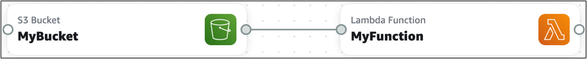

# Examples for connecting cards in Infrastructure Composer

Use the examples in this section to understand how cards can be connected in Infrastructure Composer.

## Invoke an AWS Lambda function

when an item is placed in an Amazon Simple Storage Service (Amazon S3) bucket

In this example, an **Amazon S3 bucket** card is connected to a **Lambda function** card. When
an item is placed in the Amazon S3 bucket, the function is invoked. The function can then be used
to process the item or trigger other events in your application.



This interaction requires that an event be defined for the function. Here is what
Infrastructure Composer provisions:

```
Transform: AWS::Serverless-2016-10-31
...
Resources:
  MyBucket:
    Type: AWS::S3::Bucket
    ...
  MyBucketBucketPolicy:
    Type: AWS::S3::BucketPolicy
    ...
  MyFunction:
    Type: AWS::Serverless::Function
    Properties:
      ...
      Events:
        MyBucket:
          Type: S3
          Properties:
            Bucket: !Ref MyBucket
            Events:
              - s3:ObjectCreated:* # Event that triggers invocation of function
              - s3:ObjectRemoved:* # Event that triggers invocation of function
```

## Invoke an Amazon S3 bucket from a

Lambda function

In this example, a **Lambda function** card invokes an **Amazon S3 bucket** card. The Lambda
function can be used to perform CRUD operations on items in the Amazon S3 bucket.


This interaction requires the following, which is provisioned by Infrastructure Composer:

- IAM policies that allow the Lambda function to interact with the Amazon S3
  bucket.
- Environment variables that influence the behavior of the Lambda function.

```
Transform: AWS::Serverless-2016-10-31
...
Resources:
  MyBucket:
    Type: AWS::S3::Bucket
    ...
  MyBucketBucketPolicy:
    Type: AWS::S3::BucketPolicy
    ...
  MyFunction:
    Type: AWS::Serverless::Function
    Properties:
      ...
      Environment:
        Variables:
          BUCKET_NAME: !Ref MyBucket
          BUCKET_ARN: !GetAtt MyBucket.Arn
      Policies:
        - S3CrudPolicy:
          BucketName: !Ref MyBucket
```
