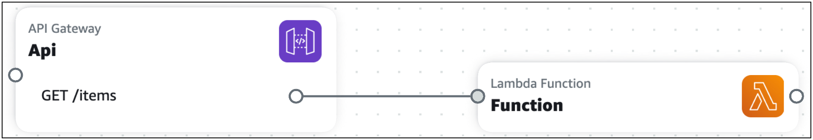
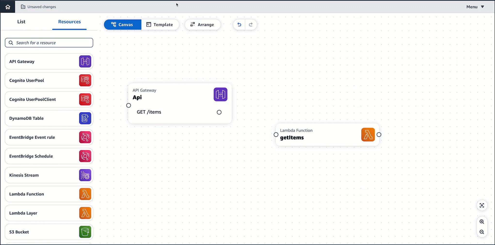

# Card connections in Infrastructure Composer

In AWS Infrastructure Composer, a connection between two cards is visually displayed by a line. These lines represent event-driven relationships within your application.

###### Topics

- [Connections between cards](#using-composer-connecting-cards "#using-composer-connecting-cards")
- [Connections between enhanced component cards](#using-composer-connecting-enhanced "#using-composer-connecting-enhanced")
- [Connections to and from standard IaC resource cards](#using-composer-connecting-standard "#using-composer-connecting-standard")

## Connections between cards

How you connect cards together varies depending on the card type. Each enhanced card has at least one connector port.
To connect them, you simply select one connector port and drag it to the port of another card, and Infrastructure Composer will connect the two resources
or display a message stating this configuration isn’t supported.

As seen above, lines between enhanced component cards are solid. Conversely, standard IaC resource cards (also referred to as standard component cards) do not have connector ports.
For these cards, you must specify these event-driven relationships in your application's template, and Infrastructure Composer will
automatically detect their connections and visualize them with a dotted line between your cards.

To learn more, see the sections below.

## Connections between enhanced component cards

In Infrastructure Composer, a connection between two enhanced component cards is visually displayed by a solid line. These lines represent event-driven relationships within your application.

To connect two cards, click on a port from one card and drag it onto a port on another card.

###### Note

Standard IaC resource cards do not have connector ports. For these cards, you must specify their event-driven relationships in your application's template,
and Infrastructure Composer will automatically detect their connections and visualize them with a dotted line between your cards.

For more information, see [Connect cards on Infrastructure Composer's visual canvas](reference-navigation-gestures-connect.md "reference-navigation-gestures-connect.md").

### What enhanced component cards provision

Connections between two cards, visually indicated by a line, provision the following
when necessary:

- AWS Identity and Access Management (IAM) policies
- Environment variables
- Events

#### IAM policies

When a resource needs permission to invoke another resource, Infrastructure Composer provisions
resource-based policies using AWS Serverless Application Model (AWS SAM) policy templates.

- To learn more about IAM permissions and policies, see [Overview of access
  management: Permissions and policies](../../../IAM/latest/UserGuide/introduction_access-management.md "../../../IAM/latest/UserGuide/introduction_access-management.md") in the
  _IAM User Guide_.
- To learn more about AWS SAM policy templates, see [AWS SAM policy templates](../../../serverless-application-model/latest/developerguide/serverless-policy-templates.md "../../../serverless-application-model/latest/developerguide/serverless-policy-templates.md") in the _AWS Serverless Application Model Developer Guide_.

#### Environment variables

Environment variables are temporary values that can be changed to affect the behavior of
your resources. When necessary, Infrastructure Composer defines the infrastructure code to utilize
environment variables between resources.

#### Events

Resources can invoke another resource through different types of events. When necessary,
Infrastructure Composer defines the infrastructure code necessary for resources to interact through event
types.

## Connections to and from standard IaC resource cards

All CloudFormation resources are available to use as standard IaC resource cards from the **Resources** palette. When you drag a standard IaC resource card onto the
canvas, a standard IaC resource card becomes a standard component card, and this prompts Infrastructure Composer to create a starting template for your resource in your application.

For more information, see [Standard cards in Infrastructure Composer](using-composer-standard-cards.md "using-composer-standard-cards.md").
