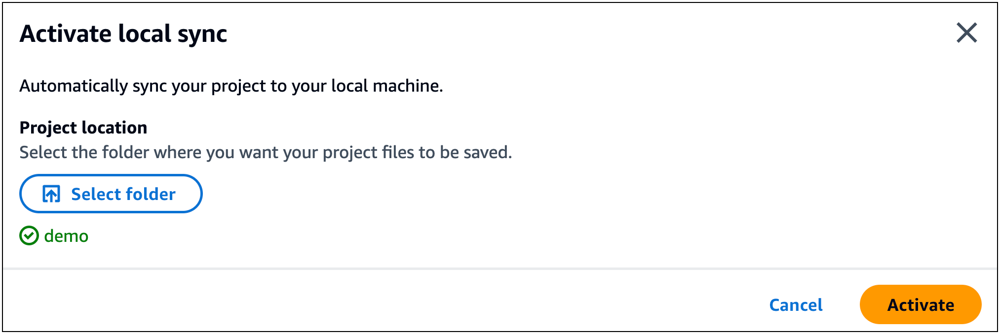
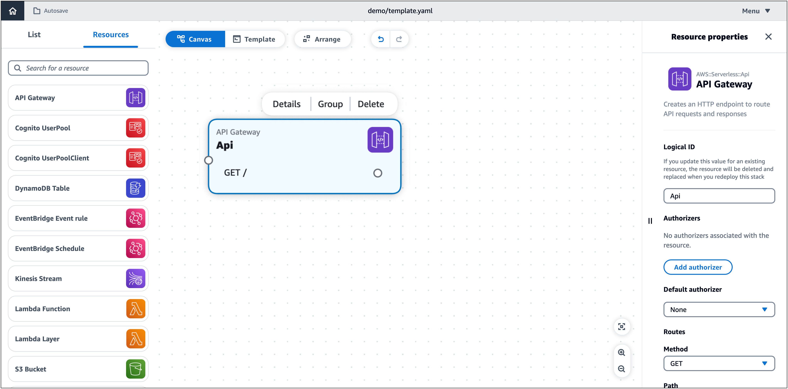
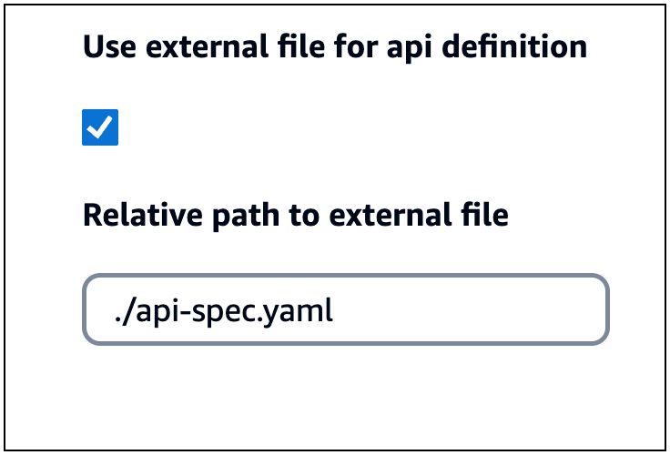
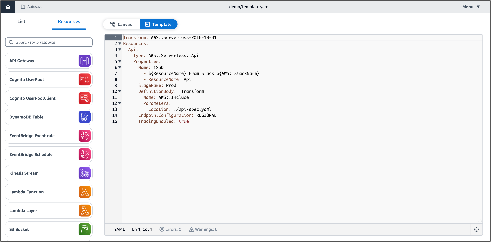

# Reference an OpenAPI specification external

file with Infrastructure Composer

This example uses Infrastructure Composer from the console to reference an external
OpenAPI specification file that defines a API Gateway
REST API.

First, create a new project from the Infrastructure Composer **home** page.

Next, activate **local sync** by
selecting **Activate local sync** from the
**Menu**. Create a new folder named
`demo`, allow the prompt to view files, and select
**Activate**. When prompted, select **Save
changes**.


Next, drag an Amazon API Gateway card onto the canvas. Select
**Details** to bring up the **Resource properties** panel.


From the **Resource properties** panel,
configure the following and **save**.

- Select the **Use external file for api
  definition** option.
- Input `./api-spec.yaml` as the **relative path to external file**


This creates the following directory on our local machine:

```
demo
└── api-spec.yaml
```

Now, you can configure the external file on our local machine. Using
our IDE, open the `api-spec.yaml` located in your
project folder. Replace its contents with the following:

```
openapi: '3.0'
info: {}
paths:
  /:
    get:
      responses: {}
    post:
      x-amazon-apigateway-integration:
        credentials:
          Fn::GetAtt:
            - ApiQueuesendmessageRole
            - Arn
        httpMethod: POST
        type: aws
        uri:
          Fn::Sub: arn:${AWS::Partition}:apigateway:${AWS::Region}:sqs:path/${AWS::AccountId}/${Queue.QueueName}
        requestParameters:
          integration.request.header.Content-Type: '''application/x-www-form-urlencoded'''
        requestTemplates:
          application/json: Action=SendMessage&MessageBody={"data":$input.body}
        responses:
          default:
            statusCode: 200
      responses:
        '200':
          description: 200 response
```

In the Infrastructure Composer **Template** view, you can see that
Infrastructure Composer has automatically updated your template to reference the external
file.


