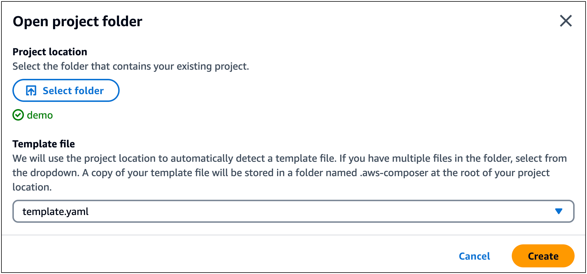
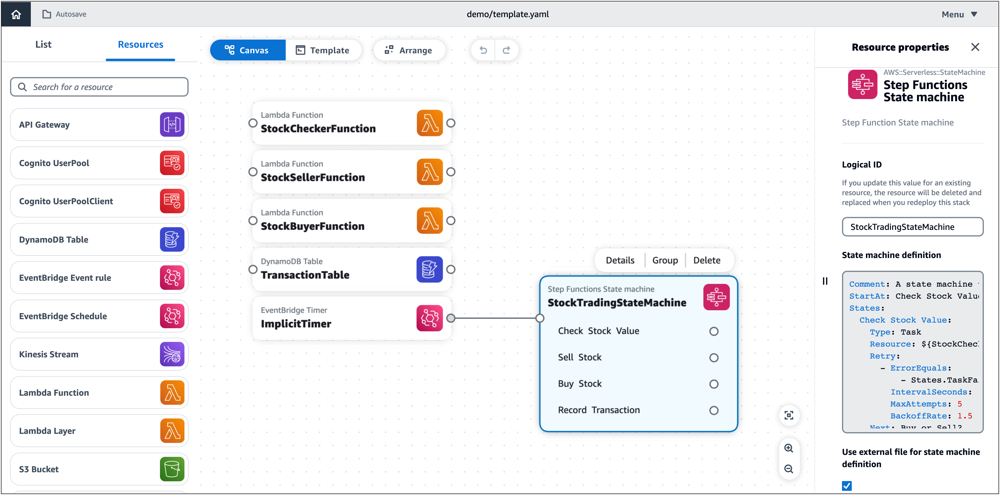

# Create an application that references an external file in

Infrastructure Composer

This example uses the AWS SAM CLI to
create an application that references an external file for its state
machine definition. You then load your project in Infrastructure Composer with your
external file properly referenced.

###### Example

1. First, use the AWS SAM CLI **sam init** command to
   initialize a new application named `demo`. During the
   interactive flow, select the **Multi-step
   workflow** quick start template.

```
`$` `sam init`

...

Which template source would you like to use?
        1 - AWS Quick Start Templates
        2 - Custom Template Location
Choice: `1`

Choose an AWS Quick Start application template
        1 - Hello World Example
        2 - Multi-step workflow
        3 - Serverless API
        4 - Scheduled task
        ...
Template: `2`

Which runtime would you like to use?
        1 - dotnet6
        2 - dotnetcore3.1
        ...
        15 - python3.7
        16 - python3.10
        17 - ruby2.7
Runtime: `16`

Based on your selections, the only Package type available is Zip.
We will proceed to selecting the Package type as Zip.

Based on your selections, the only dependency manager available is pip.
We will proceed copying the template using pip.

Would you like to enable X-Ray tracing on the function(s) in your application?  [y/N]: `ENTER`

Would you like to enable monitoring using CloudWatch Application Insights?
For more info, please view https://docs.aws.amazon.com/AmazonCloudWatch/latest/monitoring/cloudwatch-application-insights.html [y/N]: `ENTER`

Project name [sam-app]: `demo`

    -----------------------
    Generating application:
    -----------------------
    Name: demo
    Runtime: python3.10
    Architectures: x86_64
    Dependency Manager: pip
    Application Template: step-functions-sample-app
    Output Directory: .
    Configuration file: demo/samconfig.toml

    Next steps can be found in the README file at demo/README.md

...
```

This application references an external file for the state machine
definition.

```
...
Resources:
  StockTradingStateMachine:
    Type: AWS::Serverless::StateMachine
    Properties:
      DefinitionUri: statemachine/stock_trader.asl.json
...
```

The external file is located in the
`statemachine` subdirectory of our
application.

```
demo
├── README.md
├── __init__.py
├── functions
│   ├── __init__.py
│   ├── stock_buyer
│   ├── stock_checker
│   └── stock_seller
├── samconfig.toml
├── statemachine
│   └── stock_trader.asl.json
├── template.yaml
└── tests
```

2. Next, load your application in Infrastructure Composer from the console. From the Infrastructure Composer
   **home** page, select **Load a
   CloudFormation template**.
3. Select our `demo` project folder and allow
   the prompt to view files. Select our
   `template.yaml` file and select
   **Create**. When prompted, select **Save
   changes**.


Infrastructure Composer automatically detects the external state machine definition
file and loads it. Select our
**StockTradingStateMachine** resource and choose
**Details** to show the **Resource
properties** panel. Here, you can see that Infrastructure Composer has
automatically connected to our external state machine definition
file.


Any changes made to the state machine definition file will be
automatically reflected in Infrastructure Composer.
