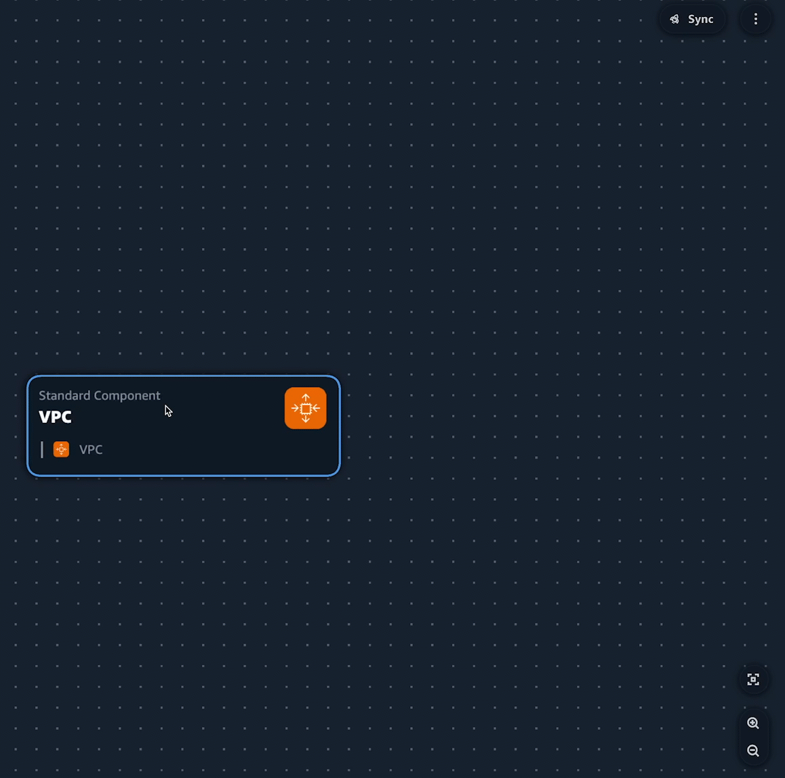

# Using AWS Infrastructure Composer with Amazon Q Developer

AWS Infrastructure Composer from the AWS Toolkit for Visual Studio Code provides an integration with Amazon Q. You can use Amazon Q within Infrastructure Composer to
generate the infrastructure code for your AWS resources as you design your application.

Amazon Q is a general purpose, machine learning-powered code generator. To learn more, see [What is Amazon Q?](../../../amazonq/latest/qdeveloper-ug/what-is.md "../../../amazonq/latest/qdeveloper-ug/what-is.md") in the
_Amazon Q Developer User Guide_.

For **standard resource** and **standard component** cards,
you can use Amazon Q to generate infrastructure code suggestions for your resources.

**Standard resource** and **standard component** cards
can represent an AWS CloudFormation resource or a collection of AWS CloudFormation resources. To learn more, see [Configure and modify cards in Infrastructure Composer](using-composer-cards.md "using-composer-cards.md").

## Setting up

To use Amazon Q in Infrastructure Composer, you must authenticate with Amazon Q in the Toolkit. For instructions, see
[Getting started with Amazon Q in VS Code and JetBrains](../../../amazonq/latest/qdeveloper-ug/q-in-IDE.md "../../../amazonq/latest/qdeveloper-ug/q-in-IDE.md") in the
_Amazon Q Developer User Guide_.

## Using Amazon Q Developer in Infrastructure Composer

You can use Amazon Q Developer from the **Resource properties** panel of any
**standard resource** or
**standard component** card.

###### To use Amazon Q in Infrastructure Composer

1. From a **standard resource** or **standard component** card,
   open the **Resource properties** panel.
2. Locate the **Resource configuration** field. This field contains the infrastructure code for the
   card.
3. Select the **Generate suggestions** button. Amazon Q will generate a suggestion.

###### Note

Code generated at this stage will not overwrite existing infrastructure code from your template. 4. To generate more suggestions, select **Regenerate**. You can toggle through the samples to
compare results. 5. To select an option, choose **Select**. You can modify the code here before saving it to your
application. To exit without saving, select the **exit icon (X)**. 6. To save the code to your application template, select **Save** from the
**Resource properties** panel.

## Learn more

To learn more about Amazon Q, see [What is Amazon Q?](../../../amazonq/latest/qdeveloper-ug/what-is.md "../../../amazonq/latest/qdeveloper-ug/what-is.md") in the _Amazon Q Developer
User Guide_.
