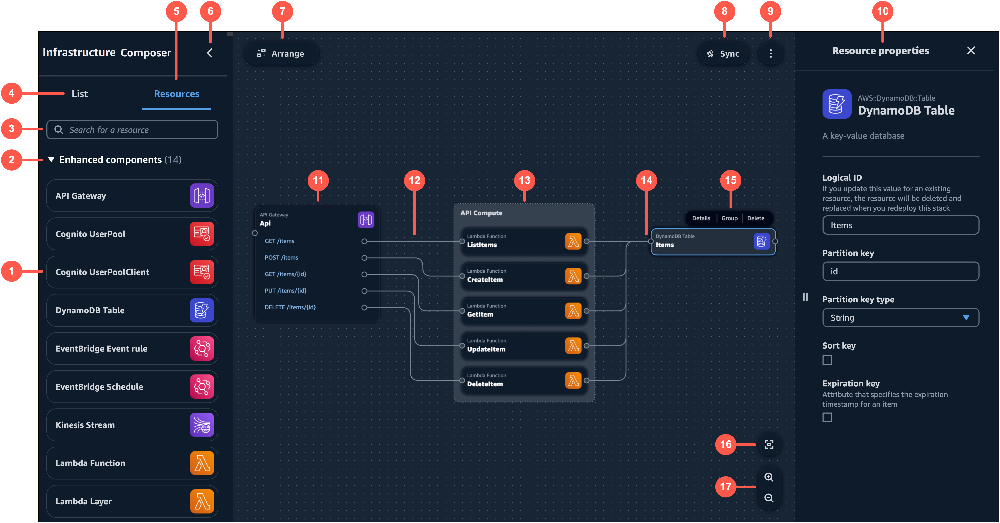

# Visual overview of Infrastructure Composer from the AWS Toolkit for Visual Studio Code

Infrastructure Composer's visual designer in the AWS Toolkit for Visual Studio Code includes a visual canvas, which includes components that are numbered in the following image and listed below.

1. **Resource palette** – Displays cards that you can design with.
2. **Card categories** – Cards are organized by categories unique to Infrastructure Composer.
3. **Resource search bar** – Search for cards that you can add to the canvas.
4. **List** – Displays a tree view of your application resources.
5. **Resources** – Displays the resource palette.
6. **Left pane toggle** – Hide or show the left pane.
7. **Arrange** – Arranges your application architecture in the canvas.
8. **Sync** – Initiates the AWS Serverless Application Model (AWS SAM) CLI `sam sync` command to deploy your application.
9. **Menu** – Provides general options such as the following:
   - **Export canvas**
   - **Tour the canvas**
   - Links to **Documentation**
   - Keyboard shortcuts

10. **Resource properties panel** – Displays relevant properties for the card that’s been selected in the canvas. This panel is dynamic.
    Properties displayed will change as you configure your card.
11. **Card** – Displays a view of your card on the canvas.
12. **Line** – Represents a connection between cards.
13. **Group** – A group of cards. You can group cards for visual organization.
14. **Port** – Connection points to other cards.
15. **Card actions** – Provides actions you can take on your card.
    - **Details** – Brings up the **Resource properties** panel.
    - **Group** – Group selected cards together.
    - **Delete** – Deletes the card from your canvas and template.

16. **Re-center** – Re-center your application diagram on the visual canvas.
17. **Zoom** – Zoom in and out on your canvas.
