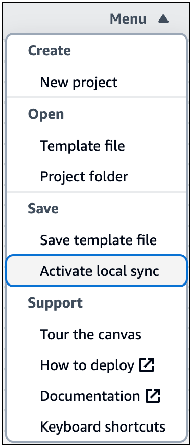

# Locally sync and save your

project in the Infrastructure Composer console

This section provides information on using Infrastructure Composer's **local sync** mode to automatically sync and save
your project to your local machine.

We recommend that you use **local sync** for the following
reasons:

You can activate **local sync** for a new project, or load an
existing project with **local sync** activated.

- By default, you need to manually save your application template as you design. Use
  **local sync** to automatically save your application template to
  your local machine as you make changes.
- **Local sync** manages and automatically syncs your project
  folders, backup folder, and [supported external
  files](using-composer-external-files.md "using-composer-external-files.md") to your local machine.
- When using **local sync**, you can connect Infrastructure Composer with
  your local IDE to speed up development. To learn more, see [Connect the Infrastructure Composer console with your local IDE](other-services-ide.md "other-services-ide.md").

## What local sync mode saves

**Local sync** mode automatically syncs and saves the
following to your local machine:

- **Application template file** – The AWS CloudFormation or
  AWS Serverless Application Model (AWS SAM) template that contains your infrastructure as code (IaC).
- **Project folders** – A general directory structure
  that organizes your AWS Lambda functions.
- **Backup directory** – A backup directory named
  `.aws-composer`, created at the root of your project location. This
  directory contains a backup copy of your application template file and project folders.
- **External files** – Supported external files that
  you can use within Infrastructure Composer. To learn more, see [Reference external files in Infrastructure Composer](using-composer-external-files.md "using-composer-external-files.md").

## Browser requirements

**Local sync** mode requires a browser that supports the File
System Access API. For more information, see [Allow web page access to local files in Infrastructure Composer](reference-fsa.md "reference-fsa.md").

## Activating local sync mode

**Local sync** mode is deactivated by default. You can
activate **Local sync** mode through the Infrastructure Composer
**menu**.

For instructions on activating **local sync** and existing loading projects, see the following topics:.

- [Activate local sync in Infrastructure Composer](using-composer-how-to-locally-sync.md "using-composer-how-to-locally-sync.md")
- [Load an existing Infrastructure Composer project with local sync activated](using-composer-how-to-load-with-local-sync.md "using-composer-how-to-load-with-local-sync.md")
