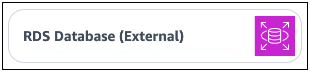
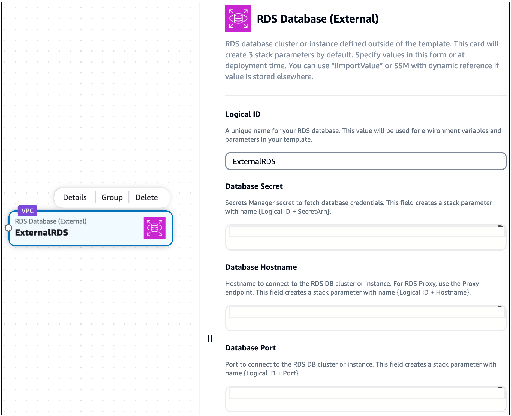
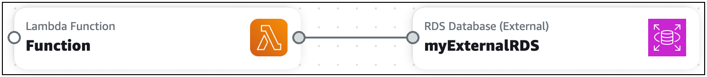

# Using Infrastructure Composer with Amazon Relational Database Service (Amazon RDS)

AWS Infrastructure Composer features an integration with Amazon Relational Database Service (Amazon RDS). Using the **RDS Database (External)**
enhanced component card in Infrastructure Composer, you can connect your application to Amazon RDS DB clusters, instances, and proxies
that are defined on another AWS CloudFormation or AWS Serverless Application Model (AWS SAM) template.

The **RDS Database (External)** enhanced component card represents Amazon RDS resources that are defined on another template. This includes:

- Amazon RDS DB cluster or instance that is defined on another template
- Amazon RDS DB proxy
  The **RDS Database (External)** enhanced component card is available from the **Resources** palette.


To use this card, drag it onto the Infrastructure Composer canvas, configure it, and connect it to other resources.

You can connect your application to the external Amazon RDS DB cluster or instance through an Lambda function.

## Requirements

To use this feature, you must meet the following requirements:

1. Your external Amazon RDS DB cluster, instance, or proxy must be using AWS Secrets Manager to manage the user
   password. To learn more, see
   [Password management with
   Amazon RDS and AWS Secrets Manager](../../../AmazonRDS/latest/UserGuide/rds-secrets-manager.md "../../../AmazonRDS/latest/UserGuide/rds-secrets-manager.md") in the _Amazon RDS User Guide_.
2. Your application in Infrastructure Composer must be a new project or must have been originally created in Infrastructure Composer.

## Procedure

### Step 1: Configure the external RDS Database card

From the **Resources** palette, drag an **RDS Database (external)** enhanced component card
onto the canvas.

Select the card and choose **Details** or double-click on the card to bring up the
**Resource properties** panel. The card's resource properties panel will appear:



You can configure the following here:

- **Logical ID** – A unique name for your external Amazon RDS DB cluster,
  instance, or proxy. This ID does not have to match the logical ID value of your external Amazon RDS DB
  resource.
- **Database secret** – An identifier for the AWS Secrets Manager secret that is associated
  with your Amazon RDS DB cluster, instance, or proxy. This field accepts the following values:
  - **Static value** – A unique identifier of the database secret, such as the secret ARN.
    The following is an example: `arn:aws:secretsmanager:us-west-2:123456789012:secret:my-path/my-secret-name-1a2b3c`.
    For more information, see [AWS Secrets Manager
    concepts](../../../secretsmanager/latest/userguide/getting-started.md "../../../secretsmanager/latest/userguide/getting-started.md") in the _AWS Secrets Manager User Guide_.
  - **Output value** – When a Secrets Manager secret is deployed to AWS CloudFormation, an output value is
    created. You can specify the output value here using the `Fn::ImportValue` intrinsic
    function. For example, `!ImportValue MySecret`.
  - **Value from the SSM Parameter Store** – You can store your secret in the SSM
    Parameter Store and specify its value using a dynamic reference. For example, `{{resolve:ssm:MySecret}}`. For more
    information, see [SSM parameters](../../../AWSCloudFormation/latest/UserGuide/dynamic-references.md#dynamic-references-ssm "../../../AWSCloudFormation/latest/UserGuide/dynamic-references.md#dynamic-references-ssm") in the
    _AWS CloudFormation User Guide_.

- **Database hostname** – The hostname that can be used to connect to your
  Amazon RDS DB cluster, instance, or proxy. This value is specified in the external template that defines your
  Amazon RDS resource. The following values are accepted:
  - **Static value** – A unique identifier of the database hostname, such as the endpoint
    address. The following is an example: `mystack-mydb-1apw1j4phylrk.cg034hpkmmjt.us-east-2.rds.amazonaws.com`.
  - **Output value** – The output value of a deployed Amazon RDS DB
    cluster, instance, or proxy. You can specify the output value using the `Fn::ImportValue`
    intrinsic function. For example, `!ImportValue myStack-myDatabase-abcd1234`.
  - **Value from the SSM Parameter Store** – You can store the database
    hostname in the SSM Parameter Store and specify its value using a dynamic reference. For example,
    `{{resolve:ssm:MyDatabase}}`.

- **Database port** – The port number that can be used to connect to your Amazon RDS
  DB cluster, instance, or proxy. This value is specified in the external template that defines your Amazon RDS
  resource. The following values are accepted:
  - **Static value** – The database port. For example, `3306`.
  - **Output value** – The output value of a deployed Amazon RDS DB
    cluster, instance, or proxy. For example, `!ImportValue myStack-MyRDSInstancePort`.
  - **Value from SSM Parameter Store** – You can store the database hostname in the SSM
    Parameter Store and specify its value using a dynamic reference. For example, `{{resolve:ssm:MyRDSInstancePort}}`.

###### Note

Only the logical ID value must be configured here. You can configure the other properties at deployment time if you
prefer.

### Step 2: Connect a Lambda Function card

From the **Resources** palette, drag a **Lambda Function** enhanced component card onto the
canvas.

Connect the left port of the **Lambda Function** card to the right port of the **RDS Database
(external)** card.



Infrastructure Composer will provision your template to facilitate this connection.

## What Infrastructure Composer does to create your connection

When you complete the procedure listed above, Infrastructure Composer performs specific actions to connect your Lambda function to your database.

### When specifying the external Amazon RDS DB cluster,

instance, or proxy

When you drag an **RDS Database (external)** card onto the canvas, Infrastructure Composer updates the `Metadata` and
`Parameters` sections of your template as needed. The following is an example:

```
Metadata:
  AWS::Composer::ExternalResources:
    ExternalRDS:
      Type: externalRDS
      Settings:
        Port: !Ref ExternalRDSPort
        Hostname: !Ref ExternalRDSHostname
        SecretArn: !Ref ExternalRDSSecretArn
Parameters:
  ExternalRDSPort:
    Type: Number
  ExternalRDSHostname:
    Type: String
  ExternalRDSSecretArn:
    Type: String
```

[Metadata](../../../AWSCloudFormation/latest/UserGuide/metadata-section-structure.md "../../../AWSCloudFormation/latest/UserGuide/metadata-section-structure.md")
is an AWS CloudFormation template section that is used to store details about your template. Metadata that is specific to Infrastructure Composer is
stored under the `AWS::Composer::ExternalResources` metadata key. Here, Infrastructure Composer stores the values that you
specify for your Amazon RDS DB cluster, instance, or proxy.

The [Parameters](../../../AWSCloudFormation/latest/UserGuide/parameters-section-structure.md "../../../AWSCloudFormation/latest/UserGuide/parameters-section-structure.md") section of an AWS CloudFormation template is used to store custom values that can be inserted throughout your
template at deployment. Depending on the type of values that you provide, Infrastructure Composer may store values here for your Amazon RDS
DB cluster, instance, or proxy and specify them throughout your template.

String values in the `Metadata` and `Parameters` section use the logical ID value that you specify on your
**RDS Database (external)** card. If you update the logical ID, the string values will change.

### When connecting the Lambda function to your database

When you connect a **Lambda Function** card to the **RDS Database (external)** card, Infrastructure Composer
provisions environment variables and AWS Identity and Access Management (IAM) policies. The following is an example:

```
Resources:
  Function:
    Type: AWS::Serverless::Function
    Properties:
      ...
      Environment:
        Variables:
          EXTERNALRDS_PORT: !Ref ExternalRDSPort
          EXTERNALRDS_HOSTNAME: !Ref ExternalRDSHostname
          EXTERNALRDS_SECRETARN: !Ref ExternalRDSSecretArn
      Policies:
        - AWSSecretsManagerGetSecretValuePolicy:
            SecretArn: !Ref ExternalRDSSecretArn
```

[Environment](../../../serverless-application-model/latest/developerguide/sam-resource-function.md#sam-function-environment "../../../serverless-application-model/latest/developerguide/sam-resource-function.md#sam-function-environment")
variables are variables that can be used by your function at runtime. To learn more, see [Using Lambda environment variables](../../../lambda/latest/dg/configuration-envvars.md "../../../lambda/latest/dg/configuration-envvars.md") in the
_AWS Lambda Developer Guide_.

[Policies](../../../serverless-application-model/latest/developerguide/sam-resource-function.md#sam-function-policies "../../../serverless-application-model/latest/developerguide/sam-resource-function.md#sam-function-policies")
provision permissions for your function. Here, Infrastructure Composer creates a policy to allow read access from your function to Secrets Manager to
obtain your password for access to the Amazon RDS DB cluster, instance, or proxy.
