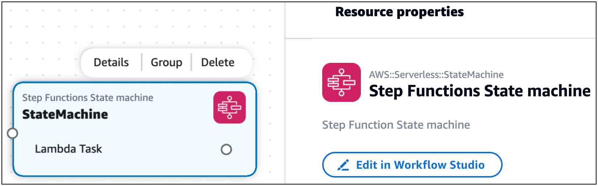
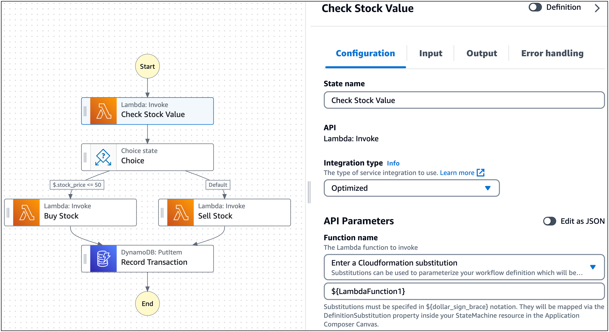
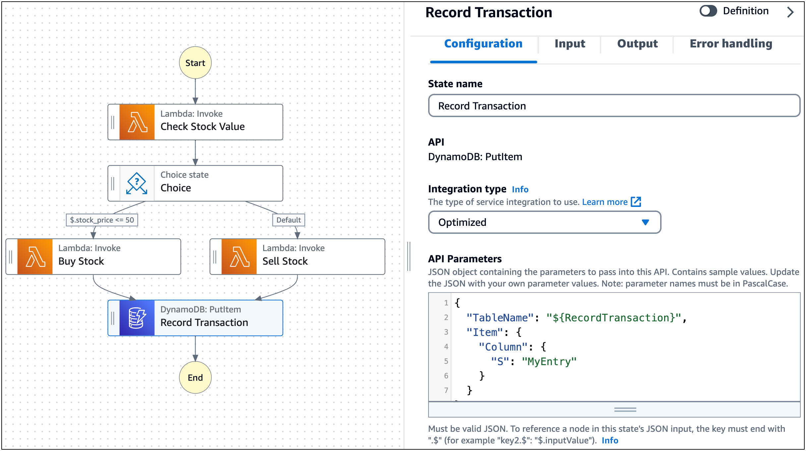
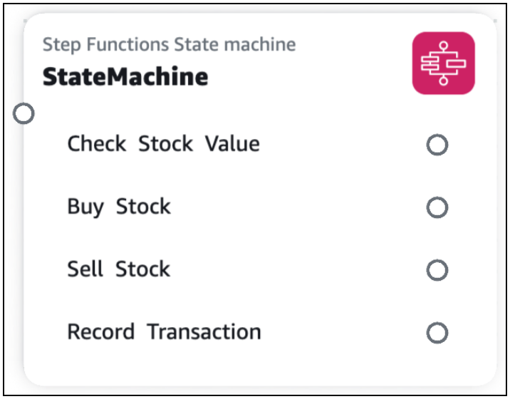
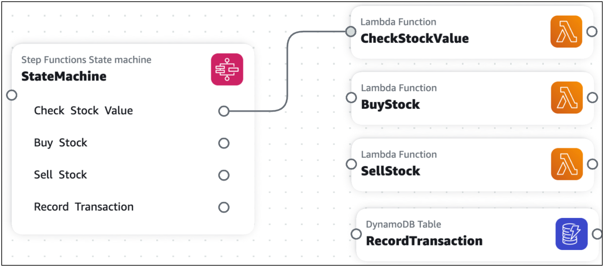

# Using AWS Infrastructure Composer with AWS Step Functions

AWS Infrastructure Composer features an integration with [AWS Step Functions Workflow Studio](../../../step-functions/latest/dg/workflow-studio.md "../../../step-functions/latest/dg/workflow-studio.md").
Use Infrastructure Composer to do the following:

- Launch Step Functions Workflow Studio directly within Infrastructure Composer.
- Create and manage new workflows or import existing workflows into Infrastructure Composer.
- Integrate your workflows with other AWS resources using the Infrastructure Composer canvas.
  The following image is of a Step Functions State machine card


With Step Functions Workflow Studio in Infrastructure Composer, you can use the benefits of two powerful visual designers in a
single place. As you design your workflow and application, Infrastructure Composer creates your infrastructure as code (IaC) to guide you
towards deployment.

###### Topics

- [IAM policies](#using-composer-services-sf-use-iam "#using-composer-services-sf-use-iam")
- [Getting started with Step Functions Workflow Studio in Infrastructure Composer](#using-composer-services-sf-gs "#using-composer-services-sf-gs")
- [Using Step Functions Workflow Studio in Infrastructure Composer](#using-composer-services-sf-use "#using-composer-services-sf-use")
- [Learn more](#using-composer-services-sf-learn "#using-composer-services-sf-learn")

## IAM policies

When you connect tasks from your workflow to resources, Infrastructure Composer automatically creates the AWS Identity and Access Management (IAM) policies required to authorize the interaction between your resources.
The following is an example:

```
Transform: AWS::Serverless-2016-10-31
Resources:
  StockTradingStateMachine:
    Type: AWS::Serverless::StateMachine
    Properties:
      ...
      Policies:
        - LambdaInvokePolicy:
            FunctionName: !Ref CheckStockValue
      ...
  CheckStockValue:
    Type: AWS::Serverless::Function
    ...
```

If necessary, you can add more IAM policies to your template.

## Getting started with Step Functions Workflow Studio in Infrastructure Composer

To get started, you can create new workflows or import existing workflows.

### To create a new workflow

1. From the **Resources** palette, drag a **Step Functions State machine** enhanced
   component card onto the canvas.


When you drag a **Step Functions State machine** card onto the canvas, Infrastructure Composer creates the following:

    * An `AWS::Serverless::StateMachine` resource that defines your state machine. By default, Infrastructure Composer creates a
     standard workflow. To create an express workflow, change the `Type` value in your template from
     `STANDARD` to `EXPRESS`.
    * An `AWS::Logs::LogGroup` resource that defines an Amazon CloudWatch log group for your
     state machine.

2. Open the card’s **Resource properties** panel and select **Edit in Workflow Studio** to open Workflow Studio within
   Infrastructure Composer.

Step Functions Workflow Studio opens in **Design** mode. To learn more, see [Design mode](../../../step-functions/latest/dg/workflow-studio-components.md#wfs-interface-design-mode "../../../step-functions/latest/dg/workflow-studio-components.md#wfs-interface-design-mode") in the _AWS Step Functions Developer Guide_.

###### Note

You can modify Infrastructure Composer to save your state machine definition in an external file. To learn more, see
[Working with external files](#using-composer-services-sf-use-external "#using-composer-services-sf-use-external"). 3. Create your workflow and choose **Save**. To exit Workflow Studio, choose
**Return to Infrastructure Composer**.

Infrastructure Composer defines your workflow using the `Defintion` property of the `AWS::Serverless::StateMachine` resource. 4. You can modify your workflow by doing any of the following:

    * Open Workflow Studio again and modify your workflow.
    * For Infrastructure Composer from the console, you can open the **Template** view of your application and modify
     your template. If using **local sync**, you can modify your workflow in your local IDE.
     Infrastructure Composer will detect your changes and update your workflow in Infrastructure Composer.
    * For Infrastructure Composer from the Toolkit for VS Code, you can directly modify your template. Infrastructure Composer will detect your changes and
     update your workflow in Infrastructure Composer.

### To import existing workflows

You can import workflows from applications that are defined using AWS Serverless Application Model (AWS SAM) templates. Use any state machine defined with the `AWS::Serverless::StateMachine`
resource type, and it will visualize as a **Step Functions State machine** enhanced component card that you can use to launch Workflow Studio.

The `AWS::Serverless::StateMachine` resource can define workflows using either of the following properties:

- `Definition` – The workflow is defined within the AWS SAM template as an object.
- `DefinitionUri` – The workflow is defined on an external file using the [Amazon States Language](../../../step-functions/latest/dg/concepts-amazon-states-language.md "../../../step-functions/latest/dg/concepts-amazon-states-language.md"). The file’s local path is then specified with this property.

#### Definition property

**Infrastructure Composer from the console**

For workflows defined using the `Definition` property, you can import a single template or the entire
project.

- **Template** – For instructions on importing a template, see [Import an existing project template in the Infrastructure Composer console](using-composer-project-import-template.md "using-composer-project-import-template.md"). To save changes that you make within Infrastructure Composer, you must export your template.
- **Project** – When you import a project, you must activate **local sync**. Changes that you make are
  automatically saved to your local machine. For instructions on importing a project, see [Import an existing project folder in the Infrastructure Composer console](using-composer-project-import-folder.md "using-composer-project-import-folder.md").

**Infrastructure Composer from the Toolkit for VS Code**

For workflows defined using the `Definition` property, you can open Infrastructure Composer from your template. For
instructions, see [Access Infrastructure Composer from the AWS Toolkit for Visual Studio Code](setting-up-composer-access-ide.md "setting-up-composer-access-ide.md").

#### DefinitionUri property

**Infrastructure Composer from the console**

For workflows defined using the `DefinitionUri` property, you must import the project and activate **local sync**. For instructions
on importing a project, see [Import an existing project folder in the Infrastructure Composer console](using-composer-project-import-folder.md "using-composer-project-import-folder.md").

**Infrastructure Composer from the Toolkit for VS Code**

For workflows defined using the `DefinitionUri` property, you can open Infrastructure Composer from your template. For
instructions, see [Access Infrastructure Composer from the AWS Toolkit for Visual Studio Code](setting-up-composer-access-ide.md "setting-up-composer-access-ide.md").

## Using Step Functions Workflow Studio in Infrastructure Composer

### Build workflows

Infrastructure Composer uses definition substitutions to map workflow tasks to resources in your application. To learn more about
definition substitutions, see `DefinitionSubstitutions` in the _AWS Serverless Application Model Developer Guide_.

When you create tasks in Workflow Studio, specify a definition substitution for each task. You can
then connect tasks to resources on the Infrastructure Composer canvas.

###### To specify a definition substitution in Workflow Studio

1. Open the **Configuration** tab of the task and locate the
   **API Parameters** field.

 2. If the **API Parameters** field has a drop down option, choose
**Enter a CloudFormation substitution**. Then, provide a unique name.

For tasks that connect to the same resource, specify the same definition substitution for each task. To use
an existing definition substitution, choose **Select a CloudFormation substitution** and select
the substitution to use. 3. If the **API Parameters** field contains a JSON object, modify the entry that specifies the
resource name to use a definition substitution. In the following example, we change `"MyDynamoDBTable"`
to `"${RecordTransaction}"`.

 4. Select **Save** and **Return to Infrastructure Composer**.

The tasks from your workflow will visualize on the **Step Functions State machine** card.



### Connect resources to workflow tasks

You can create connections in Infrastructure Composer between supported workflow tasks and supported Infrastructure Composer cards.

- **Supported workflow tasks** – Tasks for AWS services that are optimized for
  Step Functions. To learn more, see [Optimized integrations for Step Functions](../../../step-functions/latest/dg/connect-supported-services.md "../../../step-functions/latest/dg/connect-supported-services.md") in the _AWS Step Functions Developer Guide_.
- **Supported Infrastructure Composer cards** – Enhanced component cards are supported. To learn more
  about cards in Infrastructure Composer, see [Configure and modify cards in Infrastructure Composer](using-composer-cards.md "using-composer-cards.md").

When creating a connection, the AWS service of the task and card must match. For example, you can connect a
workflow task that invokes a Lambda function to a **Lambda Function** enhanced component card.

To create a connection, click and drag the port of a task to the left port of an enhanced component card.



Infrastructure Composer will automatically update your `DefinitionSubstitution` value to define your connection. The
following is an example:

```
Transform: AWS::Serverless-2016-10-31
Resources:
  StateMachine:
    Type: AWS::Serverless::StateMachine
    Properties:
      Definition:
        StartAt: Check Stock Value
        States:
          Check Stock Value:
            Type: Task
            Resource: arn:aws:states:::lambda:invoke
            Parameters:
              Payload.$: $
              FunctionName: ${CheckStockValue}
            Next: Choice
          ...
      DefinitionSubstitutions:
        CheckStockValue: !GetAtt CheckStockValue.Arn
        ...
  CheckStockValue:
    Type: AWS::Serverless::Function
    Properties:
      ...
```

### Working with external files

When you create a workflow from the **Step Functions State machine** card, Infrastructure Composer saves your
state machine definition within your template using the `Definition` property. You can configure
Infrastructure Composer to save your state machine definition on an external file.

###### Note

To use this feature with Infrastructure Composer from the AWS Management Console, you must have **local sync**
activated. For more information, see [Locally sync and save your
project in the Infrastructure Composer console](using-composer-project-local-sync.md "using-composer-project-local-sync.md").

###### To save your state machine definition on an external file

1. Open the **Resource properties** panel of your **Step Functions State
   machine** card.
2. Select the **Use external file for state machine definition** option.
3. Provide a relative path and name for your state machine definition file.
4. Choose **Save**.

Infrastructure Composer will do the following:

1. Move your state machine definition from the `Definition` field to your external file.
2. Save your state machine definition in an external file using the Amazon States Language.
3. Modify your template to reference the external file using the `DefinitionUri` field.

## Learn more

To learn more about Step Functions in Infrastructure Composer, see the following:

- [Using Workflow Studio in Infrastructure Composer](../../../step-functions/latest/dg/use-wfs-in-app-composer.md "../../../step-functions/latest/dg/use-wfs-in-app-composer.md") in the
  _AWS Step Functions Developer Guide_.
- [DefinitionSubstitutions in AWS SAM templates](../../../step-functions/latest/dg/concepts-sam-sfn.md#sam-definition-substitution-eg "../../../step-functions/latest/dg/concepts-sam-sfn.md#sam-definition-substitution-eg") in
  the _AWS Step Functions Developer Guide_.
