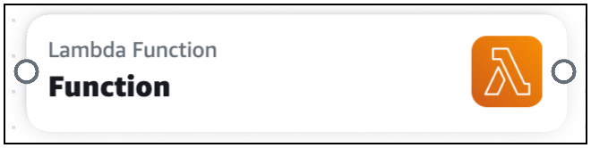
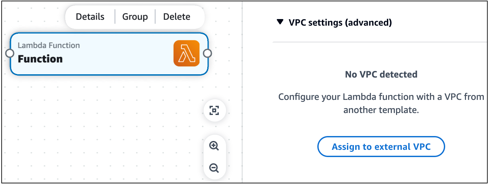
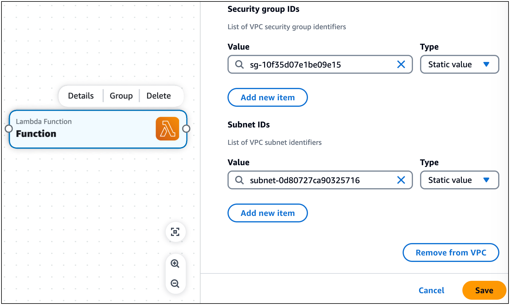

# Configure a Lambda function and a VPC defined in another template with Infrastructure Composer

In this example, we configure a Lambda function in Infrastructure Composer with a VPC defined on another template.

We start by dragging a **Lambda Function** enhanced component card onto the canvas.


Next, we open the card’s **Resource properties** panel and expand the **VPC settings (advanced)** dropdown section.


Next, we select **Assign to external VPC** to begin configuring a VPC from an external template.

In this example, we reference a security group ID and subnet ID. These values are created when the template defining the VPC is deployed. We choose the
**Static value** type and input the value of our IDs. We select **Save** when done.


Now that our Lambda function is configured with our VPC, the VPC tag is displayed on our card.


Infrastructure Composer has created the infrastructure code to configure our Lambda function with the security group and subnet of the external VPC.

```
Transform: AWS::Serverless-2016-10-31
Resources:
  Function:
    Type: AWS::Serverless::Function
    Properties:
      Description: !Sub
        - Stack ${AWS::StackName} Function ${ResourceName}
        - ResourceName: Function
      CodeUri: src/Function
      Handler: index.handler
      Runtime: nodejs18.x
      MemorySize: 3008
      Timeout: 30
      Tracing: Active
      VpcConfig:
        SecurityGroupIds:
          - sg-10f35d07e1be09e15
        SubnetIds:
          - subnet-0d80727ca90325716
  FunctionLogGroup:
    Type: AWS::Logs::LogGroup
    DeletionPolicy: Retain
    Properties:
      LogGroupName: !Sub /aws/lambda/${Function}
```
