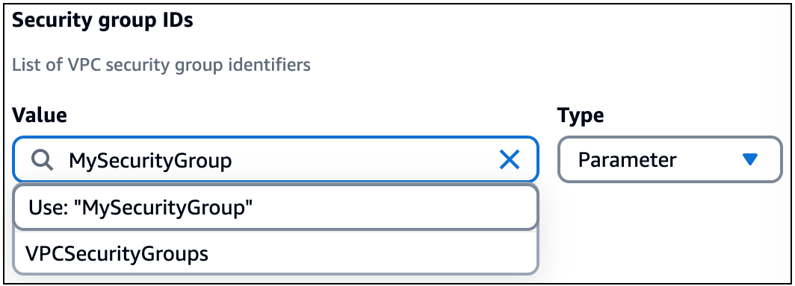

# Adding new parameters to imported templates with Infrastructure Composer

When you import an existing template with parameters defined, you can also create new parameters. Instead of selecting an existing parameter from the dropdown list, provide a
new type and value. The following is an example that creates a new parameter named `MySecurityGroup`:


For all new values that you provide in the **Resource properties** panel for the Lambda function, Infrastructure Composer defines them in a list under the
`SecurityGroupIds` or `SubnetIds` properties of a Lambda function. The following is an example:

```
...
Resources:
  MyFunction:
    Type: AWS::Serverless::Function
    Properties:
      ...
      VpcConfig:
        SecurityGroupIds:
          - sg-94b3a1f6
        SubnetIds:
          - !Ref SubnetParameter
          - !Ref VPCSubnet
```

If you want to reference the logical ID of a list parameter type from an external template, we recommend that you use the **Template** view and directly
modify your template. The logical ID of a list parameter type should always be provided as a single value and as the only value.

```
...
Parameters:
  VPCSecurityGroups:
    Description: Security group IDs generated by Infrastructure Composer
    Type: List<AWS::EC2::SecurityGroup::Id>
  VPCSubnets:
    Description: Subnet IDs generated by Infrastructure Composer
    Type: List<AWS::EC2::Subnet::Id>
Resources:
  ...
  MyFunction:
    Type: AWS::Serverless::Function
    Properties:
      ...
      VpcConfig:
        SecurityGroupIds: !Ref VPCSecurityGroups # Valid syntax
        SubnetIds:
          - !Ref VPCSubnets # Not valid syntax
```
