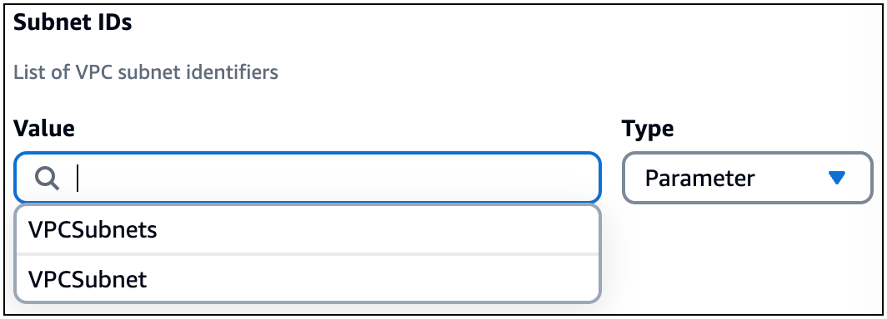
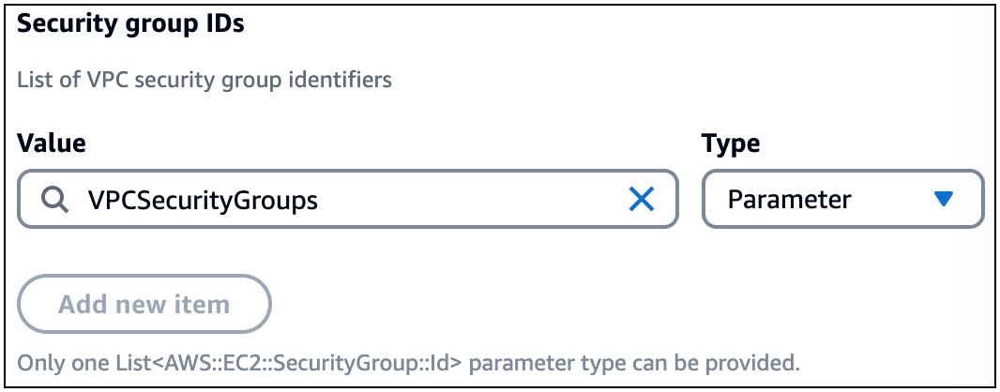

# Parameters in imported templates for an external VPC with Infrastructure Composer

When you import an existing template with parameters defined for the security groups and subnets of an external VPC, Infrastructure Composer provides a dropdown list to select your
parameters from.

The following is an example of the `Parameters` section of an imported template:

```
...
Parameters:
  VPCSecurityGroups:
    Description: Security group IDs generated by Infrastructure Composer
    Type: List<AWS::EC2::SecurityGroup::Id>
  VPCSubnets:
    Description: Subnet IDs generated by Infrastructure Composer
    Type: List<AWS::EC2::Subnet::Id>
  VPCSubnet:
    Description: Subnet Id generated by Infrastructure Composer
    Type: AWS::EC2::Subnet::Id
...
```

When configuring an external VPC for a new Lambda function on the canvas, these parameters will be available from a dropdown list. The following is an example:



## Limitations when importing list parameter types

Normally, you can specify multiple security group and subnet identifiers for each Lambda function. If your existing template contains list parameter types, such as
`List<AWS::EC2::SecurityGroup::Id>` or `List<AWS::EC2::Subnet::Id>`, you can only specify one identifier.

For more information on parameter lists type, see [Supported AWS-specific parameter types](../../../AWSCloudFormation/latest/UserGuide/parameters-section-structure.md#aws-specific-parameter-types "../../../AWSCloudFormation/latest/UserGuide/parameters-section-structure.md#aws-specific-parameter-types") in the
_AWS CloudFormation User Guide_.

The following is an example of a template that defines `VPCSecurityGroups` as a list parameter type:

```
...
Parameters:
  VPCSecurityGroups:
    Description: Security group IDs generated by Infrastructure Composer
    Type: List<AWS::EC2::SecurityGroup::Id>
...
```

In Infrastructure Composer, if you select the `VPCSecurityGroups` value as a security group identifier for a Lambda function, you will see the following message:



This limitation occurs because the `SecurityGroupIds` and `SubnetIds` properties of an `AWS::Lambda::Function VpcConfig` object both accept
only a list of string values. Since a single list parameter type contains a list of strings, it can be the only object provided when specified.

For list parameter types, the following is an example of how they are defined in the template when configured with a Lambda function:

```
...
Parameters:
  VPCSecurityGroups:
    Description: Security group IDs generated by Infrastructure Composer
    Type: List<AWS::EC2::SecurityGroup::Id>
  VPCSubnets:
    Description: Subnet IDs generated by Infrastructure Composer
    Type: List<AWS::EC2::Subnet::Id>
Resources:
  ...
  MyFunction:
    Type: AWS::Serverless::Function
    Properties:
      ...
      VpcConfig:
        SecurityGroupIds: !Ref VPCSecurityGroups
        SubnetIds: !Ref VPCSubnets
```
