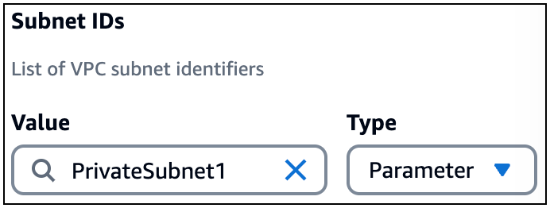
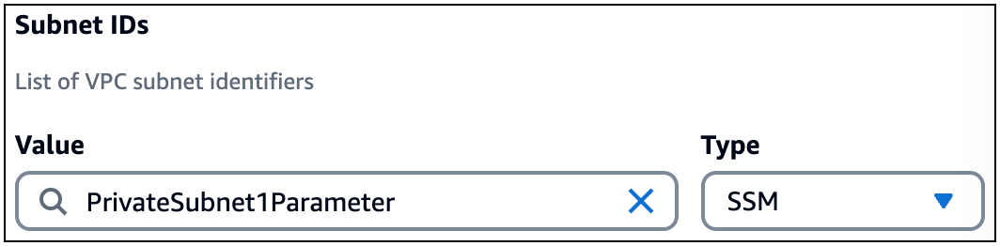
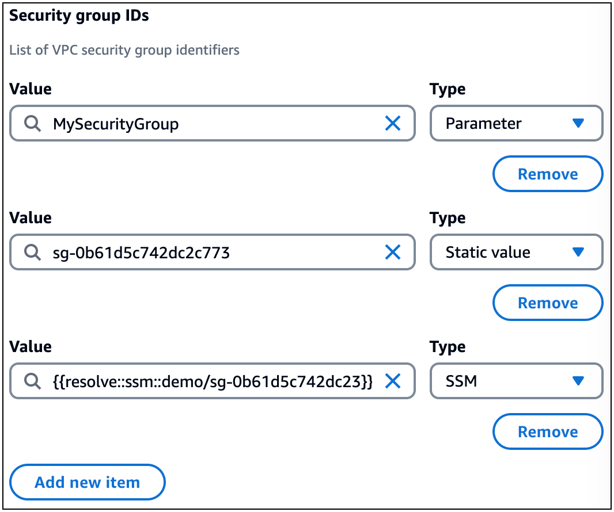

# Identify Infrastructure Composer resources and related information in a VPC

To integrate Infrastructure Composer with Amazon VPC, you must first identify resources in a VPC and the information needed to complete an integration.
This also includes configuration information related to security groups, subnet identifiers, parameter types, SSM types, static value types.

Infrastructure Composer visualizes resources in a VPC using a **VPC** tag. This tag is applied to cards on the canvas. The following is an example of a
Lambda function with a VPC tag:


VPC tags are applied to cards on the canvas when you do the following:

- Configure a Lambda function with a VPC in Infrastructure Composer.
- Import a template that contains resources configured with a VPC.

## Security group and subnet identifiers

A Lambda function can be configured with multiple security groups and subnets. To configure a security group or subnet for a
Lambda function, provide a value and type.

- **Value** – An identifier for the security group or subnet. Accepted values will vary
  based on the **type**.
- **Type** – The following types of values are allowed:
  - Parameter name
  - AWS Systems Manager (SSM) Parameter Store
  - Static value

## Parameter type

The `Parameters` section of an AWS CloudFormation template can be used to store resource information across multiple
templates. For more information on parameters, see [Parameters](../../../AWSCloudFormation/latest/UserGuide/parameters-section-structure.md "../../../AWSCloudFormation/latest/UserGuide/parameters-section-structure.md") in the
_AWS CloudFormation User Guide_.

For the **Parameter** type, you can provide a parameter name. In the following example, we provide a
`PrivateSubnet1` parameter name value:



When you provide a parameter name, Infrastructure Composer defines it in the `Parameters` section of your template. Then,
Infrastructure Composer references the parameter in your Lambda function resource. The following is an example:

```
...
Resources:
  Function:
    Type: AWS::Serverless::Function
    Properties:
      ...
      VpcConfig:
        SubnetIds:
          - !Ref PrivateSubnet1
Parameters:
  PrivateSubnet1:
    Type: AWS::EC2::Subnet::Id
    Description: Parameter is generated by Infrastructure Composer
```

## SSM type

The SSM Parameter Store provides a secure, hierarchical storage for configuration data management and secrets management.
For more information, see [AWS Systems Manager Parameter Store](../../../systems-manager/latest/userguide/systems-manager-parameter-store.md "../../../systems-manager/latest/userguide/systems-manager-parameter-store.md") in the _AWS Systems Manager User Guide_.

For the **SSM** type, you can provide the following values:

- Dynamic reference to a value from the SSM Parameter Store.
- Logical ID of an `AWS::SSM::Parameter` resource defined in your template.

### Dynamic reference

You can reference a value from the SSM Parameter Store using a dynamic reference in the following format: `{{resolve:ssm:reference-key}}`. For more information,
see [SSM parameters](../../../AWSCloudFormation/latest/UserGuide/dynamic-references.md#dynamic-references-ssm "../../../AWSCloudFormation/latest/UserGuide/dynamic-references.md#dynamic-references-ssm") in the
_AWS CloudFormation User Guide_.

Infrastructure Composer creates the infrastructure code to configure your Lambda function with the value from the SSM Parameter Store. The following is an example:

```
...
Resources:
  Function:
    Type: AWS::Serverless::Function
    Properties:
      ...
      VpcConfig:
        SecurityGroupIds:
          - '{{resolve:ssm:demo-app/sg-0b61d5c742dc2c773}}'
  ...
```

### Logical ID

You can reference an `AWS::SSM::Parameter` resource in the same template by logical ID.

The following is an example of an `AWS::SSM::Parameter` resource named `PrivateSubnet1Parameter` that stores the subnet ID for
`PrivateSubnet1`:

```
...
Resources:
  PrivateSubnet1Parameter:
    Type: AWS::SSM::Parameter
    Properties:
      Name: /MyApp/VPC/SubnetIds
      Description: Subnet ID for PrivateSubnet1
      Type: String
      Value: subnet-04df123445678a036
```

The following is an example of this resource value being provided by logical ID for the Lambda function:



Infrastructure Composer creates the infrastructure code to configure your Lambda function with the SSM parameter:

```
...
Resources:
  Function:
    Type: AWS::Serverless::Function
    Properties:
      ...
      VpcConfig:
        SubnetIds:
          - !Ref PrivateSubnet1Parameter
  ...
  PrivateSubnet1Parameter:
    Type: AWS::SSM::Parameter
    Properties:
      ...
```

## Static value type

When a security group or subnet is deployed to CloudFormation, an ID value is created. You can provide this ID as a static value.

For the **static value** type, the following are valid values:

- For security groups, provide the `GroupId`. For more information, see [Return values](../../../AWSCloudFormation/latest/UserGuide/aws-properties-ec2-security-group.md#aws-properties-ec2-security-group-return-values "../../../AWSCloudFormation/latest/UserGuide/aws-properties-ec2-security-group.md#aws-properties-ec2-security-group-return-values") in the
  _AWS CloudFormation User Guide_. The following is an example: `sg-0b61d5c742dc2c773`.
- For subnets, provide the `SubnetId`. For more information, see [Return values](../../../AWSCloudFormation/latest/UserGuide/aws-resource-ec2-subnet.md#aws-resource-ec2-subnet-return-values "../../../AWSCloudFormation/latest/UserGuide/aws-resource-ec2-subnet.md#aws-resource-ec2-subnet-return-values") in the _AWS CloudFormation User Guide_. The
  following is an example: `subnet-01234567890abcdef`.

Infrastructure Composer creates the infrastructure code to configure your Lambda function with the static value. The following is an example:

```
...
Resources:
  Function:
    Type: AWS::Serverless::Function
    Properties:
      ...
      VpcConfig:
        SecurityGroupIds:
          - subnet-01234567890abcdef
        SubnetIds:
          - sg-0b61d5c742dc2c773
  ...
```

## Using multiple types

For security groups and subnets, you can use multiple types together. The following is an example that configures three security groups for a Lambda function by providing values
of different types:



Infrastructure Composer references all three values under the `SecurityGroupIds` property:

```
...
Resources:
  Function:
    Type: AWS::Serverless::Function
    Properties:
      ...
      VpcConfig:
        SecurityGroupIds:
          - !Ref MySecurityGroup
          - sg-0b61d5c742dc2c773
          - '{{resolve::ssm::demo/sg-0b61d5c742dc23}}'
      ...
Parameters:
  MySecurityGroup:
    Type: AWS::EC2::SecurityGroup::Id
    Description: Parameter is generated by Infrastructure Composer
```
