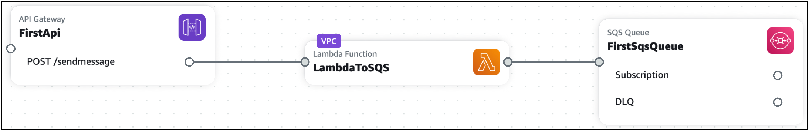

# Integrate Infrastructure Composer with Amazon Virtual Private Cloud (Amazon VPC)

AWS Infrastructure Composer features an integration with the Amazon Virtual Private Cloud (Amazon VPC) service. Using Infrastructure Composer, you can do the following:

- Identify the resources on your canvas that are in a VPC through a visual **VPC** tag.
- Configure AWS Lambda functions with VPCs from an external template.
  The following image shows is an example of an application with a Lambda function configured with a VPC.

To learn more about Amazon VPC, see [What is Amazon VPC?](../../../vpc/latest/userguide/what-is-amazon-vpc.md "../../../vpc/latest/userguide/what-is-amazon-vpc.md")
in the _Amazon VPC User Guide_.

###### Topics

- [Identify Infrastructure Composer resources and related information in a VPC](using-composer-services-vpc-tag.md "using-composer-services-vpc-tag.md")
- [Configure Lambda functions with external VPCs in Infrastructure Composer](using-composer-services-vpc-configure.md "using-composer-services-vpc-configure.md")
- [Parameters in imported templates for an external VPC with Infrastructure Composer](using-composer-services-vpc-import.md "using-composer-services-vpc-import.md")
- [Adding new parameters to imported templates with Infrastructure Composer](using-composer-services-vpc-import-add.md "using-composer-services-vpc-import-add.md")
- [Configure a Lambda function and a VPC defined in another template with Infrastructure Composer](using-composer-services-vpc-examples.md "using-composer-services-vpc-examples.md")
