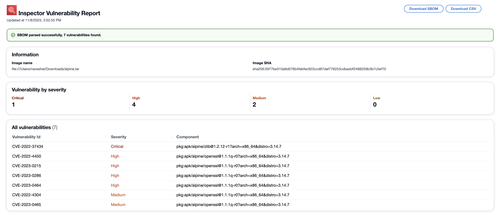

# Using the Amazon Inspector TeamCity plugin

The Amazon Inspector TeamCity plugin leverages the Amazon Inspector SBOM Generator binary and Amazon Inspector Scan API to produce detailed reports at the end of your build, so you can investigate and remediate risk before deployment.
With the Amazon Inspector TeamCity plugin, you can add Amazon Inspector vulnerability scans to your TeamCity pipeline.
Amazon Inspector vulnerability scans can be configured to pass or fail pipeline executions based on the number and severity of vulnerabilities detected.
You can view the latest version of the Amazon Inspector TeamCity plugin in the TeamCity marketplace at [https://plugins.jetbrains.com/plugin/23236-amazon-inspector-scanner](https://plugins.jetbrains.com/plugin/23236-amazon-inspector-scanner "https://plugins.jetbrains.com/plugin/23236-amazon-inspector-scanner").
For information about how to integrate Amazon Inspector Scan into your CI/CD pipeline, see [Integrating Amazon Inspector scans into your CI/CD pipeline](scanning-cicd.md "scanning-cicd.md").
For a list of operating systems and programming languages that Amazon Inspector supports, see [Supported operating systems and programming languages](supported.md "supported.md").
The following steps describe how to set up the Amazon Inspector TeamCity plugin.

1.  **Set up an AWS account.**
    - Configure an AWS account with an IAM role that allows access to
      the Amazon Inspector Scan API. For instructions, see [Setting up an AWS account to use the Amazon Inspector CI/CD integration](configure-cicd-account.md "configure-cicd-account.md").

2.  **Install the Amazon Inspector TeamCity
    plugin.**
    1. From your dashboard, go to **Administration** >
       **Plugins**.
    2. Search for **Amazon Inspector Scans**.
    3. Install the plugin.

3.  **Install the Amazon Inspector SBOM Generator.**
    - Install the Amazon Inspector SBOM Generator binary in your Teamcity server directory. For
      instructions, see [Installing Sbomgen](sbom-generator.md#install-sbomgen "sbom-generator.md#install-sbomgen").

4.  **Add an Amazon Inspector Scan build step to your project.**
    1. On the configuration page, scroll down to **Build Steps**, choose **Add build step**, and then select **Amazon Inspector Scan**.
    2. Configure the Amazon Inspector Scan build step by filling in following details:
       - Add a **Step name**.
       - Choose between two Amazon Inspector SBOM Generator installation methods: **Automatic** or **Manual**.
         - **Automatic** downloads the most recent version of Amazon Inspector SBOM Generator based on your system and CPU architecture.
         - **Manual** requires that you provide a complete path to a previously downloaded version of Amazon Inspector SBOM Generator.

       For more informaiton, see [Installing Amazon Inspector SBOM Generator (Sbomgen)](sbom-generator.md#install-sbomgen "sbom-generator.md#install-sbomgen") in [Amazon Inspector SBOM Generator](sbom-generator.md "sbom-generator.md").
       - Input your **Image Id**. Your image can be
         local, remote, or archived. Image names should follow the
         Docker naming convention. If analyzing an
         exported image, provide the path to the expected tar file. See
         the following example Image Id paths:
         - For local or remote containers:
           `NAME[:TAG|@DIGEST]`
         - For a tar file: `/path/to/image.tar`

       - For **IAM Role** enter the ARN for the role
         you configured in step 1.
       - Select an **AWS Region** to send the scan
         request through.
       - (Optional) For **Docker Authentication** enter your **Docker Username** and **Docker Password**.
         Do this only if your container image is in a private repository.
       - (Optional) For **AWS Authentication**, enter your AWS access key ID and AWS secret key.
         Do this only if you want to authenticate based on AWS credentials.
       - (Optional) Specify the **Vulnerability
         thresholds** per severity. If the number you
         specify is exceeded during a scan the image build will fail. If
         the values are all `0` the build will succeed
         regardless of the number of vulnerabilities found.

    3. Select **Save**.

5.  **View your Amazon Inspector vulnerability report.**

        1. Complete a new build of your project.
        2. When the build completes select an output format from the results.
         When you select HTML you have the option to download a JSON SBOM or CSV
         version of the report. The following is an example of an HTML
         report:

    
