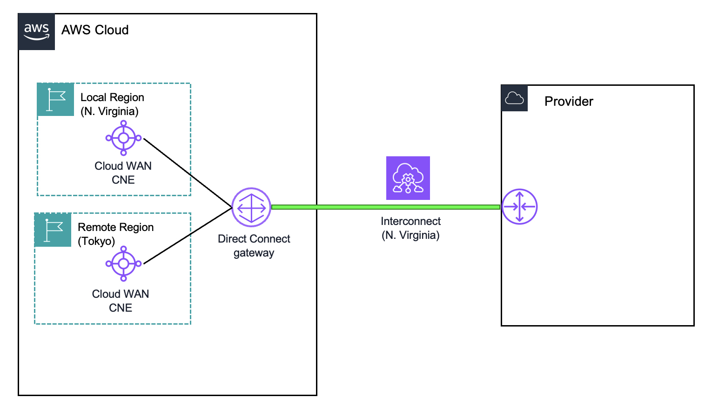
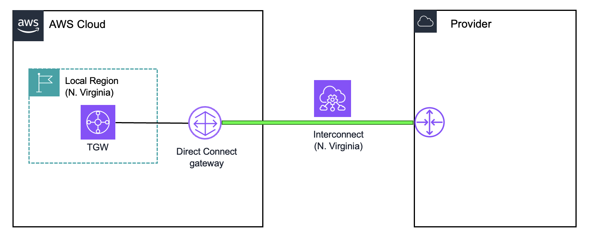
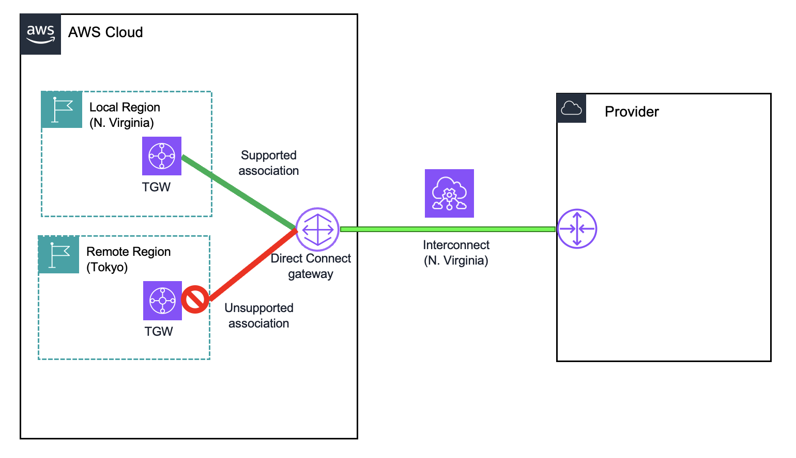
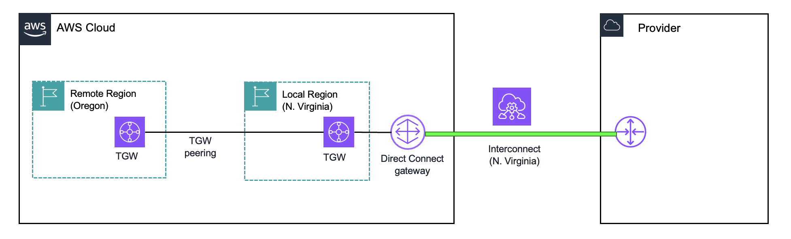

# Pricing for AWS Interconnect

###### Note

This page describes pricing for the AWS side of your Interconnect only. The service provider on the other side of your Interconnect determines their pricing independently of AWS.

###### Important

AWS pricing is subject to change. For the most current pricing information, see the pricing page for each service on [aws.amazon.com/pricing](https://aws.amazon.com/pricing/ "https://aws.amazon.com/pricing/"). The pricing examples in this documentation are for illustration purposes only and may not reflect current pricing.

## How AWS Interconnect Pricing Works

AWS Interconnect uses a single-fee pricing model based on two customer inputs: the selected bandwidth, and the geographic scope of the connectivity. Interconnect charges are computed on an hourly basis and there are no separate charges for the data transferred.

When you create an Interconnect, you configure the following options which are used to determine the hourly price:

1. An AWS Region. This determines the physical devices where your Interconnect will be provisioned and it will be considered your new Interconnect’s local Region. For example, if you select the us-east-1 Region (N. Virginia), your Interconnect will be provisioned on the physical infrastructure closest to that Region.
2. The paired Region on the other cloud service provider in the case of AWS Interconnect - multicloud, or a specific metro area where your third-party provider connects to AWS, in the case of AWS Interconnect - last mile.
3. The required bandwidth, from the supported options for the specific Region and Provider combination. Supported speeds can vary across providers and regions (for example, 10 Gbps to Google Cloud).
4. The Direct Connect gateway (DXGW) that will serve as the attach point for your Interconnect on the AWS side.

###### Note

A Direct Connect gateway is a logical object. It is used as a global routing instance that distributes your routes between Regional endpoints and edge network devices. It operates outside of the data traffic path. It is globally distributed to all the edge network devices where your Interconnects and Direct Connect Virtual interfaces are provisioned. To learn more, review the AWS Direct Connect documentation.

For example, a 1 Gbps Interconnect associated only to a local-Region TGW costs less than one provisioned in Tokyo and configured to reach a Cloud WAN Core Network Edge in AWS us-east-1 (N. Virginia).

To review the price for a specific path, use the AWS Interconnect Pricing tool. Select the AWS Region where your workload resides and the Region where your Interconnect was provisioned to see that specific path’s Tier.

## Tiered pricing and provisioned capacity

Interconnect is priced using a Tier structure. Each specific AWS Region to Interconnect path has been assigned a Tier and each Tier has a unique price for every offered bandwidth. The following table illustrates how the Tiers increase as the global scope of the connectivity increases. It is provided for guidance purposes only and should not be considered as strict categories.

| Tier   | Connectivity scope | General description                                                                                                |
| ------ | ------------------ | ------------------------------------------------------------------------------------------------------------------ |
| Tier 1 | Local              | Endpoint in the local Region of your Interconnect                                                                  |
| Tier 2 | Regional           | Endpoint in a Region in the same general geographic area or across areas with widespread networking infrastructure |
| Tier 3 | Continental        | Endpoint in a Region farther across a continental or geographical area                                             |
| Tier 4 | Long-haul          | Endpoint in a Region across a large geographical area or different continents                                      |
| Tier 5 | Maximum scope      | Endpoint in a Region farther across a large geographical area or different continents                              |

AWS Interconnect - multicloud customers can also use one free, local (Tier 1) 500 Mbps interconnect per AWS Region per cloud services provider that is Generally Available with AWS. Subject to AWS Service Terms.

A higher Tier automatically includes all paths belonging to a lower Tier. Your Interconnect will be automatically subscribed to the lowest Tier that includes all the specific paths between the Regions where your workloads reside and your Interconnect. The same mechanism applies in the case of Cloud WAN when you add a new CNE to your Core Network. Examples are provided below to show how Tiers operate.

## Tier operation with Global and Regional/Local use cases

By using a DXGW, you can use your Interconnect with supported AWS networking services: Virtual private gateways, Transit Gateways, and Cloud WAN.

### Global connectivity to Cloud WAN

Cloud WAN is a global networking service that spans across all AWS Regions where you have configured a Core Network Edge (CNE) to be a part of your Core Network. Using the native Direct Connect attachment, any Cloud WAN CNE can reach any Interconnect globally that is attached to the same DXGW.

For example:

- You have a global Core Network with CNEs in the us-east-1 (N. Virginia) and ap-northeast-1/Asia Pacific (Tokyo) Regions.
- You create an Interconnect in us-east-1 and attach it to a DXGW.
- In this configuration, us-east-1 is the local Region for your Interconnect, and ap-northeast-1 is a remote Region.
- You then associate that DXGW to a Core Network segment that has both CNEs.

In this configuration, both CNEs can reach your Interconnect using the shortest available path and without routing traffic through a Region.

### Local connectivity to Virtual gateways or Transit Gateways

Virtual gateways and Transit Gateways are regional networking services which reside in a single, specific AWS Region. When using Interconnect with regional networking services, a DXGW with an Interconnect attachment supports associations to a VGW or TGW only in the Interconnect’s local Region (selected at creation). If you attempt to attach an Interconnect to an existing DXGW that is already associated to a TGW in the local Region and also to a TGW in a remote Region, then the new attachment will fail.

For example:

- You have a TGW in us-east-1 (N. Virginia) and another TGW in us-west-2 (Oregon).
- You created a 1 Gbps Interconnect and selected us-east-1 (N. Virginia) as the AWS Region.
- The DXGW that has that Interconnect attached will only be able to be associated to your TGW in us-east-1 (N. Virginia).

Valid local architecture:

Unsupported architecture when using local networking services in a remote Region:

Note that architectures that use TGW peering across Regions are fully supported. Following the example above, your TGW in the remote Region, us-west-2 (Oregon), can reach your Interconnect in us-east-1 (N. Virginia) by peering to your TGW in that Region. Cross-region data transfer charges and TGW data processing charges would apply. For more information, review the TGW documentation.

