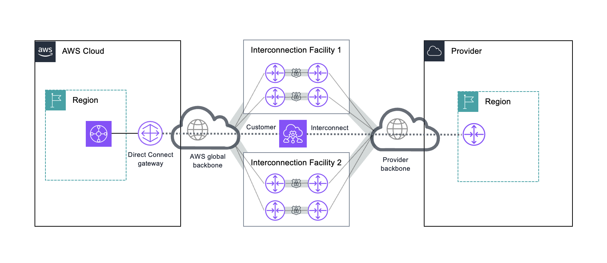
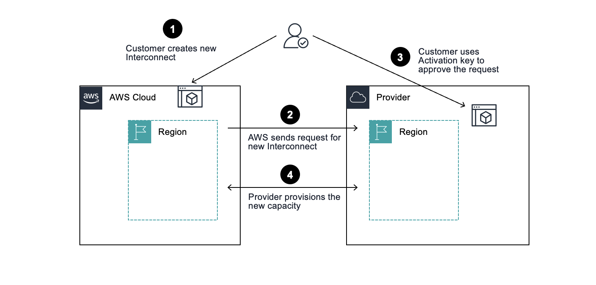

# What is AWS Interconnect?

## What is AWS Interconnect?

AWS Interconnect is a managed private connectivity service. It enables you to create high-speed network connections between your AWS
Virtual Private Clouds (VPCs) and your VPCs on other public clouds.

With AWS Interconnect, you no longer need to configure physical or virtual routers to connect privately across clouds. Through a simplified process you select your source AWS Region,
your destination region with another Cloud Services Provider (CSP), and your required network capacity.

AWS and the other CSP will provision and configure your requested capacity on redundant network devices in minutes. They present it to
you as a single object called an _interconnect_.

###### Note

AWS Interconnect is in Public Preview with Google Cloud. You can create a preview 1Gbps Interconnect in the supported Regions and use it at no cost for the duration of the Public Preview (one per customer). At the time AWS Interconnect becomes Generally Available, any
“preview” 1Gbps connections will be removed from your account. Pricing for AWS Interconnect will be announced before General Availability.
Your use of AWS Interconnect is governed by the [AWS Service Terms](https://aws.amazon.com/service-terms/ "https://aws.amazon.com/service-terms/"), including the terms regarding access to “Betas and Previews”. Therefore, we advise that you
do not route any production traffic through your preview connection during the Public Preview.
The information in this guide provides details to interconnect with Google Cloud. Content will be updated as more cloud service providers are added to this capability.

## Advantages of AWS Interconnect

**Simplified multicloud architecture**

With AWS Interconnect your traffic is transported on the AWS global backbone until it is handed off to the other CSP directly.
You don’t need to route traffic through on-premises network devices or virtual routers.

**Fast provisioning and scaling**

New Multicloud interconnects between AWS and Google Cloud are provisioned and configured in minutes.
On General Availability, customers will be able to increase or decrease the bandwidth of a specific Multicloud connection by modifying that attribute, without the need to recreate the connection.

**Fully managed service**

AWS and Google Cloud manage all aspects of the physical network infrastructure. Support is provided by AWS and Google Cloud.

## Region availability

Preview begins with support for the following AWS and Google Cloud Regions:

- AWS US East (N. Virginia) us-east-1 – Google Cloud N. Virginia (us-east4)
- AWS US West (N. California) us-west-1 – Google Cloud Los Angeles (us-west2)
- AWS US West (Oregon) us-west-2 – Google Cloud Oregon (us-west1)
- AWS Europe (London) eu-west-2 – Google Cloud London (europe-west2)
- AWS Europe (Frankfurt) eu-central-1 – Google Cloud Frankfurt (europe-west3)

## How AWS Interconnect works

AWS Interconnect is designed to connect your private networks in AWS with your private network in a different CSP’s region. You don’t
need to think about physical networking devices or configure routing protocols. The service is also designed to provision capacity in
minutes. It follows our standards for security and maximum network resiliency.

To achieve these design goals, AWS and Google Cloud have pre-provisioned capacity in each of the supported regions. This capacity spans
multiple network devices distributed across at least two physical buildings. These buildings have independent power and networking.

All connections between the AWS network devices and the adjacent Google Cloud edge devices are encrypted by default. The encryption
uses industry standard IEEE 802.1AE MAC Security (MACsec). The devices are configured to transmit customer traffic only if the
encryption session is active.

## AWS Interconnect concepts

**Multicloud Interconnect**

A connection type that represents the network capacity that you requested, provisioned between AWS and another CSP in a highly-available configuration.

**Attach point**

A multicloud connection will always be attached on creation to an attach point on both sides. Attach points are logical constructs on both clouds. On AWS the attach point
is the Direct Connect gateway. On Google Cloud the attachment point is the Google Cloud Router. You must have an existing attach point on both sides to create a new multicloud Interconnect.

**Direct Connect gateway integration**

The Direct Connect gateway is a logical, highly-available, globally distributed object that serves as the attach point for Region or Local Zone-based
AWS networking services such as Virtual private gateways, Transit Gateways, and Cloud WAN, and AWS Interconnect.

**Create/Accept flows and Activation key**

The process to create a new multicloud Interconnect has two main actions: a create action which you start on either AWS or Google Cloud,
and an accept action for the new multicloud connection, performed on the cloud that receives the request to create the new interconnect. The create action on one CSP produces an Activation
key which is needed to perform the accept action on the other CSP. During Public Preview the create and accept actions can be completed in the Console on AWS, and with CLI/SDK on Google Cloud.

**Built-in resiliency and security**

The following diagram shows a high level physical infrastructure that is used to provide the AWS Interconnect multicloud service. The
customer Interconnect is represented by the green logical attachment. This attachment is created directly between the attach points
in both clouds. The customer sees only the abstracted object on either side’s console.

In this example the customer is using a Transit Gateway attached to a Direct Connect gateway. This gateway is used as the attach point
on the AWS side.

At the infrastructure level AWS and the other CSPs provisioned multiple logical connections. These connections span multiple network
devices across two physical facilities. All the physical connections between the AWS routers and the other CSP routers in each
facility are secured using MACsec.

**Multicloud Interconnect creation process at high-level**

In the following example diagram, a customer begins the process by creating a new Interconnect using the AWS Console (1). AWS receives
the request. AWS provides the customer with the new Interconnect activation key. AWS submits the request to the other CSP (2).

The other CSP receives the request and waits for confirmation from the customer. The customer then uses the activation key to approve
the request (3).

The CSPs then begin the provisioning process. No further customer interaction is needed (4). The process is completed with the
successful creation of the new Interconnect. The Interconnect attaches to the Direct Connect gateway on the AWS side and to the Google
Cloud Router on the Google side.

## Supported configurations with AWS networking services

AWS Interconnect can connect to your VPCs through supported AWS networking services: Virtual private gateways, Transit Gateways, and Cloud WAN.

### Virtual private gateways and Transit Gateways

Virtual gateways or Transit Gateways in a specific AWS Region, through a Direct Connect gateway, can only reach an Interconnect that provides connectivity to the paired Google Cloud Region.
This Interconnect is considered "local" to that AWS Region. For example, a Transit Gateway in the AWS Region N. Virginia (us-east-1) can only reach an Interconnect that connects to the Google Cloud N. Virginia (us-east4) Region.

### Cloud WAN

When using Cloud WAN you define the AWS Regions where your global network will have a Core Network Edge (CNE). Using the native Direct Connect attachment, any Cloud WAN CNE can reach any
Interconnect globally that is attached to the same Direct Connect gateway.

## Network health monitoring

All Interconnects include a single CloudWatch Network Synthetic Monitor at no extra cost. You can use this active synthetic probe to produce round trip latency and packet loss metrics.
You can configure CloudWatch alarms on your set thresholds. Refer to the CloudWatch Network Synthetic Monitor user guide for configuration. Note that the Network Health Indicator feature
is not yet supported with Interconnects. Latency and packet loss metrics are fully supported.

## Bandwidth utilization monitoring

Your Interconnects provide a percentage utilization metric on CloudWatch. This metric displays the percentage of the capacity of your Interconnect that your traffic is utilizing. This metric is
designed to help you understand your usage patterns and increase or decrease your provisioned bandwidth as needed.

You can set up CloudWatch alarms on your desired thresholds to help you prevent potential congestion events due to an application consuming all of your provisioned network capacity on an Interconnect.

## Other considerations

- Multicloud Interconnects support IPv4 and IPv6 address families.
- Multicloud Interconnects can receive 1000 IPv4 prefixes plus 1000 IPv6 prefixes from Google Cloud.
- On the AWS side the MTU for multicloud Interconnects is set automatically to 8500.
- You can attach a multicloud Interconnect to an existing Direct Connect gateway that already has Private Virtual interfaces or Transit virtual interfaces attached to it. You can continue to
  use that Direct Connect gateway with new virtual interfaces of the same type.
