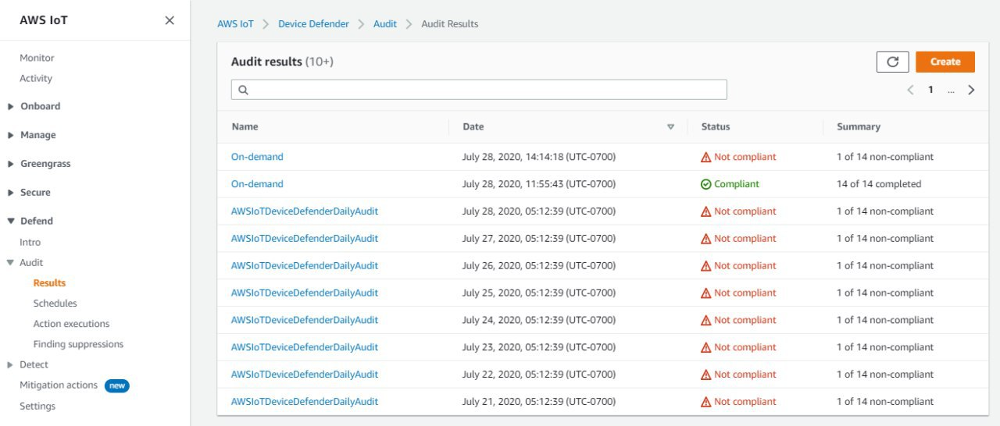
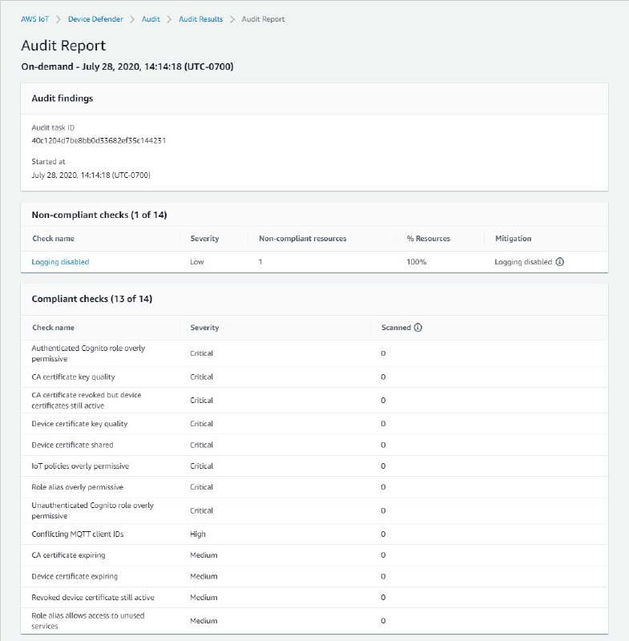
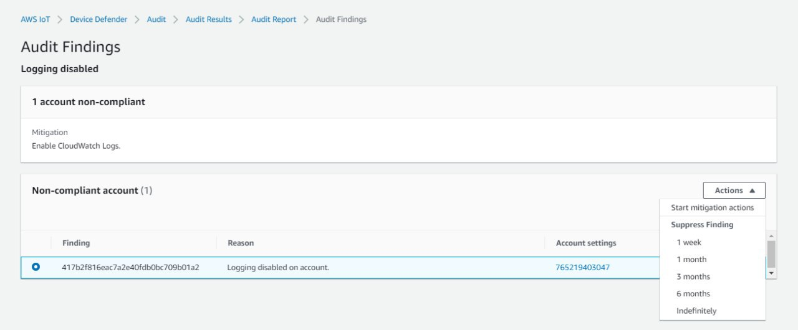
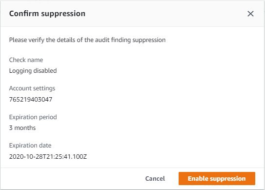
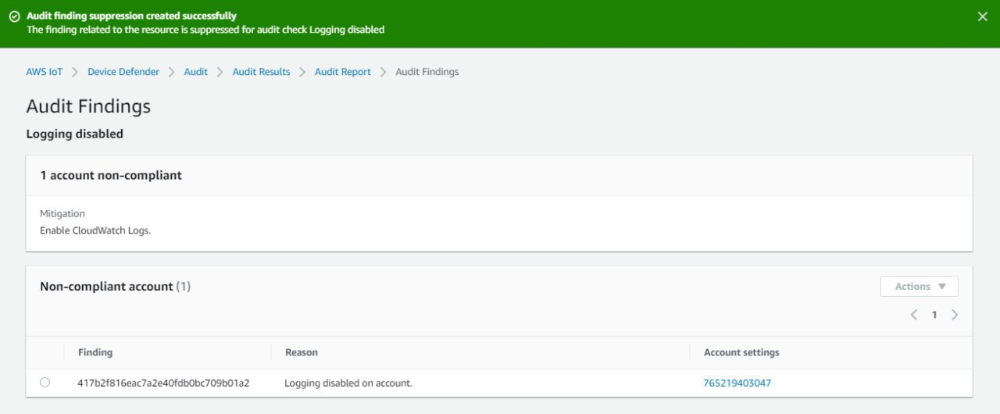
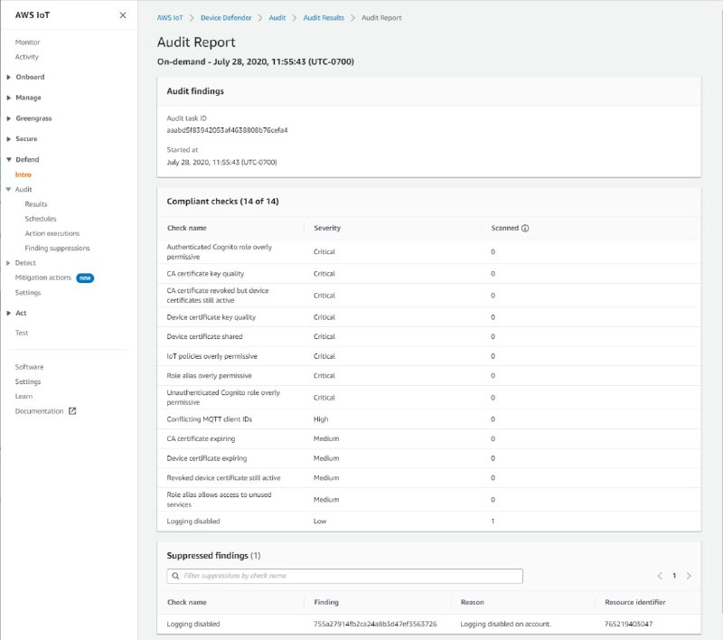
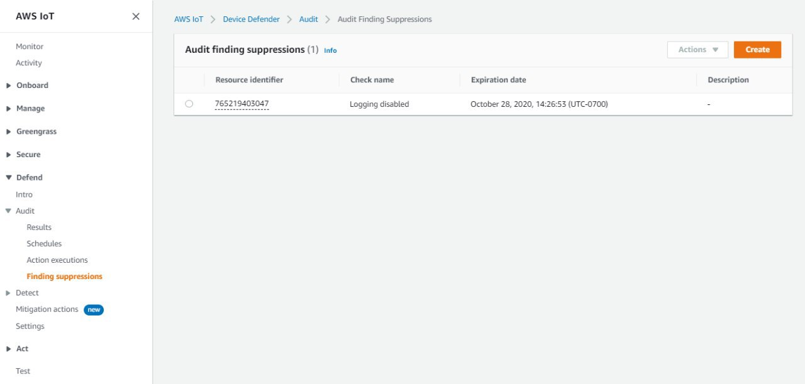
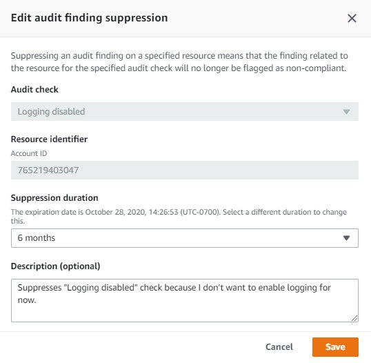
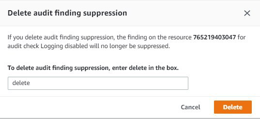

# Audit finding suppressions

When you run an audit, it reports findings for all non-compliant resources. This means
your audit reports include findings for resources where you're working toward mitigating
issues and also for resources that are known to be non-compliant, such as test or broken
devices. The audit continues to report findings for resources that remain non-compliant in
successive audit runs, which may add unwanted information to your reports. Audit finding
suppressions enable you to suppress or filter out findings for a defined period of time
until the resource is fixed, or indefinitely for a resource associated with a test or broken
device.

###### Note

Mitigation actions won't be available for suppressed audit findings. For more
information about mitigation actions, see [Mitigation actions](dd-mitigation-actions.md "dd-mitigation-actions.md").

For information about audit finding suppression quotas, see [AWS IoT Device Defender endpoints and
quotas](../../../general/latest/gr/iot_device_defender.md "../../../general/latest/gr/iot_device_defender.md").

## How audit finding suppressions work

When you create an audit finding suppression for a non-compliant resource, your audit
reports and notifications behave differently.

Your audit reports will include a new section that lists all the suppressed findings
associated with the report. Suppressed findings won't be considered when we evaluate
whether an audit check is compliant or not. A suppressed resource count is also returned
for each audit check when you use the [describe-audit-task](../../../cli/latest/reference/iot/describe-audit-task.md "../../../cli/latest/reference/iot/describe-audit-task.md")
command in the command line interface (CLI).

For audit notifications, suppressed findings aren't considered when we evaluate
whether an audit check is compliant or not. A suppressed resource count is also included
in each audit check notification AWS IoT Device Defender publishes to Amazon CloudWatch and Amazon Simple
Notification Service (Amazon SNS).

## How to use audit finding suppressions in the

console

###### To suppress a finding from an audit report

The following procedure shows you how to create an audit finding suppression in
the AWS IoT console.

1. In the [AWS IoT console](https://console.aws.amazon.com/iot "https://console.aws.amazon.com/iot"),
   in the navigation pane, expand **Defend**, and then choose
   **Audit**, **Results**.
2. Select an audit report you'd like to review.

 3. In the **Non-compliant checks** section, under
**Check name**, choose the audit check that you're
interested in.

 4. On the audit check details screen, if there are findings you don't want to
see, select the option button next to the finding. Next, choose
**Actions**, and then choose the amount of time you'd like
your audit finding suppression to persist.

###### Note

In the console, you can select _1 week_, _1
month_, _3 months_, _6
months_, or _Indefinitely_ as expiration
dates for your audit finding suppression. If you want to set a specific
expiration date, you can do so only in the CLI or API. Audit finding
suppressions can also be canceled anytime regardless of expiration
date.

 5. Confirm the suppression details, and then choose **Enable
suppression**.

 6. After you've created the audit finding suppression, a banner appears
confirming your audit finding suppression was created.



###### To view your suppressed findings in an audit report

1. In the [AWS IoT console](https://console.aws.amazon.com/iot "https://console.aws.amazon.com/iot"),
   in the navigation pane, expand **Defend**, and then choose
   **Audit**, **Results**.
2. Select an audit report you'd like to review.
3. In the **Suppressed findings** section, view which audit
   findings have been suppressed for your chosen audit report.



###### To list your audit finding suppressions

- In the [AWS IoT console](https://console.aws.amazon.com/iot "https://console.aws.amazon.com/iot"),
  in the navigation pane, expand **Defend**, and then choose
  **Audit**, **Finding
  suppressions**.



###### To edit your audit finding suppression

1. In the [AWS IoT console](https://console.aws.amazon.com/iot "https://console.aws.amazon.com/iot"),
   in the navigation pane, expand **Defend**, and then choose
   **Audit**, **Finding
   suppressions**.
2. Select the option button next to the audit finding suppression you'd like to
   edit. Next, choose **Actions**,
   **Edit**.
3. On the **Edit audit finding suppression** window, you can
   change the **Suppression duration** or **Description
   (optional)**.

 4. After you've made your changes, choose **Save**. The
**Finding suppressions** window opens.

###### To delete an audit finding suppression

1. In the [AWS IoT console](https://console.aws.amazon.com/iot "https://console.aws.amazon.com/iot"),
   in the navigation pane, expand **Defend**, and then choose
   **Audit**, **Finding
   suppressions**.
2. Select the option button next to the audit finding suppression you'd like to
   delete, and then choose **Actions**,
   **Delete**.
3. On the **Delete audit finding suppression** window, enter
   `delete` in the text box to confirm your deletion, and then
   choose **Delete**. The **Finding
   suppressions** window opens.



## How to use audit finding suppressions in the CLI

You can use the following CLI commands to create and manage audit finding
suppressions.

- [create-audit-suppression](../../../cli/latest/reference/iot/create-audit-suppression.md "../../../cli/latest/reference/iot/create-audit-suppression.md")
- [describe-audit-suppression](../../../cli/latest/reference/iot/describe-audit-suppression.md "../../../cli/latest/reference/iot/describe-audit-suppression.md")
- [update-audit-suppression](../../../cli/latest/reference/iot/update-audit-suppression.md "../../../cli/latest/reference/iot/update-audit-suppression.md")
- [delete-audit-suppression](../../../cli/latest/reference/iot/delete-audit-suppression.md "../../../cli/latest/reference/iot/delete-audit-suppression.md")
- [list-audit-suppressions](../../../cli/latest/reference/iot/list-audit-suppressions.md "../../../cli/latest/reference/iot/list-audit-suppressions.md")

The `resource-identifier` you input depends on the `check-name`
you're suppressing findings for. The following table details which checks require which
`resource-identifier` for creating and editing suppressions.

###### Note

The suppression commands do not indicate turning off an audit. Audits will still
run on your AWS IoT devices. Suppressions are only applicable to the audit
findings.

| `check-name`                                            | `resource-identifier`     |
| ------------------------------------------------------- | ------------------------- |
| `AUTHENTICATE_COGNITO_ROLE_OVERLY_PERMISSIVE_CHECK`     | `cognitoIdentityPoolId`   |
| `CA_CERT_APPROACHING_EXPIRATION_CHECK`                  | `caCertificateId`         |
| `CA_CERTIFICATE_KEY_QUALITY_CHECK`                      | `caCertificateId`         |
| `CONFLICTING_CLIENT_IDS_CHECK`                          | `clientId`                |
| `DEVICE_CERT_APPROACHING_EXPIRATION_CHECK`              | `deviceCertificateId`     |
| `DEVICE_CERTIFICATE_KEY_QUALITY_CHECK`                  | `deviceCertificateId`     |
| `DEVICE_CERTIFICATE_SHARED_CHECK`                       | `deviceCertificateId`     |
| `IOT_POLICY_OVERLY_PERMISSIVE_CHECK`                    | `policyVersionIdentifier` |
| `IOT_ROLE_ALIAS_ALLOWS_ACCESS_TO_UNUSED_SERVICES_CHECK` | `roleAliasArn`            |
| `IOT_ROLE_ALIAS_OVERLY_PERMISSIVE_CHECK`                | `roleAliasArn`            |
| `LOGGING_DISABLED_CHECK`                                | `account`                 |
| `REVOKED_CA_CERT_CHECK`                                 | `caCertificateId`         |
| `REVOKED_DEVICE_CERT_CHECK`                             | `deviceCertificateId`     |
| `UNAUTHENTICATED_COGNITO_ROLE_OVERLY_PERMISSIVE_CHECK`  | `cognitoIdentityPoolId`   |

###### To create and apply an audit finding suppression

The following procedure shows you how to create an audit finding suppression in
the AWS CLI.

- Use the `create-audit-suppression` command to create an audit
  finding suppression. The following example creates an audit finding suppression
  for AWS account `123456789012` on the basis of the
  check **Logging disabled**.

```
aws iot create-audit-suppression \
    --check-name `LOGGING_DISABLED_CHECK` \
    --resource-identifier account=`123456789012` \
    --client-request-token `28ac32c3-384c-487a-a368-c7bbd481f554` \
    --suppress-indefinitely \
    --description "`Suppresses logging disabled check because I don't want to enable logging for now.`"
```

There is no output for this command.

## Audit finding suppressions APIs

The following APIs can be used to create and manage audit finding suppressions.

- [CreateAuditSuppression](../../../iot/latest/apireference/API_CreateAuditSuppression.md "../../../iot/latest/apireference/API_CreateAuditSuppression.md")
- [DescribeAuditSuppression](../../../iot/latest/apireference/API_DescribeAuditSuppression.md "../../../iot/latest/apireference/API_DescribeAuditSuppression.md")
- [UpdateAuditSuppression](../../../iot/latest/apireference/API_UpdateAuditSuppression.md "../../../iot/latest/apireference/API_UpdateAuditSuppression.md")
- [DeleteAuditSuppression](../../../iot/latest/apireference/API_DeleteAuditSuppression.md "../../../iot/latest/apireference/API_DeleteAuditSuppression.md")
- [ListAuditSuppressions](../../../iot/latest/apireference/API_ListAuditSuppressions.md "../../../iot/latest/apireference/API_ListAuditSuppressions.md")

To filter _for_ specific audit findings, you can use the [ListAuditFindings](../../../iot/latest/apireference/API_ListAuditFindings.md "../../../iot/latest/apireference/API_ListAuditFindings.md") API.
