# ML Detect guide

###### Note

ML Detect is not available in the following regions:

- Asia Pacific (Malaysia)
  In this Getting Started guide, you create an ML Detect Security Profile that uses machine
  learning (ML) to create models of expected behavior based on historical metric data from
  your devices. While ML Detect is creating the ML model, you can monitor its progress. After
  the ML model is built, you can view and investigate alarms on an ongoing basis and mitigate
  identified issues.

For more information about ML Detect and its API and CLI commands, see [ML Detect](dd-detect-ml.md "dd-detect-ml.md").

###### This chapter contains the following sections:

- [Prerequisites](#ml-detect-prereqs "#ml-detect-prereqs")
- [How to use ML Detect in the console](#dd-detect-ml-console "#dd-detect-ml-console")
- [How to use ML Detect with the CLI](#dd-detect-ml-cli "#dd-detect-ml-cli")

## Prerequisites

- An AWS account. If you don't have this, see [Setting
  up](../../../iot/latest/developerguide/dd-setting-up.md "../../../iot/latest/developerguide/dd-setting-up.md").

## How to use ML Detect in the console

###### Tutorials

- [Enable ML Detect](#enable-ml-detect-console "#enable-ml-detect-console")
- [Monitor your ML model status](#monitor-ml-models-console "#monitor-ml-models-console")
- [Review your ML Detect alarms](#review-ml-alarms-console "#review-ml-alarms-console")
- [Fine-tune your ML alarms](#fine-tune-ml-models-console "#fine-tune-ml-models-console")
- [Mark your alarm's verification state](#mark-your-alarms "#mark-your-alarms")
- [Mitigate identified device issues](#mitigate-ml-issues-console "#mitigate-ml-issues-console")

### Enable ML Detect

The following procedures detail how to set up ML Detect in the console.

1. First, make sure your devices will create the minimum datapoints required
   as defined in [ML Detect minimum
   requirements](dd-detect-ml.md#dd-detect-ml-requirements "dd-detect-ml.md#dd-detect-ml-requirements") for ongoing training and refreshing of the model.
   For data collection to progress, ensure your Security Profile is attached to
   a target, which can be a thing or thing group.
2. In the [AWS IoT
   console](https://console.aws.amazon.com/iot "https://console.aws.amazon.com/iot"), in the navigation pane, expand
   **Defend**. Choose **Detect**,
   **Security profiles**, **Create security
   profile**, and then **Create ML anomaly Detect
   profile**.
3. On the **Set basic configurations** page, do the
   following.
   - Under **Target**, choose your target device
     groups.
   - Under **Security profile name**, enter a name for
     your Security Profile.
   - (Optional) Under **Description** you can write in a short description for the
     ML profile.
   - Under **Selected metric behaviors in Security Profile**, choose the
     metrics you'd like to monitor.

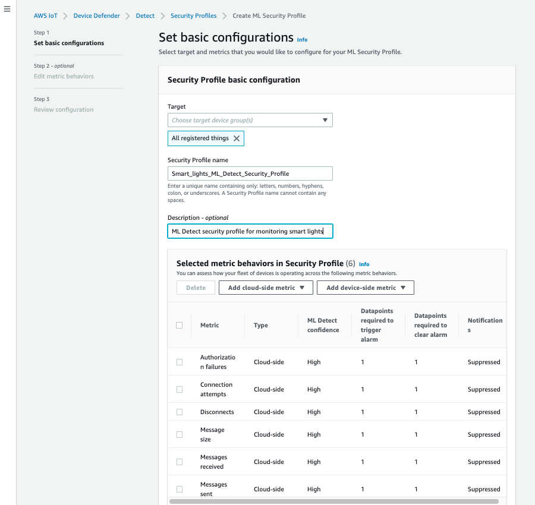

When you're done, choose **Next**. 4. On the **Set SNS (optional)** page, specify an SNS topic
for alarm notifications when a device violates a behavior in your profile.
Choose an IAM role you will use to publish to the selected SNS topic.

If you don't have an SNS role yet, use the following steps to create a
role with the proper permissions and trust relationships required.

    * Navigate to the [IAM console](https://console.aws.amazon.com/iam/ "https://console.aws.amazon.com/iam/"). In the navigation pane, choose
     **Roles** and then choose **Create
     role**.
    * Under **Select type of trusted entity**, select
     **AWS Service**. Then, under **Choose a
     use case**, choose **IoT** and under
     **Select your use case**, choose **IoT
     - Device Defender Mitigation Actions**. When you're
     done, choose **Next: Permissions**.
    * Under **Attached permissions policies**, ensure
     that
     **AWSIoTDeviceDefenderPublishFindingsToSNSMitigationAction**
     is selected, and then choose **Next:
     Tags**.


    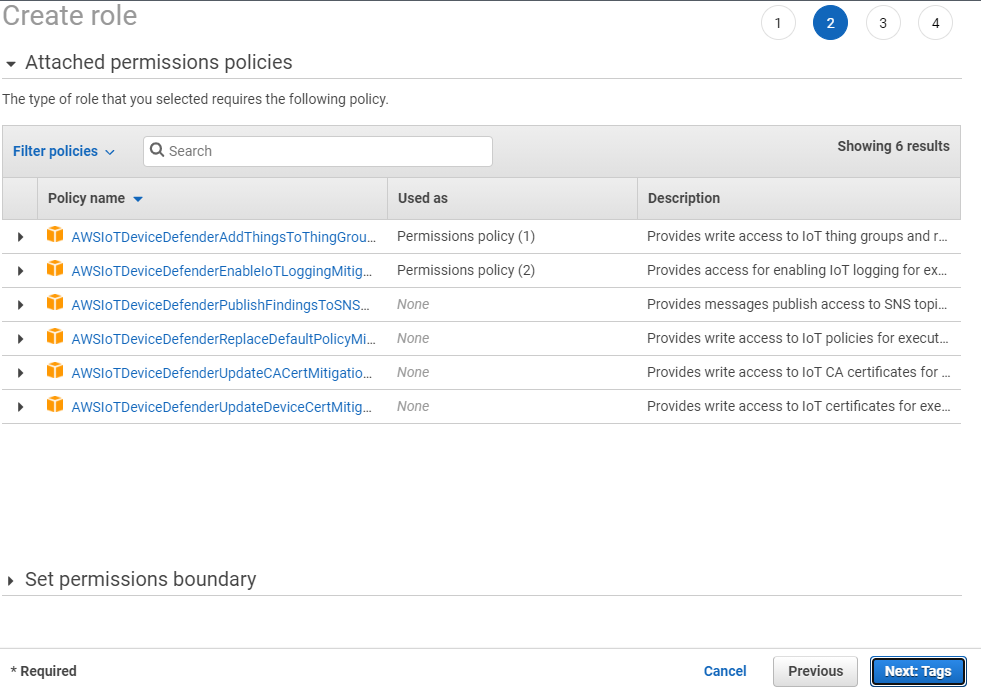
    * Under **Add tags (optional)**, you can add any
     tags you'd like to associate with your role. When you're done,
     choose **Next: Review**.
    * Under **Review**, give your role a name and
     ensure that
     **AWSIoTDeviceDefenderPublishFindingsToSNSMitigationAction**
     is listed under **Permissions** and **AWS
     service: iot.amazonaws.com** is listed under
     **Trust relationships**. When you're done,
     choose **Create role**.


    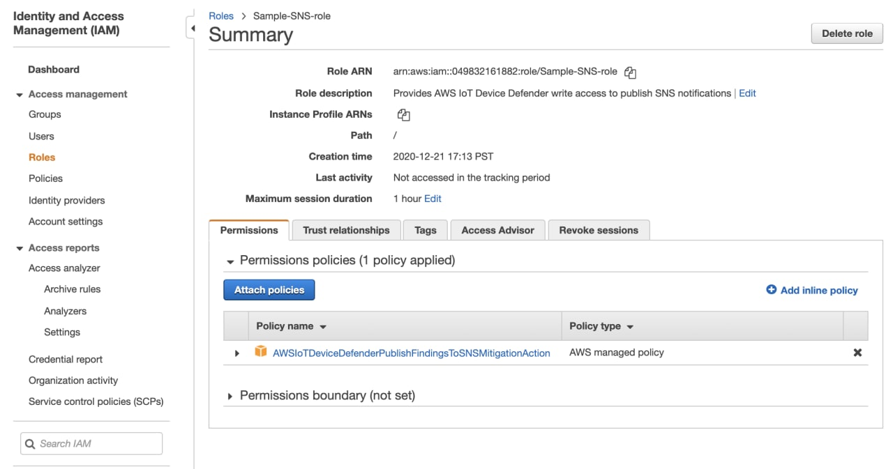


    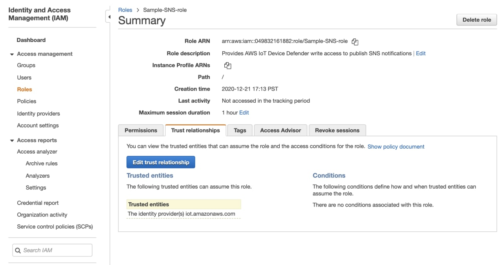

5. On the **Edit Metric behavior** page, you can
   customize your ML behavior settings.

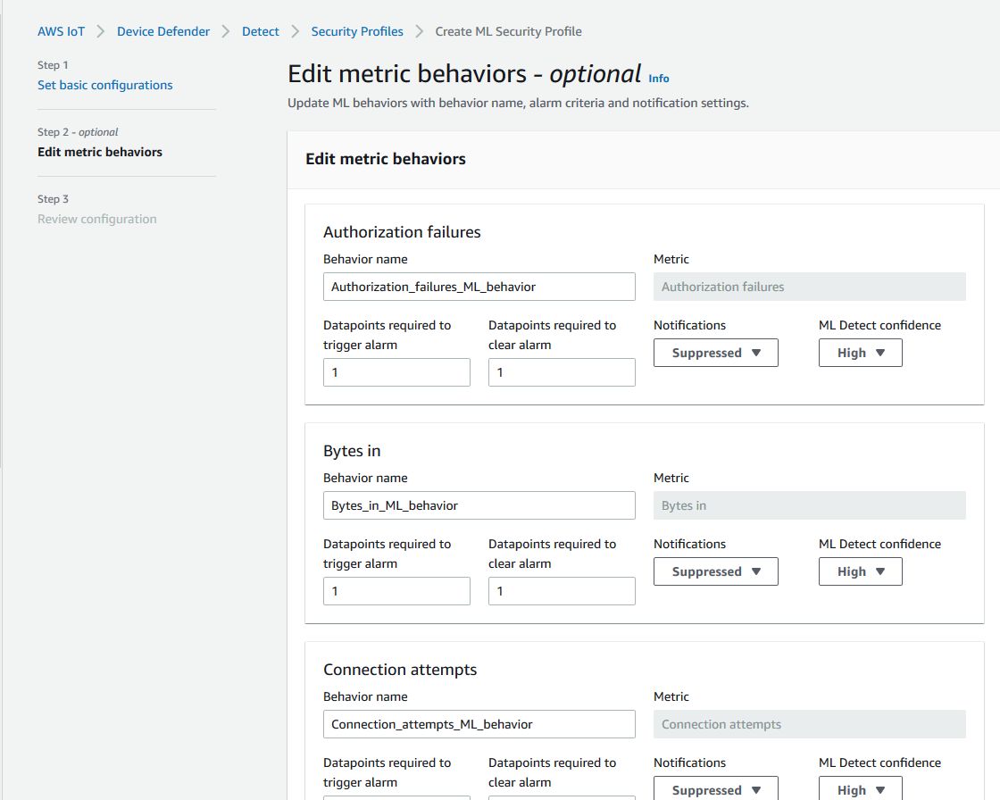 6. When you're done, choose **Next**. 7. On the **Review configuration** page, verify the
behaviors you'd like machine learning to monitor, and then choose
**Next**.

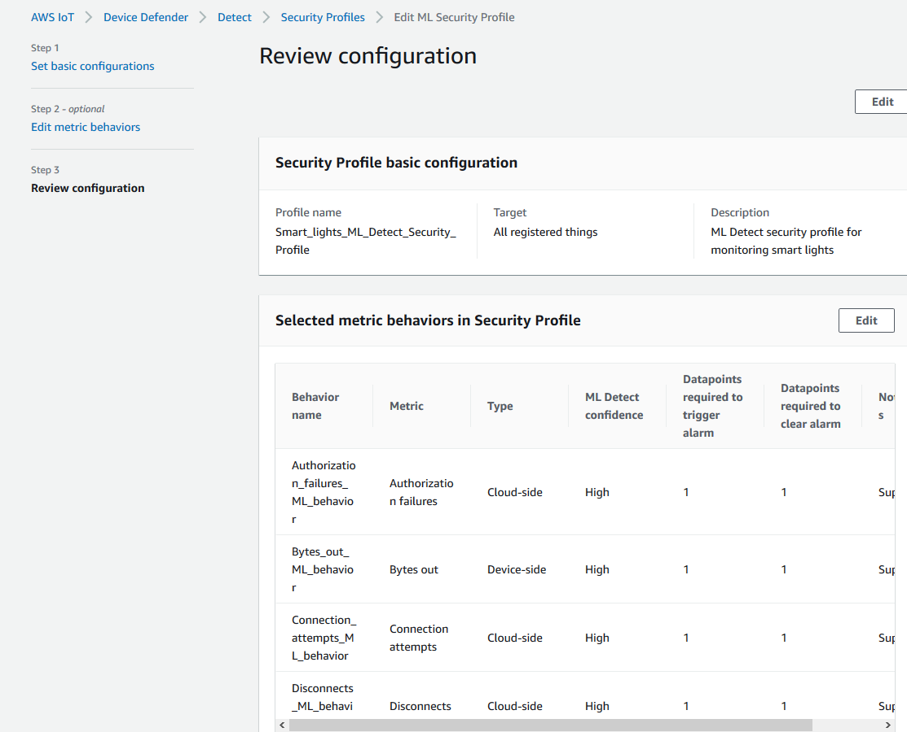 8. After you've created your Security Profile, you're redirected to the
**Security Profiles** page, where the newly created
Security Profile appears.

###### Note

The initial ML model training and creation takes 14 days to complete.
You can expect to see alarms after it's complete, if there is any
anomalous activity on your devices.

### Monitor your ML model status

While your ML models are in the initial training period, you can monitor their
progress at any time by taking the following steps.

1. In the [AWS IoT
   console](https://console.aws.amazon.com/iot "https://console.aws.amazon.com/iot"), in the navigation pane, expand
   **Defend**, and then choose
   **Detect**, **Security profiles**.
2. On the **Security Profiles** page, choose the Security
   Profile you'd like to review. Then, choose **Behaviors and ML
   training**.
3. On the **Behaviors and ML training** page, check the
   training progress of your ML models.

After your model status is **Active**, it'll start making
Detect decisions based on your usage and update the profile every
day.

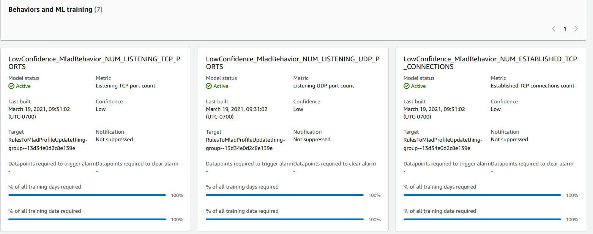

###### Note

If your model doesn't progress as expected, make sure your devices are meeting
the [Minimum requirements](dd-detect-ml.md#dd-detect-ml-requirements "dd-detect-ml.md#dd-detect-ml-requirements").

### Review your ML Detect alarms

After your ML models are built and ready for data inference, you can regularly
view and investigate alarms that are identified by the models.

1. In the [AWS IoT
   console](https://console.aws.amazon.com/iot "https://console.aws.amazon.com/iot"), in the navigation pane, expand
   **Defend**, and then choose
   **Detect**, **Alarms**.

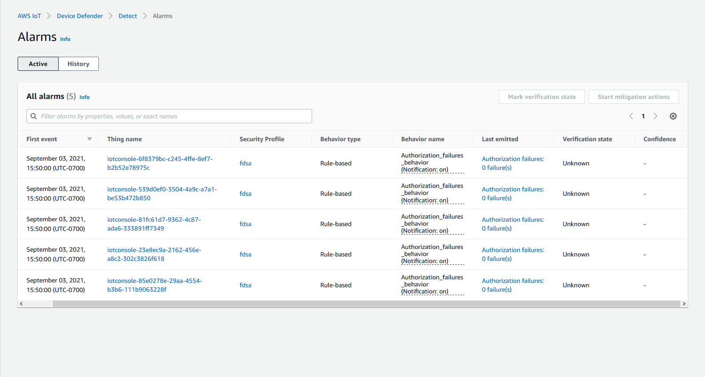 2. If you navigate to the **History** tab, you can also view
details about your devices that are no longer in alarms.

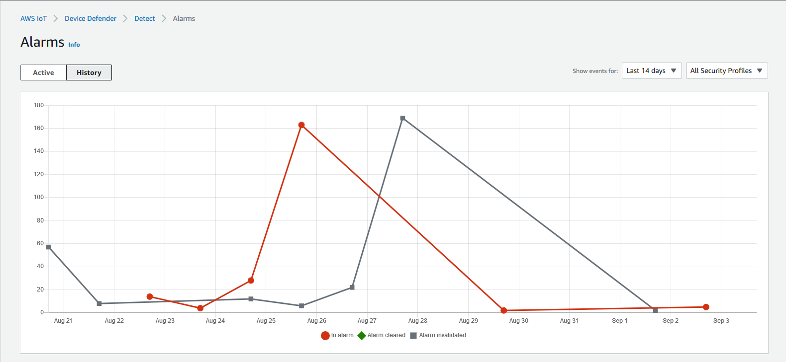

To get more information, under **Manage** choose
**Things**, chose the thing you'd like to see more
details for, and then navigate to **Defender metrics**. You
can access the **Defender metrics graph** and perform your
investigation on anything in alarm from the **Active** tab.
In this case, the graph shows a spike in message size, which initiated the
alarm. You can see the alarm subsequently cleared.

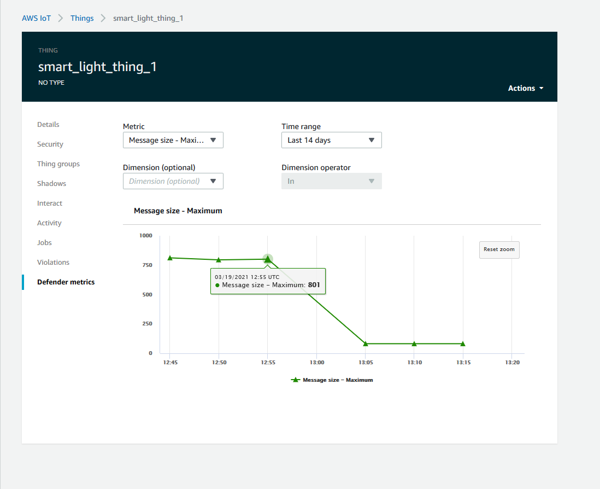

### Fine-tune your ML alarms

After your ML models are built and ready for data evaluations, you can update
your Security Profile's ML behavior settings to change the configuration. The
following procedure shows you how to update your Security Profile's ML behavior
settings in the AWS CLI.

1. In the [AWS IoT
   console](https://console.aws.amazon.com/iot "https://console.aws.amazon.com/iot"), in the navigation pane, expand
   **Defend**, and then choose
   **Detect**, **Security profiles**.
2. On the **Security Profiles** page, select the check box
   next to the Security Profile you'd like to review. Then, choose
   **Actions**, **Edit**.

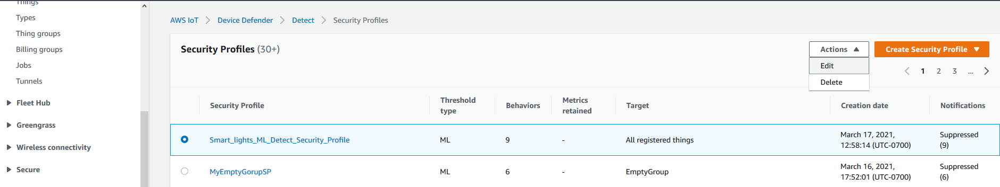 3. Under **Set basic configurations**, you can adjust
Security Profile target thing groups or change what metrics you want to
monitor.

 4. You can update any of the following by navigating to **Edit metric
behaviors**.

    * Your ML model datapoints required to initiate alarm
    * Your ML model datapoints required to clear alarm
    * Your ML Detect confidence level
    * Your ML Detect notifications (for example,
     **Not suppressed**, **Suppressed**)

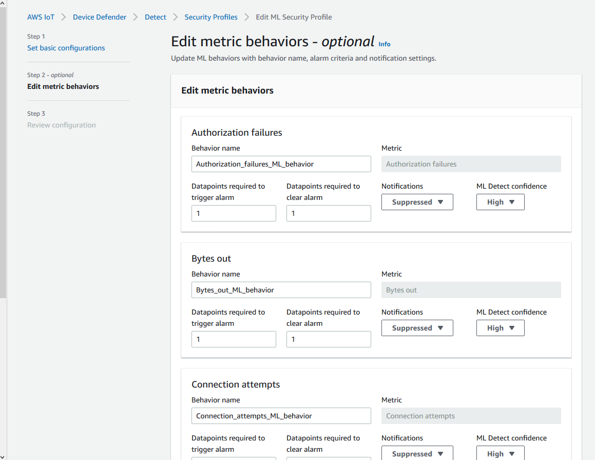

### Mark your alarm's verification state

Mark your alarms by setting the verification state and providing a description
of that verification state. This helps you and your team identify alarms that
you don't have to respond to.

1. In the [AWS IoT console](https://console.aws.amazon.com/iot/ "https://console.aws.amazon.com/iot/"), on the
   navigation pane, expand **Defend**, and then choose
   **Detect**, **Alarms**. Select an
   alarm to mark its verification state.

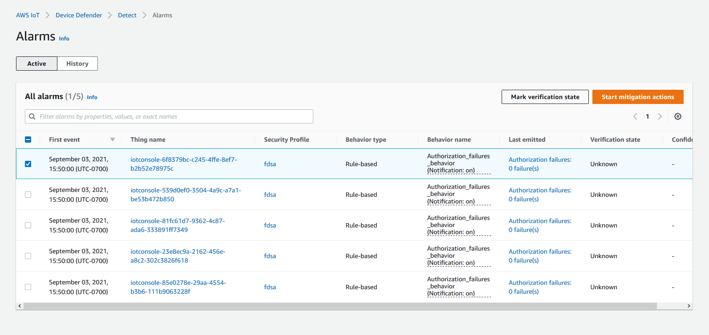 2. Choose **Mark verification state**. The verification state modal
opens. 3. Choose the appropriate verification state, enter a verification description (optional), and
then choose **Mark**. This action assigns a verification
state and description to the chosen alarm.

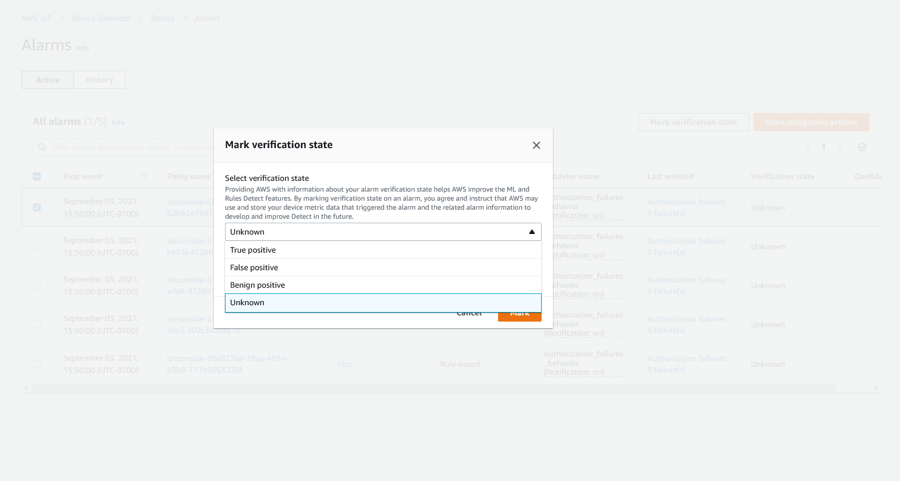

### Mitigate identified device issues

1. _(Optional)_ Before setting up quarantine mitigation
   actions, let's set up a quarantine group where we'll move the device that's
   in violation to. You can also use an existing group.
2. Navigate to **Manage**, **Thing
   groups**, and then **Create Thing Group**. Name
   your thing group. For this tutorial, we'll name our thing group
   `Quarantine_group`. Under **Thing
   group**, **Security**, apply the following
   policy to the thing group.

JSON

```
`{
 "Version":"2012-10-17",
 "Statement": [
 {
 "Effect": "Deny",
 "Action": "iot:*",
 "Resource": "*"
 }
 ]
}`

```

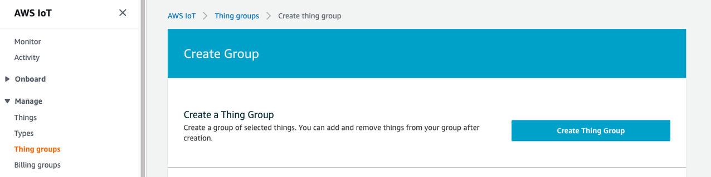

When you're done, choose **Create thing group**. 3. Now that we've created a thing group, let's create a mitigation action
that move devices that in alarm into the
`Quarantine_group`.

Under **Defend**, **Mitigation
actions**, choose **Create**.

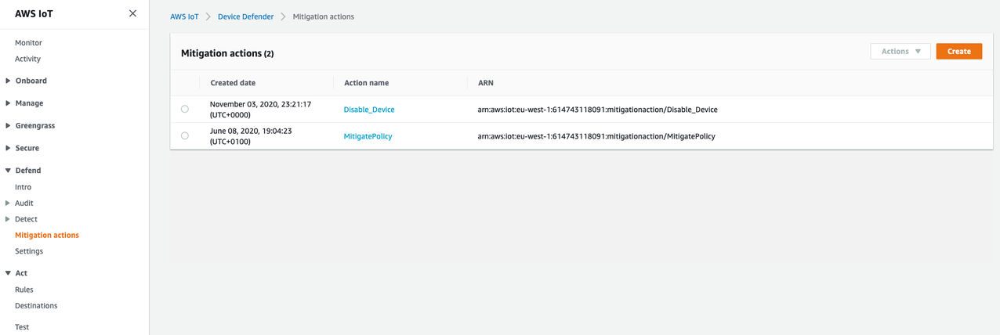 4. On the **Create a new mitigation action** page, enter the
following information.

    * **Action name**: Give your mitigation action a
     name, such as `Quarantine_action`.
    * **Action type**: Choose the type of action. We'll
     choose **Add things to thing group (Audit or Detect
     mitigation)**.
    * **Action execution role**: Create a role or
     choose an existing role if you created one earlier.
    * **Parameters**: Choose a thing group. We can use
     `Quarantine_group`, which we created
     earlier.

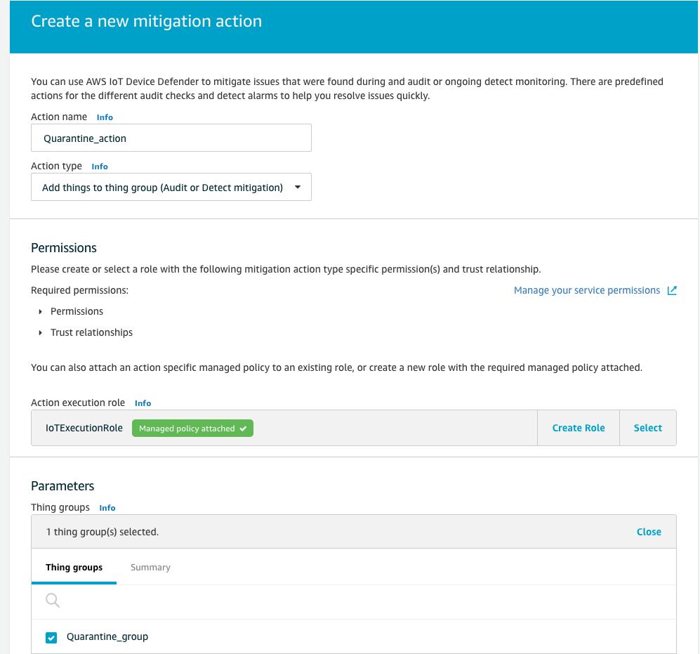

When you're done, choose **Save**. You now have a
mitigation action that moves devices in alarm to a quarantine thing group,
and a mitigation action to isolate the device while you investigate. 5. Navigate to **Defender**, **Detect**,
**Alarms**. You can see which devices are in alarm
state under **Active**.


Select the device you want to move to the quarantine group and choose
**Start Mitigation Actions**. 6. Under **Start mitigation actions**, **Start
Actions** select the mitigation action you created earlier. For
example, we'll choose `Quarantine_action`, then choose
**Start**. The Action Tasks page opens.

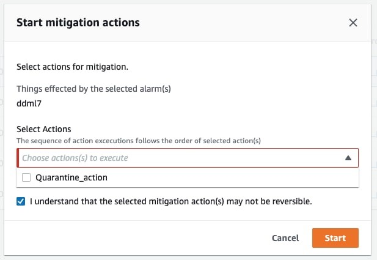 7. The device is now isolated in `Quarantine_group` and
you can investigate the root cause of the issue that set off the alarm.
After you complete the investigation, you can move the device out of the
thing group or take further actions.

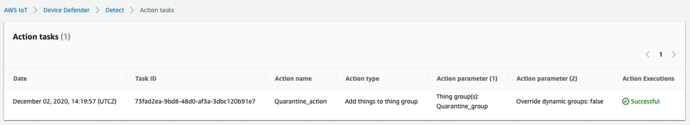

## How to use ML Detect with the CLI

The following shows you how to set up ML Detect using the CLI.

###### Tutorials

- [Enable ML Detect](#enable-ml-detect-cli "#enable-ml-detect-cli")
- [Monitor your ML model status](#monitor-ml-models-cli "#monitor-ml-models-cli")
- [Review your ML Detect alarms](#review-ml-alarms-cli "#review-ml-alarms-cli")
- [Fine-tune your ML alarms](#fine-tune-ml-models-cli "#fine-tune-ml-models-cli")
- [Mark your alarm's verification state](#mark-verification-state-cli "#mark-verification-state-cli")
- [Mitigate identified device issues](#mitigate-issues-cli "#mitigate-issues-cli")

### Enable ML Detect

The following procedure shows you how to enable ML Detect in the AWS CLI.

1. Make sure your devices will create the minimum datapoints required as
   defined in [ML Detect minimum
   requirements](dd-detect-ml.md#dd-detect-ml-requirements "dd-detect-ml.md#dd-detect-ml-requirements") for ongoing training and refreshing of the model.
   For data collection to progress, ensure your things are in a thing group
   attached to a Security Profile.
2. Create an ML Detect Security Profile by using the `create-security-profile` command. The following
   example creates a Security Profile named
   `security-profile-for-smart-lights` that checks
   for number of messages sent, number of authorization failures, number of
   connection attempts, and number of disconnects. The example uses
   `mlDetectionConfig` to establish that the metric will use the
   ML Detect model.

```
aws iot create-security-profile \
    --security-profile-name `security-profile-for-smart-lights` \
    --behaviors \
     '[{
    "name": "num-messages-sent-ml-behavior",
    "metric": "aws:num-messages-sent",
    "criteria": {
      "consecutiveDatapointsToAlarm": 1,
      "consecutiveDatapointsToClear": 1,
      "mlDetectionConfig": {
        "confidenceLevel": "HIGH"
      }
    },
    "suppressAlerts": true
  },
  {
    "name": "num-authorization-failures-ml-behavior",
    "metric": "aws:num-authorization-failures",
    "criteria": {
      "consecutiveDatapointsToAlarm": 1,
      "consecutiveDatapointsToClear": 1,
      "mlDetectionConfig": {
        "confidenceLevel": "HIGH"
      }
    },
    "suppressAlerts": true
  },
  {
    "name": "num-connection-attempts-ml-behavior",
    "metric": "aws:num-connection-attempts",
    "criteria": {
      "consecutiveDatapointsToAlarm": 1,
      "consecutiveDatapointsToClear": 1,
      "mlDetectionConfig": {
        "confidenceLevel": "HIGH"
      }
    },
    "suppressAlerts": true
  },
  {
    "name": "num-disconnects-ml-behavior",
    "metric": "aws:num-disconnects",
    "criteria": {
      "consecutiveDatapointsToAlarm": 1,
      "consecutiveDatapointsToClear": 1,
      "mlDetectionConfig": {
        "confidenceLevel": "HIGH"
      }
    },
    "suppressAlerts": true
  }]'
```

Output:

```
{
    "securityProfileName": "`security-profile-for-smart-lights`",
    "securityProfileArn": "arn:aws:iot:`eu-west-1`:`123456789012`:securityprofile/`security-profile-for-smart-lights`"
  }
```

3. Next, associate your Security Profile with one or multiple thing groups.
   Use the `attach-security-profile` command to attach a thing
   group to your Security Profile. The following example associates a thing
   group named `ML_Detect_beta_static_group` with the
   `security-profile-for-smart-lights` Security
   Profile.

```
aws iot attach-security-profile \
--security-profile-name `security-profile-for-smart-lights` \
--security-profile-target-arn arn:aws:iot:`eu-west-1`:`123456789012`:thinggroup/`ML_Detect_beta_static_group`
```

Output:

None. 4. After you've created your complete Security Profile, the ML model begins
training. The initial ML model training and building takes 14 days to
complete. After 14 days, if there's anomalous activity on your device, you
can expect to see alarms.

### Monitor your ML model status

The following procedure shows you how to monitor your ML models in-progress
training.

- Use the `get-behavior-model-training-summaries` command to
  view your ML model's progress. The following example gets the ML model
  training progress summary for the
  `security-profile-for-smart-lights` Security
  Profile. `modelStatus` shows you if a model has completed
  training or is still pending build for a particular behavior.

```
aws iot get-behavior-model-training-summaries \
   --security-profile-name `security-profile-for-smart-lights`
```

Output:

```
{
    "summaries": [
        {
            "securityProfileName": "`security-profile-for-smart-lights`",
            "behaviorName": "Messages_sent_ML_behavior",
            "trainingDataCollectionStartDate": "2020-11-30T14:00:00-08:00",
            "modelStatus": "ACTIVE",
            "datapointsCollectionPercentage": 29.408,
            "lastModelRefreshDate": "2020-12-07T14:35:19.237000-08:00"
        },
        {
            "securityProfileName": "`security-profile-for-smart-lights`",
            "behaviorName": "Messages_received_ML_behavior",
            "modelStatus": "PENDING_BUILD",
            "datapointsCollectionPercentage": 0.0
        },
        {
            "securityProfileName": "`security-profile-for-smart-lights`",
            "behaviorName": "Authorization_failures_ML_behavior",
            "trainingDataCollectionStartDate": "2020-11-30T14:00:00-08:00",
            "modelStatus": "ACTIVE",
            "datapointsCollectionPercentage": 35.464,
            "lastModelRefreshDate": "2020-12-07T14:29:44.396000-08:00"
        },
        {
            "securityProfileName": "`security-profile-for-smart-lights`",
            "behaviorName": "Message_size_ML_behavior",
            "trainingDataCollectionStartDate": "2020-11-30T14:00:00-08:00",
            "modelStatus": "ACTIVE",
            "datapointsCollectionPercentage": 29.332,
            "lastModelRefreshDate": "2020-12-07T14:30:44.113000-08:00"
        },
        {
            "securityProfileName": "`security-profile-for-smart-lights`",
            "behaviorName": "Connection_attempts_ML_behavior",
            "trainingDataCollectionStartDate": "2020-11-30T14:00:00-08:00",
            "modelStatus": "ACTIVE",
            "datapointsCollectionPercentage": 32.891999999999996,
            "lastModelRefreshDate": "2020-12-07T14:29:43.121000-08:00"
        },
        {
            "securityProfileName": "`security-profile-for-smart-lights`",
            "behaviorName": "Disconnects_ML_behavior",
            "trainingDataCollectionStartDate": "2020-11-30T14:00:00-08:00",
            "modelStatus": "ACTIVE",
            "datapointsCollectionPercentage": 35.46,
            "lastModelRefreshDate": "2020-12-07T14:29:55.556000-08:00"
        }
    ]
}
```

###### Note

If your model doesn't progress as expected, make sure your devices are meeting
the [Minimum requirements](dd-detect-ml.md#dd-detect-ml-requirements "dd-detect-ml.md#dd-detect-ml-requirements").

### Review your ML Detect alarms

After your ML models are built and ready for data evaluations, you can
regularly view any alarms that are inferred by the models. The following
procedure shows you how to view your alarms in the AWS CLI.

- To see all active alarms, use the `list-active-violations` command.

```
aws iot list-active-violations \
--max-results 2
```

Output:

```
{
    "activeViolations": []
}
```

Alternatively, you can view all violations discovered during a given time
period by using the `list-violation-events` command. The following example
lists violation events from September 22, 2020 5:42:13 GMT to October 26,
2020 5:42:13 GMT.

```
aws iot list-violation-events \
    --start-time `1599500533` \
    --end-time `1600796533` \
    --max-results `2`
```

Output:

```
{
    "violationEvents": [
        {
            "violationId": "1448be98c09c3d4ab7cb9b6f3ece65d6",
            "thingName": "lightbulb-1",
            "securityProfileName": "`security-profile-for-smart-lights`",
            "behavior": {
                "name": "LowConfidence_MladBehavior_MessagesSent",
                "metric": "aws:num-messages-sent",
                "criteria": {
                    "consecutiveDatapointsToAlarm": 1,
                    "consecutiveDatapointsToClear": 1,
                    "mlDetectionConfig": {
                        "confidenceLevel": "HIGH"
                    }
                },
                "suppressAlerts": true
            },
            "violationEventType": "alarm-invalidated",
            "violationEventTime": 1600780245.29
        },
        {
            "violationId": "df4537569ef23efb1c029a433ae84b52",
            "thingName": "lightbulb-2",
            "securityProfileName": "`security-profile-for-smart-lights`",
            "behavior": {
                "name": "LowConfidence_MladBehavior_MessagesSent",
                "metric": "aws:num-messages-sent",
                "criteria": {
                    "consecutiveDatapointsToAlarm": 1,
                    "consecutiveDatapointsToClear": 1,
                    "mlDetectionConfig": {
                        "confidenceLevel": "HIGH"
                    }
                },
                "suppressAlerts": true
            },
            "violationEventType": "alarm-invalidated",
            "violationEventTime": 1600780245.281
        }
    ],
    "nextToken": "Amo6XIUrsOohsojuIG6TuwSR3X9iUvH2OCksBZg6bed2j21VSnD1uP1pflxKX1+a3cvBRSosIB0xFv40kM6RYBknZ/vxabMe/ZW31Ps/WiZHlr9Wg7R7eEGli59IJ/U0iBQ1McP/ht0E2XA2TTIvYeMmKQQPsRj/eoV9j7P/wveu7skNGepU/mvpV0O2Ap7hnV5U+Prx/9+iJA/341va+pQww7jpUeHmJN9Hw4MqW0ysw0Ry3w38hOQWEpz2xwFWAxAARxeIxCxt5c37RK/lRZBlhYqoB+w2PZ74730h8pICGY4gktJxkwHyyRabpSM/G/f5DFrD9O5v8idkTZzBxW2jrbzSUIdafPtsZHL/yAMKr3HAKtaABz2nTsOBNre7X2d/jIjjarhon0Dh9l+8I9Y5Ey+DIFBcqFTvhibKAafQt3gs6CUiqHdWiCenfJyb8whmDE2qxvdxGElGmRb+k6kuN5jrZxxw95gzfYDgRHv11iEn8h1qZLD0czkIFBpMppHj9cetHPvM+qffXGAzKi8tL6eQuCdMLXmVE3jbqcJcjk9ItnaYJi5zKDz9FVbrz9qZZPtZJFHp"
}
```

### Fine-tune your ML alarms

Once your ML models are built and ready for data evaluations, you can update
your Security Profile's ML behavior settings to change the configuration. The
following procedure shows you how to update your Security Profile's ML behavior
settings in the AWS CLI.

- To change your Security Profile's ML behavior settings, use the
  `update-security-profile` command. The following
  example updates the
  `security-profile-for-smart-lights` Security
  Profile's behaviors by changing the `confidenceLevel` of a few of
  the behaviors and unsuppresses notifications for all behaviors.

```
aws iot update-security-profile \
    --security-profile-name `security-profile-for-smart-lights` \
    --behaviors \
     '[{
      "name": "num-messages-sent-ml-behavior",
      "metric": "aws:num-messages-sent",
      "criteria": {
          "mlDetectionConfig": {
              "confidenceLevel" : "HIGH"
          }
      },
      "suppressAlerts": false
  },
  {
      "name": "num-authorization-failures-ml-behavior",
      "metric": "aws:num-authorization-failures",
      "criteria": {
          "mlDetectionConfig": {
              "confidenceLevel" : "HIGH"
          }
      },
      "suppressAlerts": false
  },
  {
      "name": "num-connection-attempts-ml-behavior",
      "metric": "aws:num-connection-attempts",
      "criteria": {
          "mlDetectionConfig": {
              "confidenceLevel" : "HIGH"
          }
      },
      "suppressAlerts": false
  },
  {
      "name": "num-disconnects-ml-behavior",
      "metric": "aws:num-disconnects",
      "criteria": {
          "mlDetectionConfig": {
              "confidenceLevel" : "LOW"
          }
      },
      "suppressAlerts": false

  }]'
```

Output:

```
 {
    "securityProfileName": "`security-profile-for-smart-lights`",
    "securityProfileArn": "arn:aws:iot:eu-west-1:`123456789012`:securityprofile/`security-profile-for-smart-lights`",
    "behaviors": [
        {
            "name": "num-messages-sent-ml-behavior",
            "metric": "aws:num-messages-sent",
            "criteria": {
                "mlDetectionConfig": {
                    "confidenceLevel": "HIGH"
                }
            }
        },
        {
            "name": "num-authorization-failures-ml-behavior",
            "metric": "aws:num-authorization-failures",
            "criteria": {
                "mlDetectionConfig": {
                    "confidenceLevel": "HIGH"
                }
            }
        },
        {
            "name": "num-connection-attempts-ml-behavior",
            "metric": "aws:num-connection-attempts",
            "criteria": {
                "mlDetectionConfig": {
                    "confidenceLevel": "HIGH"
                }
            },
            "suppressAlerts": false
        },
        {
            "name": "num-disconnects-ml-behavior",
            "metric": "aws:num-disconnects",
            "criteria": {
                "mlDetectionConfig": {
                    "confidenceLevel": "LOW"
                }
            },
            "suppressAlerts": true
        }
    ],
    "version": 2,
    "creationDate": 1600799559.249,
    "lastModifiedDate": 1600800516.856
}
```

### Mark your alarm's verification state

You can mark your alarms with verification states to help classify alarms and investigate anomalies.

- Mark your alarms with a verification state and a description of that state. For example to set an alarm's verification state to False positive, use the following command:

```
aws iot put-verification-state-on-violation --violation-id `12345`  --verification-state `FALSE_POSITIVE` --verification-state-description `"This is dummy description"`  --endpoint `https://us-east-1.iot.amazonaws.com` --region `us-east-1`
```

Output:

None.

### Mitigate identified device issues

1. Use the `create-thing-group` command to create a thing group
   for the mitigation action. In the following example, we create a thing group
   called **ThingGroupForDetectMitigationAction**.

```
aws iot create-thing-group —thing-group-name `ThingGroupForDetectMitigationAction`
```

Output:

```
{
 "thingGroupName": "`ThingGroupForDetectMitigationAction`",
 "thingGroupArn": "arn:aws:iot:`us-east-1`:`123456789012`:thinggroup/`ThingGroupForDetectMitigationAction`",
 "thingGroupId": "4139cd61-10fa-4c40-b867-0fc6209dca4d"
}
```

2. Next, use the `create-mitigation-action` command to create a
   mitigation action. In the following example, we create a mitigation action
   called **detect_mitigation_action** with the ARN of the IAM
   role that is used to apply the mitigation action. We also define the type of
   action and the parameters for that action. In this case, our mitigation will
   move things to our previously created thing group called
   **ThingGroupForDetectMitigationAction**.

```
aws iot create-mitigation-action --action-name `detect_mitigation_action` \
--role-arn arn:aws:iam::`123456789012`:role/`MitigationActionValidRole` \
--action-params \
'{
     "addThingsToThingGroupParams": {
         "thingGroupNames": ["`ThingGroupForDetectMitigationAction`"],
         "overrideDynamicGroups": false
     }
 }'
```

Output:

```
{
 "actionArn": "arn:aws:iot:`us-east-1`:`123456789012`:mitigationaction/`detect_mitigation_action`",
 "actionId": "`5939e3a0-bf4c-44bb-a547-1ab59ffe67c3`"
}
```

3. Use the `start-detect-mitigation-actions-task` command to
   start your mitigation actions task. `task-id`,
   `target` and `actions` are required
   parameters.

```
aws iot start-detect-mitigation-actions-task \
    --task-id `taskIdForMitigationAction` \
    --target '{ "violationIds" : [ "`violationId-1`", "`violationId-2`" ] }' \
    --actions "`detect_mitigation_action`" \
    --include-only-active-violations \
    --include-suppressed-alerts
```

Output:

```
{
    "taskId": "`taskIdForMitigationAction`"
}
```

4. (Optional)To view mitigation action executions included in a task, use
   the `list-detect-mitigation-actions-executions`
   command.

```
aws iot list-detect-mitigation-actions-executions \
    --task-id `taskIdForMitigationAction` \
    --max-items `5` \
    --page-size `4`
```

Output:

```
{
    "actionsExecutions": [
        {
            "taskId": "`e56ee95e - f4e7 - 459 c - b60a - 2701784290 af`",
            "violationId": "`214_fe0d92d21ee8112a6cf1724049d80`",
            "actionName": "`underTest_MAThingGroup71232127`",
            "thingName": "`cancelDetectMitigationActionsTaskd143821b`",
            "executionStartDate": "`Thu Jan 07 18: 35: 21 UTC 2021`",
            "executionEndDate": "`Thu Jan 07 18: 35: 21 UTC 2021`",
            "status": "SUCCESSFUL",
        }
    ]
}
```

5. (Optional) Use the `describe-detect-mitigation-actions-task` command to
   get information about a mitigation action task.

```
aws iot describe-detect-mitigation-actions-task \
    --task-id `taskIdForMitigationAction`
```

Output:

```
{
    "taskSummary": {
        "taskId": "`taskIdForMitigationAction`",
        "taskStatus": "SUCCESSFUL",
        "taskStartTime": 1609988361.224,
        "taskEndTime": 1609988362.281,
        "target": {
            "securityProfileName": "`security-profile-for-smart-lights`",
            "behaviorName": "num-messages-sent-ml-behavior"
        },
        "violationEventOccurrenceRange": {
            "startTime": 1609986633.0,
            "endTime": 1609987833.0
        },
        "onlyActiveViolationsIncluded": true,
        "suppressedAlertsIncluded": true,
        "actionsDefinition": [
            {
                "name": "`detect_mitigation_action`",
                "id": "5939e3a0-bf4c-44bb-a547-1ab59ffe67c3",
                "roleArn": "arn:aws:iam::123456789012:role/`MitigatioActionValidRole`",
                "actionParams": {
                    "addThingsToThingGroupParams": {
                        "thingGroupNames": [
                            "`ThingGroupForDetectMitigationAction`"
                        ],
                        "overrideDynamicGroups": false
                    }
                }
            }
        ],
        "taskStatistics": {
            "actionsExecuted": 0,
            "actionsSkipped": 0,
            "actionsFailed": 0
        }
    }
}
```

6. (Optional) To get a list of your mitigation actions tasks, use the
   `list-detect-mitigation-actions-tasks` command.

```
aws iot list-detect-mitigation-actions-tasks \
    --start-time `1609985315` \
    --end-time `1609988915` \
    --max-items `5` \
    --page-size `4`
```

Output:

```
{
    "tasks": [
        {
            "taskId": "`taskIdForMitigationAction`",
            "taskStatus": "SUCCESSFUL",
            "taskStartTime": `1609988361.224`,
            "taskEndTime": `1609988362.281`,
            "target": {
                "securityProfileName": "`security-profile-for-smart-lights`",
                "behaviorName": "num-messages-sent-ml-behavior"
            },
            "violationEventOccurrenceRange": {
                "startTime": 1609986633.0,
                "endTime": 1609987833.0
            },
            "onlyActiveViolationsIncluded": true,
            "suppressedAlertsIncluded": true,
            "actionsDefinition": [
                {
                    "name": "detect_mitigation_action",
                    "id": "5939e3a0-bf4c-44bb-a547-1ab59ffe67c3",
                    "roleArn": "arn:aws:iam::123456789012:role/MitigatioActionValidRole",
                    "actionParams": {
                        "addThingsToThingGroupParams": {
                            "thingGroupNames": [
                                "ThingGroupForDetectMitigationAction"
                            ],
                            "overrideDynamicGroups": false
                        }
                    }
                }
            ],
            "taskStatistics": {
                "actionsExecuted": 0,
                "actionsSkipped": 0,
                "actionsFailed": 0
            }
        }
    ]
}
```

7. (Optional) To cancel a mitigation actions task, use the `cancel-detect-mitigation-actions-task`
   command.

```
aws iot cancel-detect-mitigation-actions-task \
    --task-id `taskIdForMitigationAction`
```

Output:

None.
