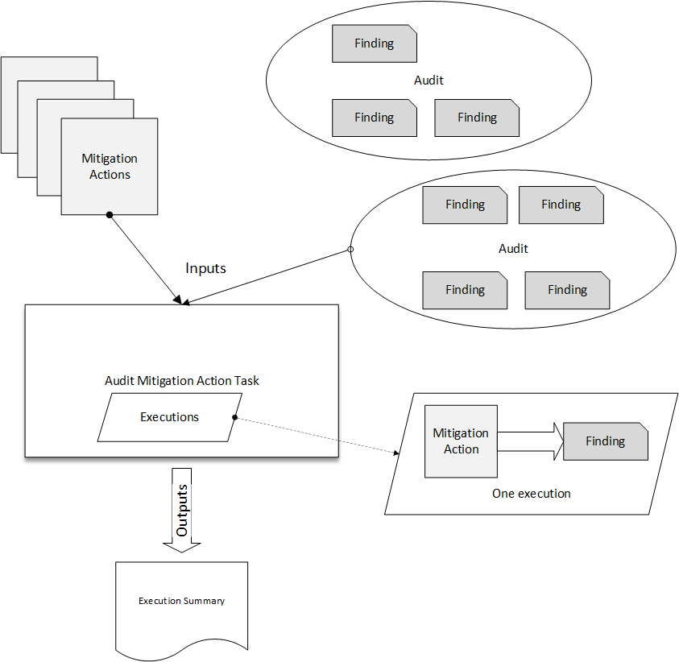
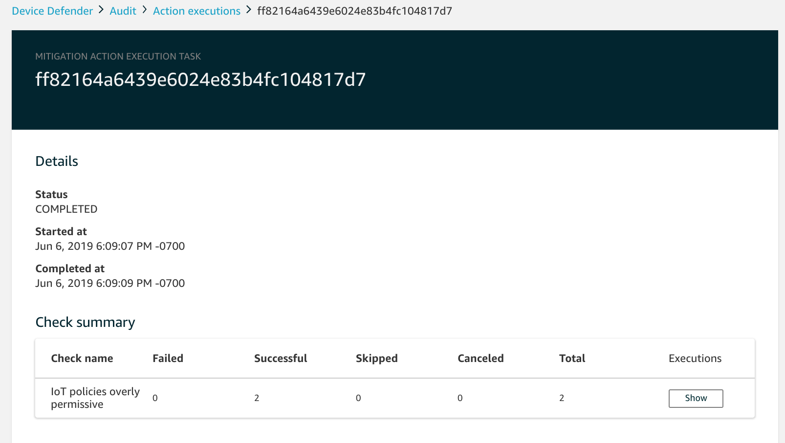
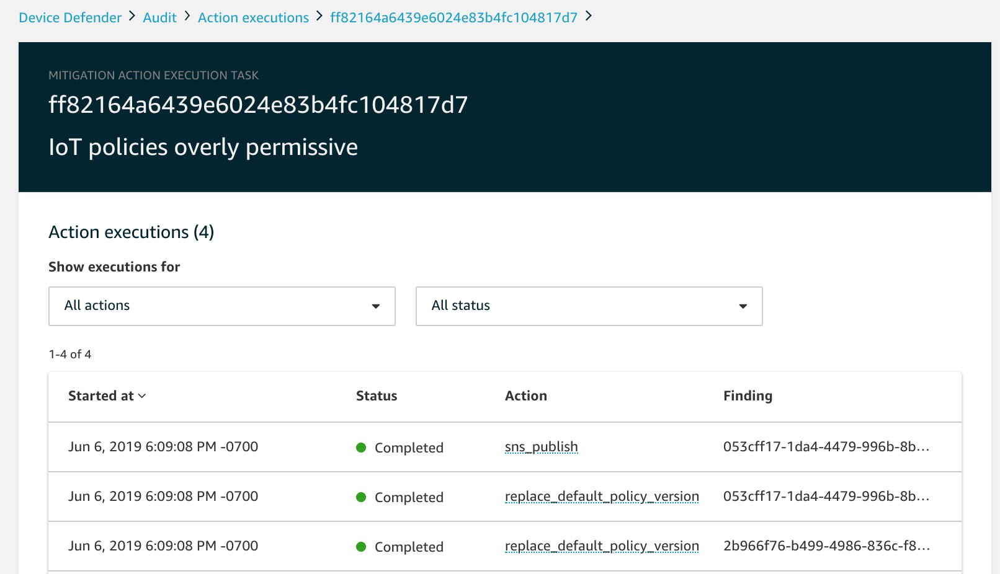

# Mitigation actions

You can use AWS IoT Device Defender to take actions to mitigate issues that were found in an Audit finding
or Detect alarm.

###### Note

Mitigation actions won't be performed on suppressed audit findings. For more information
about audit finding suppressions, see [Audit finding suppressions](audit-finding-suppressions.md "audit-finding-suppressions.md").

## Audit mitigation actions

AWS IoT Device Defender provides predefined actions for the different audit checks. You configure those
actions for your AWS account and then apply them to a set of findings. Those findings can
be:

- All findings from an audit. This option is available in both the AWS IoT console and
  by using the AWS CLI.
- A list of individual findings. This option is only available by using the
  AWS CLI.
- A filtered set of findings from an audit.

The following table lists the types of audit checks and the supported mitigation actions
for each:

| Audit check to mitigation action mapping                     | Audit check                                                                     | Supported mitigation actions |
| ------------------------------------------------------------ | ------------------------------------------------------------------------------- | ---------------------------- |
| REVOKED_CA_CERT_CHECK                                        | PUBLISH_FINDING_TO_SNS, UPDATE_CA_CERTIFICATE                                   |
| INTERMEDIATE_CA_REVOKED_FOR_ACTIVE_DEVICE_CERTIFICATES_CHECK | PUBLISH_FINDING_TO_SNS, UPDATE_DEVICE_CERTIFICATE,<br>ADD_THINGS_TO_THING_GROUP |
| DEVICE_CERTIFICATE_SHARED_CHECK                              | PUBLISH_FINDING_TO_SNS, UPDATE_DEVICE_CERTIFICATE,<br>ADD_THINGS_TO_THING_GROUP |
| UNAUTHENTICATED_COGNITO_ROLE_OVERLY_PERMISSIVE_CHECK         | PUBLISH_FINDING_TO_SNS                                                          |
| AUTHENTICATED_COGNITO_ROLE_OVERLY_PERMISSIVE_CHECK           | PUBLISH_FINDING_TO_SNS                                                          |
| IOT_POLICY_OVERLY_PERMISSIVE_CHECK                           | PUBLISH_FINDING_TO_SNS, REPLACE_DEFAULT_POLICY_VERSION                          |
| IOT_POLICY_POTENTIAL_MISCONFIGURATION_CHECK                  | PUBLISH_FINDING_TO_SNS, REPLACE_DEFAULT_POLICY_VERSION                          |
| CA_CERTIFICATE_EXPIRING_CHECK                                | PUBLISH_FINDING_TO_SNS, UPDATE_CA_CERTIFICATE                                   |
| CONFLICTING_CLIENT_IDS_CHECK                                 | PUBLISH_FINDING_TO_SNS                                                          |
| DEVICE_CERTIFICATE_EXPIRING_CHECK                            | PUBLISH_FINDING_TO_SNS, UPDATE_DEVICE_CERTIFICATE,<br>ADD_THINGS_TO_THING_GROUP |
| REVOKED_DEVICE_CERTIFICATE_STILL_ACTIVE_CHECK                | PUBLISH_FINDING_TO_SNS, UPDATE_DEVICE_CERTIFICATE,<br>ADD_THINGS_TO_THING_GROUP |
| LOGGING_DISABLED_CHECK                                       | PUBLISH_FINDING_TO_SNS, ENABLE_IOT_LOGGING                                      |
| DEVICE_CERTIFICATE_KEY_QUALITY_CHECK                         | PUBLISH_FINDING_TO_SNS, UPDATE_DEVICE_CERTIFICATE,<br>ADD_THINGS_TO_THING_GROUP |
| CA_CERTIFICATE_KEY_QUALITY_CHECK                             | PUBLISH_FINDING_TO_SNS, UPDATE_CA_CERTIFICATE                                   |
| IOT_ROLE_ALIAS_OVERLY_PERMISSIVE_CHECK                       | PUBLISH_FINDING_TO_SNS                                                          |
| IOT_ROLE_ALIAS_ALLOWS_ACCESS_TO_UNUSED_SERVICES_CHECK        | PUBLISH_FINDING_TO_SNS                                                          |

All audit checks support publishing the audit findings to Amazon SNS so you can take custom
actions in response to the notification. Each type of audit check can support additional
mitigation actions:

**REVOKED_CA_CERT_CHECK**

- Change the state of the certificate to mark it as inactive in AWS IoT.

**DEVICE_CERTIFICATE_SHARED_CHECK**

- Change the state of the device certificate to mark it as inactive in
  AWS IoT.
- Add the devices that use that certificate to a thing group.

**UNAUTHENTICATED_COGNITO_ROLE_OVERLY_PERMISSIVE_CHECK**

- No additional supported actions.

**AUTHENTICATED_COGNITO_ROLE_OVERLY_PERMISSIVE_CHECK**

- No additional supported actions.

**IOT_POLICY_OVERLY_PERMISSIVE_CHECK**

- Add a blank AWS IoT policy version to restrict permissions.

**IOT_POLICY_POTENTIAL_MISCONFIGURATION_CHECK**

- Identify potential misconfigurations in AWS IoT policies.

**CA_CERT_APPROACHING_EXPIRATION_CHECK**

- Change the state of the certificate to mark it as inactive in AWS IoT.

**CONFLICTING_CLIENT_IDS_CHECK**

- No additional supported actions.

**DEVICE_CERT_APPROACHING_EXPIRATION_CHECK**

- Change the state of the device certificate to mark it as inactive in
  AWS IoT.
- Add the devices that use that certificate to a thing group.

**DEVICE_CERTIFICATE_KEY_QUALITY_CHECK**

- Change the state of the device certificate to mark it as inactive in
  AWS IoT.
- Add the devices that use that certificate to a thing group.

**CA_CERTIFICATE_KEY_QUALITY_CHECK**

- Change the state of the certificate to mark it as inactive in AWS IoT.

**REVOKED_DEVICE_CERT_CHECK**

- Change the state of the device certificate to mark it as inactive in
  AWS IoT.
- Add the devices that use that certificate to a thing group.

**LOGGING_DISABLED_CHECK**

- Enable logging.

AWS IoT Device Defender supports the following types of mitigation actions on Audit findings:

| Action type                    | Notes                                                                                                                                                                                                                                     |
| ------------------------------ | ----------------------------------------------------------------------------------------------------------------------------------------------------------------------------------------------------------------------------------------- |
| ADD_THINGS_TO_THING_GROUP      | You specify the group to which you want to add the devices. You also specify<br>whether membership in one or more dynamic groups should be overridden if that would<br>exceed the maximum number of groups to which the thing can belong. |
| ENABLE_IOT_LOGGING             | You specify the logging level and the role with permissions for logging. You<br>cannot specify a logging level of `DISABLED`.                                                                                                             |
| PUBLISH_FINDING_TO_SNS         | You specify the topic to which the finding should be published.                                                                                                                                                                           |
| REPLACE_DEFAULT_POLICY_VERSION | You specify the template name. Replaces the policy version with a default or<br>blank policy. Only a value of `BLANK_POLICY` is currently<br>supported.                                                                                   |
| UPDATE_CA_CERTIFICATE          | You specify the new state for the CA certificate. Only a value of<br>`DEACTIVATE` is currently supported.                                                                                                                                 |
| UPDATE_DEVICE_CERTIFICATE      | You specify the new state for the device certificate. Only a value of<br>`DEACTIVATE` is currently supported.                                                                                                                             |

By configuring standard actions when issues are found during an audit, you can respond
to those issues consistently. Using these defined mitigation actions also helps you resolve
the issues more quickly and with less chance of human error.

###### Important

Applying mitigation actions that change certificates, add things to a new thing group,
or replace the policy can have an impact on your devices and applications. For example,
devices might be unable to connect. Consider the implications of the mitigation actions
before you apply them. You might need to take other actions to correct the problems before
your devices and applications can function normally. For example, you might need to
provide updated device certificates. Mitigation actions can help you quickly limit your
risk, but you must still take corrective actions to address the underlying issues.

Some actions, such as reactivating a device certificate, can only be performed manually.
AWS IoT Device Defender does not provide a mechanism to automatically roll back mitigation actions that have
been applied.

## Detect mitigation actions

AWS IoT Device Defender supports the following types of mitigation actions on Detect alarms:

| Action type               | Notes                                                                                                                                                                                                                                     |
| ------------------------- | ----------------------------------------------------------------------------------------------------------------------------------------------------------------------------------------------------------------------------------------- |
| ADD_THINGS_TO_THING_GROUP | You specify the group to which you want to add the devices. You also specify<br>whether membership in one or more dynamic groups should be overridden if that would<br>exceed the maximum number of groups to which the thing can belong. |

## How to define and manage mitigation

actions

You can use the AWS IoT console or the AWS CLI to define and manage mitigation actions for
your AWS account.

### Create mitigation actions

Each mitigation action that you define is a combination of a predefined action type
and parameters specific to your account.

###### To use the AWS IoT console to create mitigation actions

1. Open the [Mitigation actions page in the AWS IoT
   console](https://console.aws.amazon.com//iot/home#/dd/mitigationActionConfigsHub "https://console.aws.amazon.com//iot/home#/dd/mitigationActionConfigsHub").
2. On the **Mitigation actions** page, choose
   **Create**.
3. On the **Create a new mitigation action** page, in **Action name**, enter a unique name for your mitigation action.
4. In **Action type**, specify the type of action that you want to
   define.
5. In **Permissions**, choose the IAM role under whose
   permissions the action is applied.
6. Each action type requests a different set of parameters. Enter the parameters for
   the action. For example, if you choose the **Add things to thing
   group** action type, choose the destination group and select or clear
   **Override dynamic groups**.
7. Choose **Create** to save your mitigation action to your AWS
   account.

###### To use the AWS CLI to create mitigation actions

- Use the [CreateMitigationAction](../../../iot/latest/apireference/API_CreateMitigationAction.md "../../../iot/latest/apireference/API_CreateMitigationAction.md") command to create your mitigation action. The unique
  name that you give the action is used when you apply that action to audit findings.
  Choose a meaningful name.

###### To use the AWS IoT console to view and modify mitigation actions

1. Open the [Mitigation actions page in the AWS IoT
   console](https://console.aws.amazon.com//iot/home#/dd/mitigationActionConfigsHub "https://console.aws.amazon.com//iot/home#/dd/mitigationActionConfigsHub").

The **Mitigation actions** page displays a list of all of the
mitigation actions that are defined for your AWS account. 2. Choose the action name link for the mitigation action that you want to change. 3. Choose **Edit** and make your changes to the mitigation action. You cannot change the name because the name of the mitigation action is used to identify it. 4. Choose **Update** to save the changes to the mitigation action to your AWS account.

###### To use the AWS CLI to list a mitigation action

- Use the [ListMitigationAction](../../../iot/latest/apireference/API_ListMitigationAction.md "../../../iot/latest/apireference/API_ListMitigationAction.md") command to list your mitigation actions. If you want
  to change or delete a mitigation action, make a note of the name.

###### To use the AWS CLI to update a mitigation action

- Use the [UpdateMitigationAction](../../../iot/latest/apireference/API_UpdateMitigationAction.md "../../../iot/latest/apireference/API_UpdateMitigationAction.md") command to change your mitigation action.

###### To use the AWS IoT console to delete a mitigation action

1. Open the [Mitigation actions page in the AWS IoT
   console](https://console.aws.amazon.com//iot/home#/dd/mitigationActionConfigsHub "https://console.aws.amazon.com//iot/home#/dd/mitigationActionConfigsHub").

The **Mitigation actions** page displays all of the mitigation
actions that are defined for your AWS account. 2. Choose the the mitigation action that you want to delete, and then choose **Delete**. 3. In the **Are you sure you want to delete** window, choose **Delete**.

###### To use the AWS CLI to delete mitigation actions

- Use the [UpdateMitigationAction](../../../iot/latest/apireference/API_UpdateMitigationAction.md "../../../iot/latest/apireference/API_UpdateMitigationAction.md") command to change your mitigation action.

###### To use the AWS IoT console to view mitigation action details

1. Open the [Mitigation actions page in the AWS IoT
   console](https://console.aws.amazon.com//iot/home#/dd/mitigationActionConfigsHub "https://console.aws.amazon.com//iot/home#/dd/mitigationActionConfigsHub").

The **Mitigation actions** page displays all of the mitigation
actions that are defined for your AWS account. 2. Choose the action name link for the mitigation action that you want to view.

###### To use the AWS CLI to view mitigation action details

- Use the [DescribeMitigationAction](../../../iot/latest/apireference/API_DescribeMitigationAction.md "../../../iot/latest/apireference/API_DescribeMitigationAction.md") command to view details for your mitigation
  action.

## Apply mitigation actions

After you have defined a set of mitigation actions, you can apply those actions to the
findings from an audit. When you apply actions, you start an audit mitigation actions task.
This task might take some time to complete, depending on the set of findings and the actions
that you apply to them. For example, if you have a large pool of devices whose certificates
have expired, it might take some time to deactivate all of those certificates or to move
those devices to a quarantine group. Other actions, such as enabling logging, can be
completed quickly.

You can view the list of action executions and cancel an execution that has not yet been
completed. Actions already performed as part of the canceled action execution are not rolled
back. If you are applying multiple actions to a set of findings and one of those actions
failed, the subsequent actions are skipped for that finding (but are still applied to other
findings). The task status for the finding is FAILED. The `taskStatus` is set to
failed if one or more of the actions failed when applied to the findings. Actions are
applied in the order in which they are specified.

Each action execution applies a set of actions to a target. That target can be a list of
findings or it can be all findings from an audit.

The following diagram shows how you can define an audit mitigation task that takes all
findings from one audit and applies a set of actions to those findings. A single execution
applies one action to one finding. The audit mitigation actions task outputs an execution
summary.



The following diagram shows how you can define an audit mitigation task that takes a
list of individual findings from one or more audits and applies a set of actions to those
findings. A single execution applies one action to one finding. The audit mitigation actions
task outputs an execution summary.


You can use the AWS IoT console or the AWS CLI to apply mitigation actions.

###### To use the AWS IoT console to apply mitigation actions by starting an action

execution

1. Open the [Audit results page in the AWS IoT
   console](https://console.aws.amazon.com//iot/home#/dd/auditResultsHub "https://console.aws.amazon.com//iot/home#/dd/auditResultsHub").
2. Choose the name for the audit to which you want to apply actions.
3. Choose **Start mitigation actions**. This button is not available
   if all of your checks are compliant.
4. In **Start a new mitigation action**, the task name defaults to the audit ID, but you can change it to something more meaningful.
5. For each type of check that had one or more noncompliant findings in the audit, you
   can choose one or more actions to apply. Only actions that are valid for the check type
   are displayed.

###### Note

If you have not configured actions for your AWS account, the list of actions is
empty. You can choose the **Create mitigation action** link to create one or more
mitigation actions. 6. When you have specified all of the actions that you want to apply, choose
**Start task**.

###### To use the AWS CLI to apply mitigation actions by starting an audit mitigation actions

execution

1. If you want to apply actions to all findings for the audit, use the [ListAuditTasks](../../../iot/latest/apireference/API_ListAuditTasks.md "../../../iot/latest/apireference/API_ListAuditTasks.md") command to find the task ID.
2. If you want to apply actions to selected findings only, use the [ListAuditFindings](../../../iot/latest/apireference/API_ListAuditFindings.md "../../../iot/latest/apireference/API_ListAuditFindings.md") command to get the finding IDs.
3. Use the [ListMitigationActions](../../../iot/latest/apireference/API_ListMitigationActions.md "../../../iot/latest/apireference/API_ListMitigationActions.md") command and make note of the names of the mitigation
   actions that you want to apply.
4. Use the [StartAuditMitigationActionsTask](../../../iot/latest/apireference/API_StartAuditMitigationActionsTask.md "../../../iot/latest/apireference/API_StartAuditMitigationActionsTask.md") command to apply actions to the target. Make
   note of the task ID. You can use the ID to check the state of the action execution,
   review the details, or cancel it.

###### To use the AWS IoT console to view your action executions

1. Open the [Action tasks page in the AWS IoT
   console](https://console.aws.amazon.com//iot/home#/dd/auditTasksHub "https://console.aws.amazon.com//iot/home#/dd/auditTasksHub").

A list of action tasks shows when each was started and the current status. 2. Choose the **Name** link to see details for the task. The details
include all of the actions that are applied by the task, their target, and their
status.



You can use the **Show executions for** filters to focus on types
of actions or action states. 3. To see details for the task, in **Executions**, choose
**Show**.



###### To use the AWS CLI to list your started tasks

1. Use [ListAuditMitigationActionsTasks](../../../iot/latest/apireference/API_ListAuditMitigationActionsTasks.md "../../../iot/latest/apireference/API_ListAuditMitigationActionsTasks.md") to view your audit mitigation actions tasks.
   You can provide filters to narrow the results. If you want to view details of the task,
   make note of the task ID.
2. Use [ListAuditMitigationActionsExecutions](../../../iot/latest/apireference/API_ListAuditMitigationActionsExecutions.md "../../../iot/latest/apireference/API_ListAuditMitigationActionsExecutions.md") to view execution details for a
   particular audit mitigation actions task.
3. Use [DescribeAuditMitigationActionsTask](../../../iot/latest/apireference/API_DescribeAuditMitigationActionsTask.md "../../../iot/latest/apireference/API_DescribeAuditMitigationActionsTask.md") to view details about the task, such as
   the parameters specified when it was started.

###### To use the AWS CLI to cancel a running audit mitigation actions task

1. Use the [ListAuditMitigationActionsTasks](../../../iot/latest/apireference/API_ListDetectMitigationActionsExecutions.md "../../../iot/latest/apireference/API_ListDetectMitigationActionsExecutions.md") command to find the task ID for the task
   whose execution you want to cancel. You can provide filters to narrow the
   results.
2. Use the [ListDetectMitigationActionsExecutions](../../../iot/latest/apireference/API_CancelAuditMitigationActionsTask.md "../../../iot/latest/apireference/API_CancelAuditMitigationActionsTask.md") command, using the task ID, to cancel
   your audit mitigation actions task. You cannot cancel tasks that have been completed.
   When you cancel a task, remaining actions are not applied, but mitigation actions that
   were already applied are not rolled back.

## Permissions

For each mitigation action that you define, you must provide the role used to apply that
action.

| Permissions for mitigation actions | Action type                                                                                                                                                                                                                                                                                                                | Permissions policy template |
| ---------------------------------- | -------------------------------------------------------------------------------------------------------------------------------------------------------------------------------------------------------------------------------------------------------------------------------------------------------------------------- | --------------------------- |
| UPDATE_DEVICE_CERTIFICATE          | JSON<br>``<br>`{<br>"Version":"2012-10-17",<br>"Statement":[<br>{<br>"Effect":"Allow",<br>"Action":[<br>"iot:UpdateCertificate"<br>],<br>"Resource":[<br>"*"<br>]<br>}<br>]<br>}`<br>``                                                                                                                                    |
| UPDATE_CA_CERTIFICATE              | JSON<br>``<br>`{<br>"Version":"2012-10-17",<br>"Statement":[<br>{<br>"Effect":"Allow",<br>"Action":[<br>"iot:UpdateCACertificate"<br>],<br>"Resource":[<br>"*"<br>]<br>}<br>]<br>}`<br>``                                                                                                                                  |
| ADD_THINGS_TO_THING_GROUP          | JSON<br>``<br>`{<br>"Version":"2012-10-17",<br>"Statement":[<br>{<br>"Effect":"Allow",<br>"Action":[<br>"iot:ListPrincipalThings",<br>"iot:AddThingToThingGroup"<br>],<br>"Resource":[<br>"*"<br>]<br>}<br>]<br>}`<br>``                                                                                                   |
| REPLACE_DEFAULT_POLICY_VERSION     | JSON<br>``<br>`{<br>"Version":"2012-10-17",<br>"Statement":[<br>{<br>"Effect":"Allow",<br>"Action":[<br>"iot:CreatePolicyVersion"<br>],<br>"Resource":[<br>"*"<br>]<br>}<br>]<br>}`<br>``                                                                                                                                  |
| ENABLE_IOT_LOGGING                 | JSON<br>``<br>`{<br>"Version":"2012-10-17",<br>"Statement": [<br>{<br>"Effect": "Allow",<br>"Action": [<br>"iot:SetV2LoggingOptions"<br>],<br>"Resource": "*"<br>},<br>{<br>"Effect": "Allow",<br>"Action": [<br>"iam:PassRole"<br>],<br>"Resource": "arn:aws:iam::123456789012:role/IoTLoggingRole"<br>}<br>]<br>}`<br>`` |
| PUBLISH_FINDING_TO_SNS             | JSON<br>``<br>`{<br>"Version":"2012-10-17",<br>"Statement":[<br>{<br>"Effect":"Allow",<br>"Action":[<br>"sns:Publish"<br>],<br>"Resource":[<br>"arn:aws:sns:`us-east-1`:123456789012:`example-topic`"<br>]<br>}<br>]<br>}`<br>``                                                                                           |

For all mitigation action types, use the following trust policy template:

JSON

```
`{
 "Version":"2012-10-17",
 "Statement": [
 {
 "Sid": "",
 "Effect": "Allow",
 "Principal": {
 "Service": "iot.amazonaws.com"
 },
 "Action": "sts:AssumeRole",
 "Condition": {
 "ArnLike": {
 "aws:SourceArn": "arn:aws:iot:*:123456789012::*"
 },
 "StringEquals": {
 "aws:SourceAccount": "123456789012:"
 }
 }
 }
 ]
}`

```
