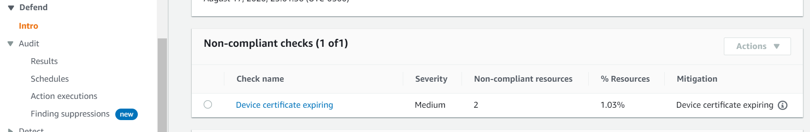
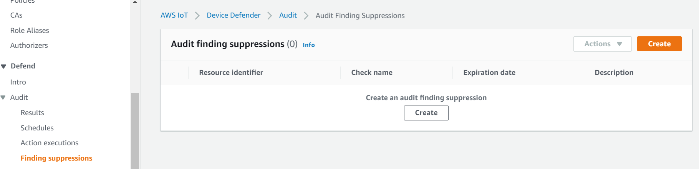
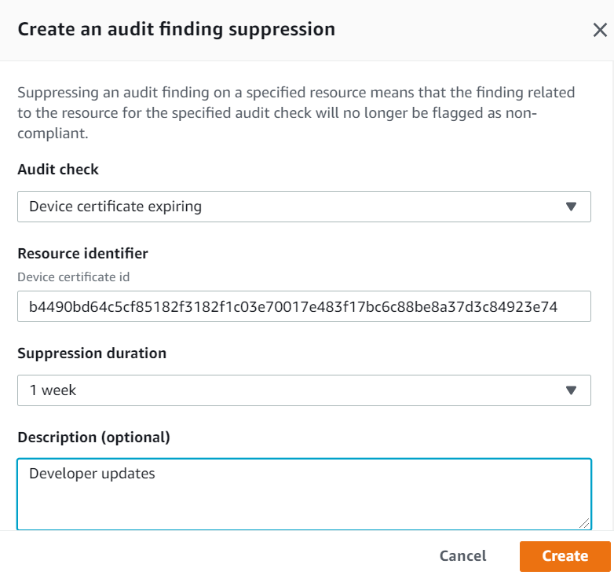
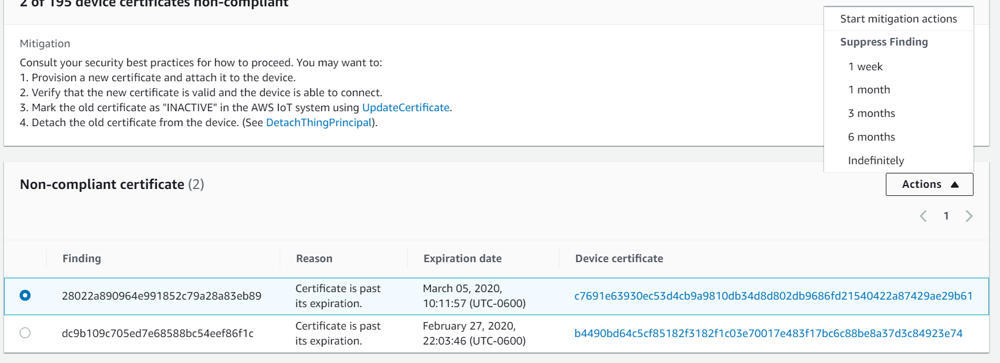

# Customize when and how you view AWS IoT Device Defender audit

results

AWS IoT Device Defender audit provides periodic security checks to confirm AWS IoT devices and resources are
following best practices. For each check, the audit results are categorized as compliant or
non-compliant, where non-compliance results in console warning icons. To reduce noise from
repeating known issues, the audit finding suppression feature allows you to temporarily
silence these non-compliance notifications.

You can suppress select audit checks for a specific resource or account for a
predetermined time period. An audit check result that has been suppressed is categorized as
a suppressed finding, separate from the compliant and non-compliant categories. This new
category doesn't trigger an alarm like a non-compliant result. This allows you to reduce
non-compliance notification disturbances during known maintenance periods or until an update
is scheduled to be completed.

## Getting started

The following sections detail how you can use audit finding suppressions to suppress a
`Device certificate expiring` check in the console and CLI. If you'd like
to follow either of the demonstrations, you must first create two expiring certificates
for Device Defender to detect.

Use the following to create your certificates.

- [Create and
  register a CA certificate](../../../iot/latest/developerguide/create-device-cert.md "../../../iot/latest/developerguide/create-device-cert.md") in the _AWS IoT Core
  Developer Guide_
- [Create a client
  certificate using your CA certificate](../../../iot/latest/developerguide/create-device-cert.md "../../../iot/latest/developerguide/create-device-cert.md"). In step 3, set your
  `days` parameter to `1`.

If you're using the CLI to create your certificates, enter the following
command.

```
openssl x509 -req \
    -in `device_cert_csr_filename` \
    -CA `root_ca_pem_filename` \
    -CAkey `root_ca_key_filename` \
    -CAcreateserial \
    -out `device_cert_pem_filename` \
    -days `1` -sha256
```

## Customize your audit findings in the

console

The following walkthrough uses an account with two expired device certificates that
trigger a non-compliant audit check. In this scenario, we want to disable the warning
because our developers are testing a new feature that'll address the problem. We create
an audit finding suppression for each certificate to stop the audit result from being
non-compliant for the next week.

1. We will first run an on-demand audit to show that the expired device
   certificate check is non-compliant.

From the [AWS IoT
console](https://console.aws.amazon.com/iot "https://console.aws.amazon.com/iot"), choose **Defend** from the left sidebar, then
**Audit**, and then **Results**. On the
**Audit Results** page, choose
**Create**. The **Create a new audit**
window opens. Choose **Create**.



From the on-demand audit results, we can see that "Device certificate
expiring" is non-compliant for two resources. 2. Now, we'd like to disable the "Device certificate expiring" non-compliant
check warning because our developers are testing new features that will fix the
warning.

From the left sidebar under **Defend**, choose
**Audit**, and then choose **Finding
suppressions**. On the **Audit finding
suppressions** page, choose **Create**.

 3. On the **Create an audit finding suppression** window, we
need to fill out the following.

    * **Audit check**: We select `Device certificate
     expiring`, because that is the audit check we'd like to
     suppress.
    * **Resource identifier**: We input the device
     certificate ID of one of the certificates we'd like to suppress audit
     findings for.
    * **Suppression duration**: We select `1
     week`, because that's how long we'd like to suppress the
     `Device certificate expiring` audit check for.
    * **Description (optional)**: We add a note that
     describes why we're suppressing this audit finding.



After we've filled out the fields, choose **Create**. We
see a success banner after the audit finding suppression has been
created. 4. We've suppressed an audit finding for one of the certificates and now we need
to suppress the audit finding for the second certificate. We could use the same
suppression method that we used in step 3, but we will be using a different
method for demonstration purposes.

From the left sidebar under **Defend**, choose
**Audit**, and then choose **Results**. On
the **Audit results** page, choose the audit with the
non-compliant resource. Then, select the resource under **Non-compliant
checks**. In our case, we select "Device certificate
expiring". 5. On the **Device certificate expiring** page, under
**Non-compliant policy** choose the option button next to
the finding that needs to be suppressed. Next, choose the
**Actions** dropdown menu, and then choose the duration for
which you'd like finding to be suppressed. In our case, we choose `1
 week` as we did for the other certificate. On the **Confirm
suppression** window, choose **Enable
suppression**.



We see a success banner after the audit finding suppression has been created.
Now, both audit findings have been suppressed for 1 week while our developers
work on a solution to address the warning.

## Customize your audit findings in the CLI

The following walkthrough uses an account with an expired device certificate that
trigger a non-compliant audit check. In this scenario, we want to disable the warning
because our developers are testing a new feature that'll address the problem. We create
an audit finding suppression for the certificate to stop the audit result from being
non-compliant for the next week.

We use the following CLI commands.

- [create-audit-suppression](../../../cli/latest/reference/iot/create-audit-suppression.md "../../../cli/latest/reference/iot/create-audit-suppression.md")
- [describe-audit-suppression](../../../cli/latest/reference/iot/describe-audit-suppression.md "../../../cli/latest/reference/iot/describe-audit-suppression.md")
- [update-audit-suppression](../../../cli/latest/reference/iot/update-audit-suppression.md "../../../cli/latest/reference/iot/update-audit-suppression.md")
- [delete-audit-suppression](../../../cli/latest/reference/iot/delete-audit-suppression.md "../../../cli/latest/reference/iot/delete-audit-suppression.md")
- [list-audit-suppressions](../../../cli/latest/reference/iot/list-audit-suppressions.md "../../../cli/latest/reference/iot/list-audit-suppressions.md")

1. Use the following command to enable the audit.

```
aws iot update-account-audit-configuration \
   --audit-check-configurations "{\"DEVICE_CERTIFICATE_EXPIRING_CHECK\":{\"enabled\":true}}"
```

Output:

None. 2. Use the following command to run an on-demand audit that targets the
`DEVICE_CERTIFICATE_EXPIRING_CHECK` audit check.

```
aws iot start-on-demand-audit-task \
    --target-check-names `DEVICE_CERTIFICATE_EXPIRING_CHECK`
```

Output:

```
{
    "taskId": "787ed873b69cb4d6cdbae6ddd06996c5"
}
```

3. Use the [describe-account-audit-configuration](../../../cli/latest/reference/iot/describe-account-audit-configuration.md "../../../cli/latest/reference/iot/describe-account-audit-configuration.md") command to describe the audit
   configuration. We want to confirm that we've turned on the audit check for
   `DEVICE_CERTIFICATE_EXPIRING_CHECK`.

```
aws iot describe-account-audit-configuration
```

Output:

```

{
    "roleArn": "`arn:aws:iam::<accountid>:role/service-role/project`",
    "auditNotificationTargetConfigurations": {
        "SNS": {
            "targetArn": "`arn:aws:sns:us-east-1:<accountid>:project_sns`",
            "roleArn": "`arn:aws:iam::<accountid>:role/service-role/project`",
            "enabled": true
        }
    },
    "auditCheckConfigurations": {
        "AUTHENTICATED_COGNITO_ROLE_OVERLY_PERMISSIVE_CHECK": {
            "enabled": false
        },
        "CA_CERTIFICATE_EXPIRING_CHECK": {
            "enabled": false
        },
        "CA_CERTIFICATE_KEY_QUALITY_CHECK": {
            "enabled": false
        },
        "CONFLICTING_CLIENT_IDS_CHECK": {
            "enabled": false
        },
        "DEVICE_CERTIFICATE_EXPIRING_CHECK": {
            "enabled": true
        },
        "DEVICE_CERTIFICATE_KEY_QUALITY_CHECK": {
            "enabled": false
        },
        "DEVICE_CERTIFICATE_SHARED_CHECK": {
            "enabled": false
        },
        "IOT_POLICY_OVERLY_PERMISSIVE_CHECK": {
            "enabled": true
        },
        "IOT_ROLE_ALIAS_ALLOWS_ACCESS_TO_UNUSED_SERVICES_CHECK": {
            "enabled": false
        },
        "IOT_ROLE_ALIAS_OVERLY_PERMISSIVE_CHECK": {
            "enabled": false
        },
        "LOGGING_DISABLED_CHECK": {
            "enabled": false
        },
        "REVOKED_CA_CERTIFICATE_STILL_ACTIVE_CHECK": {
            "enabled": false
        },
        "REVOKED_DEVICE_CERTIFICATE_STILL_ACTIVE_CHECK": {
            "enabled": false
        },
        "UNAUTHENTICATED_COGNITO_ROLE_OVERLY_PERMISSIVE_CHECK": {
            "enabled": false
        }
    }
}
```

`DEVICE_CERTIFICATE_EXPIRING_CHECK` should have a value of
`true`. 4. Use the [list-audit-task](../../../cli/latest/reference/iot/list-audit-task.md "../../../cli/latest/reference/iot/list-audit-task.md") command to identify the completed audit
tasks.

```
aws iot list-audit-tasks \
    --task-status "COMPLETED" \
    --start-time `2020-07-31` \
    --end-time `2020-08-01`
```

Output:

```
{
    "tasks": [
        {
            "taskId": "`787ed873b69cb4d6cdbae6ddd06996c5`",
            "taskStatus": "COMPLETED",
            "taskType": "SCHEDULED_AUDIT_TASK"
        }
    ]
}
```

The `taskId` of the audit you ran in step 1 should have a
`taskStatus` of `COMPLETED`. 5. Use the [describe-audit-task](../../../cli/latest/reference/iot/describe-audit-task.md "../../../cli/latest/reference/iot/describe-audit-task.md") command to get details about the completed
audit using the `taskId` output from the previous step.
This command lists details about your audit.

```
aws iot describe-audit-task \
    --task-id "`787ed873b69cb4d6cdbae6ddd06996c5`"
```

Output:

```
{
    "taskStatus": "COMPLETED",
    "taskType": "SCHEDULED_AUDIT_TASK",
    "taskStartTime": 1596168096.157,
    "taskStatistics": {
        "totalChecks": 1,
        "inProgressChecks": 0,
        "waitingForDataCollectionChecks": 0,
        "compliantChecks": 0,
        "nonCompliantChecks": 1,
        "failedChecks": 0,
        "canceledChecks": 0
    },
    "scheduledAuditName": "AWSIoTDeviceDefenderDailyAudit",
    "auditDetails": {
        "DEVICE_CERTIFICATE_EXPIRING_CHECK": {
            "checkRunStatus": "COMPLETED_NON_COMPLIANT",
            "checkCompliant": false,
            "totalResourcesCount": 195,
            "nonCompliantResourcesCount": 2
        }
    }
}
```

6. Use the [list-audit-findings](../../../cli/latest/reference/iot/list-audit-findings.md "../../../cli/latest/reference/iot/list-audit-findings.md") command to find the non-compliant certificate
   ID so that we can suspend the audit alerts for this resource.

```
aws iot list-audit-findings \
    --start-time `2020-07-31` \
    --end-time `2020-08-01`
```

Output:

```
{
    "findings": [
        {
            "findingId": "`296ccd39f806bf9d8f8de20d0ceb33a1`",
            "taskId": "`787ed873b69cb4d6cdbae6ddd06996c5`",
            "checkName": "DEVICE_CERTIFICATE_EXPIRING_CHECK",
            "taskStartTime": 1596168096.157,
            "findingTime": 1596168096.651,
            "severity": "MEDIUM",
            "nonCompliantResource": {
                "resourceType": "DEVICE_CERTIFICATE",
                "resourceIdentifier": {
                    "deviceCertificateId": "b4490<shortened>"
                },
                "additionalInfo": {
                "EXPIRATION_TIME": "1582862626000"
                }
            },
            "reasonForNonCompliance": "Certificate is past its expiration.",
            "reasonForNonComplianceCode": "CERTIFICATE_PAST_EXPIRATION",
            "isSuppressed": false
        },
        {
            "findingId": "37ecb79b7afb53deb328ec78e647631c",
            "taskId": "787ed873b69cb4d6cdbae6ddd06996c5",
            "checkName": "DEVICE_CERTIFICATE_EXPIRING_CHECK",
            "taskStartTime": 1596168096.157,
            "findingTime": 1596168096.651,
            "severity": "MEDIUM",
            "nonCompliantResource": {
                "resourceType": "DEVICE_CERTIFICATE",
                "resourceIdentifier": {
                    "deviceCertificateId": "c7691<shortened>"
                },
                "additionalInfo": {
                "EXPIRATION_TIME": "1583424717000"
                }
            },
            "reasonForNonCompliance": "Certificate is past its expiration.",
            "reasonForNonComplianceCode": "CERTIFICATE_PAST_EXPIRATION",
            "isSuppressed": false
        }
   ]
}
```

7. Use the [create-audit-suppression](../../../cli/latest/reference/iot/create-audit-suppression.md "../../../cli/latest/reference/iot/create-audit-suppression.md") command to suppress notifications for the
   `DEVICE_CERTIFICATE_EXPIRING_CHECK` audit check for a device
   certificate with the id
   `c7691e<shortened>` until
   `2020-08-20`.

```
aws iot create-audit-suppression \
    --check-name DEVICE_CERTIFICATE_EXPIRING_CHECK \
    --resource-identifier deviceCertificateId="`c7691e<shortened>`" \
    --no-suppress-indefinitely \
    --expiration-date `2020-08-20`
```

8. Use the [list-audit-suppression](../../../cli/latest/reference/iot/list-audit-suppression.md "../../../cli/latest/reference/iot/list-audit-suppression.md") command to confirm the audit suppression
   setting and get details about the suppression.

```
aws iot list-audit-suppressions
```

Output:

```
{
    "suppressions": [
        {
        "checkName": "DEVICE_CERTIFICATE_EXPIRING_CHECK",
            "resourceIdentifier": {
                "deviceCertificateId": "`c7691e<shortened>`"
            },
        "expirationDate": 1597881600.0,
        "suppressIndefinitely": false
        }
    ]
}
```

9. The [update-audit-suppression](../../../cli/latest/reference/iot/update-audit-suppression.md "../../../cli/latest/reference/iot/update-audit-suppression.md") command can be used to update the audit
   finding suppression. The example below updates the
   `expiration-date` to `08/21/20`.

```
aws iot update-audit-suppression \
    --check-name DEVICE_CERTIFICATE_EXPIRING_CHECK \
    --resource-identifier deviceCertificateId=c7691e<shortened> \
    --no-suppress-indefinitely \
    --expiration-date `2020-08-21`
```

10. The [delete-audit-suppression](../../../cli/latest/reference/iot/delete-audit-suppression.md "../../../cli/latest/reference/iot/delete-audit-suppression.md") command can be used to remove an audit
    finding suppression.

```
aws iot delete-audit-suppression \
    --check-name DEVICE_CERTIFICATE_EXPIRING_CHECK \
    --resource-identifier deviceCertificateId="`c7691e<shortened>`"
```

To confirm deletion, use the [list-audit-suppressions](../../../cli/latest/reference/iot/list-audit-suppressions.md "../../../cli/latest/reference/iot/list-audit-suppressions.md") command.

```
aws iot list-audit-suppressions
```

Output:

```
{
 "suppressions": []
}
```

In this tutorial, we showed you how to suppress a `Device certificate expiring`
check in the console and CLI. For more information about audit finding suppressions, see
[Audit finding suppressions](audit-finding-suppressions.md "audit-finding-suppressions.md")
