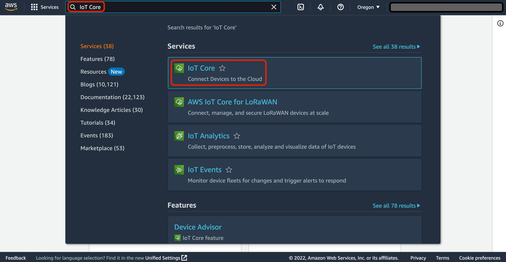
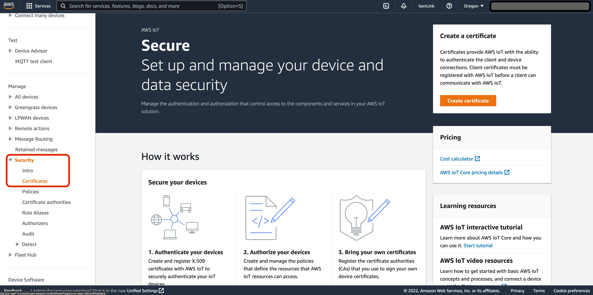
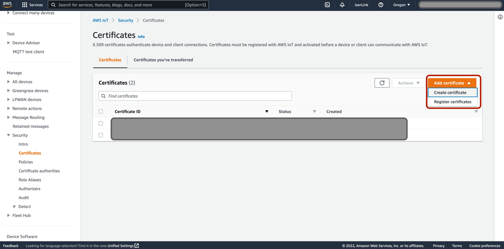
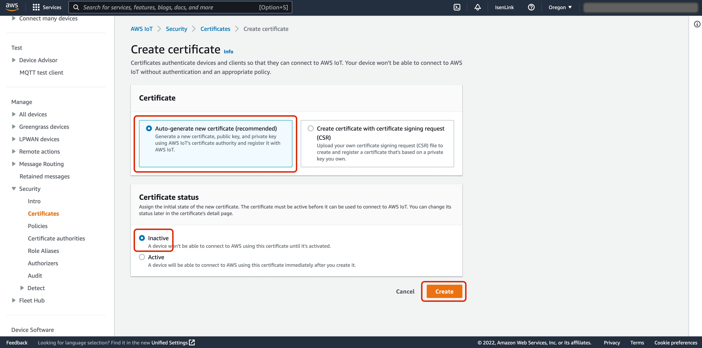
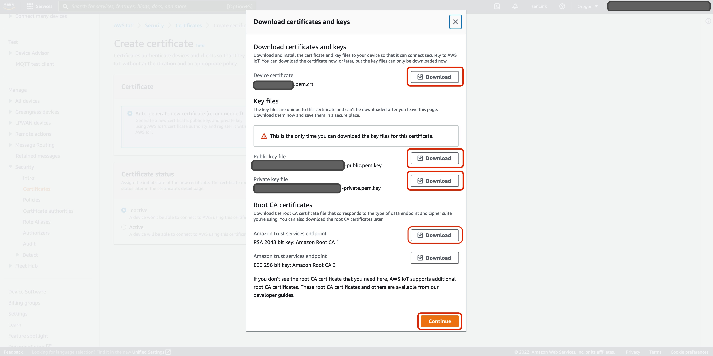

# Appendix A - Steps to obtain a claim-thing

This appendix talks about the steps to obtain a claim-thing. To generate a claim-thing certificate, follow this 7 step process. Once
the certificate is generated, the next thing to do is to register as an OEM with AWS. This is a 3 step process which details information
about the registration.

## Generate a "claim-thing" certificate

1. If you do not have AWS account, or wish to use a new one specifically for ExpressLink
   follow the steps to [Create an AWS account](../../../accounts/latest/reference/manage-acct-creating.md "../../../accounts/latest/reference/manage-acct-creating.md").
2. If you aren't already signed in to your AWS account, sign in, then open
   the [AWS IoT console](https://console.aws.amazon.com/iot/home "https://console.aws.amazon.com/iot/home").

 3. In the AWS IoT console, on the left navigation pane, select
**Security** to expand the sub-menu, then select
**Certificates**.

 4. On the **Certificates** page, on the right side of the
table that shows currently-installed certificates, select
**Add certificate**, then select
**Create certificate** in the drop-down menu.

 5. On the **Create certificate** page, choose
**Auto-generate new certificate**, and choose
**Inactive**. Select **Create** to create
an X.509 certificate.

 6. In the pop-up window that opens, select **Download** for
each of the credentials files that you will need:

    * ``certificate fingerprint`.pem.crt`
    * ``certificate fingerprint`-public.pem.key`
    * ``certificate fingerprint`-private.pem.key`
    * `Amazon Root CA 1` (this file will be downloaded
     as `AmazonRootCA1.pem`).

(The `certificate fingerprint` is a hexadecimal
string that uniquely identifies the certificate and is generated using the
certificate body.)

 7. Select **Continue** to close the pop-up window, then store
the keys and the certificate in a safe place following security best practices.

## Register as an OEM with AWS

1.  Send an email with the following information to
    `<expresslink-onboarding@amazon.com>`:
    - Company name
    - AWS account ID
    - Technical/Developer Contact (name and email)
    - Technical Manager Contact (name and email)

2.  When it receives the request, the AWS IoT ExpressLink service team will:

        * provide a secure mechanism for you to upload the certificate generated
         in the previous section.
        * create a
         [universally unique identifier](https://en.wikipedia.org/wiki/Universally_unique_identifier "https://en.wikipedia.org/wiki/Universally_unique_identifier") (UUID), a 128-bit string label for
         your onboarding functionality. The UUID is required to connect to the
         Staging Endpoint.

    The AWS IoT ExpressLink service team will send the UUID for the onboarding
    functionality, instructions for uploading the certificate, related documentation,
    and terms & conditions to the two technical contacts listed in your request.

3.  After you receive the information listed in the previous step, follow the
    instructions and upload the certificate
    (``certificate fingerprint`.pem.crt`)
    that you generated in the previous section.

###### Warning

DO NOT upload the private key!
(``certificate fingerprint`-private.pem.key`).
