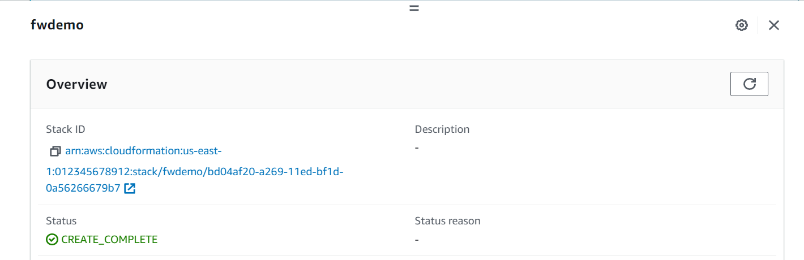
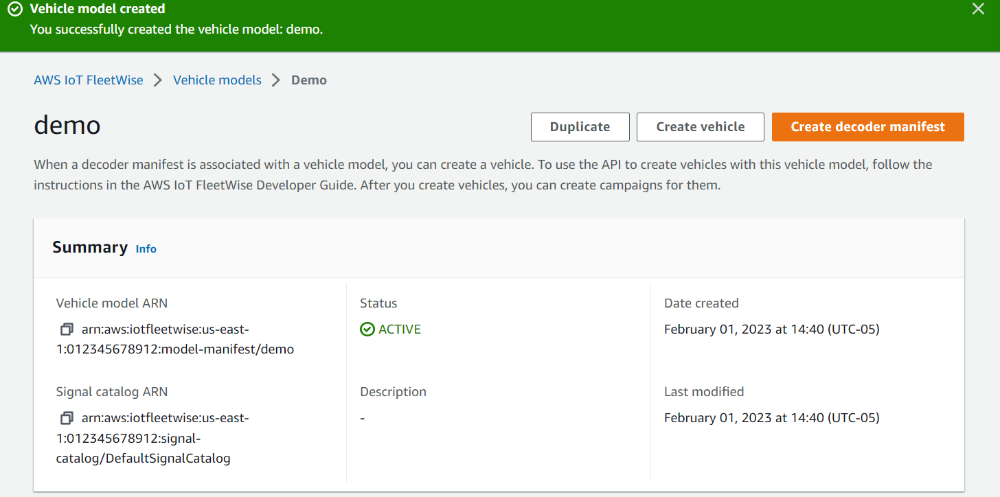

# Tutorial: Get started with AWS IoT FleetWise

With AWS IoT FleetWise, you can collect, transform, and transfer your vehicle data. Use the tutorial in this section to get started with AWS IoT FleetWise.

See the following topics to learn more about AWS IoT FleetWise:

- [Ingest AWS IoT FleetWise data to the cloud](data-ingestion.md "data-ingestion.md")
- [Model AWS IoT FleetWise vehicles](vehicle-modeling.md "vehicle-modeling.md")
- [Manage AWS IoT FleetWise vehicles](vehicles.md "vehicles.md")
- [Manage fleets in AWS IoT FleetWise](fleets.md "fleets.md")
- [Collect AWS IoT FleetWise data with campaigns](campaigns.md "campaigns.md")

## Introduction

Use AWS IoT FleetWise to collect, transform, and transfer the unique data format from automated
vehicles to the cloud in near real time. You have access to fleet-wide insights. This can
help you to efficiently detect and mitigate issues in vehicle health, transfer high-value
data signals, and remotely diagnose problems, all while reducing costs.

This tutorial shows you how to get started with AWS IoT FleetWise. You’ll learn how to
create a vehicle model (model manifest), a decoder manifest, a vehicle, and a
campaign.

For more information about the key components and concepts of AWS IoT FleetWise, see [Key concepts and features of AWS IoT FleetWise](how-iotfleetwise-works.md "how-iotfleetwise-works.md").

Estimated time: About 45 minutes.

###### Important

You will be charged for the AWS IoT FleetWise resources that this demo creates and consumes.
For more information, see [AWS IoT FleetWise](https://aws.amazon.com/iot-fleetwise/pricing/ "https://aws.amazon.com/iot-fleetwise/pricing/")
in the _AWS IoT FleetWise Pricing_ page.

###### Topics

## Prerequisites

To complete this getting started tutorial, you first need the following:

- An AWS account. If you don't have an AWS account, see [Creating an AWS account](../../../accounts/latest/reference/manage-acct-creating.md "../../../accounts/latest/reference/manage-acct-creating.md") in the _AWS Account Management Reference Guide_.
- Access to an AWS Region that supports AWS IoT FleetWise. Currently, AWS IoT FleetWise is supported
  in US East (N. Virginia) and Europe (Frankfurt). You can use the Region selector in the AWS Management Console to switch to one of these
  Regions. For more information, see [AWS IoT FleetWise endpoints and
  quotas](../../../general/latest/gr/iotfleetwise.md "../../../general/latest/gr/iotfleetwise.md").
- Amazon Timestream resources:
  - An Amazon Timestream database. For more information, see [Create a database](../../../timestream/latest/developerguide/console_timestream.md#console_timestream.db.using-console "../../../timestream/latest/developerguide/console_timestream.md#console_timestream.db.using-console") in the _Amazon Timestream
    Developer Guide_.
  - An Amazon Timestream table created in Amazon Timestream that will hold your data.
    For more information, see [Create a table](../../../timestream/latest/developerguide/console_timestream.md#console_timestream.table.using-console "../../../timestream/latest/developerguide/console_timestream.md#console_timestream.table.using-console") in the _Amazon Timestream
    Developer Guide_.

- The Edge Agent software demo. (Instructions for setting up the demo are in the next
  step.)
  - You can use the Explore Edge Agent quick start demo to explore
    AWS IoT FleetWise and learn how to develop Edge Agent software for AWS IoT FleetWise. This demo
    uses an CloudFormation template. It walks you through reviewing the Edge Agent
    reference implementation, developing your Edge Agent, and then deploying
    your Edge Agent software on an Amazon EC2 Graviton and generating sample vehicle data.
    The demo also provides a script that you can use to create a signal
    catalog, a vehicle model, a decoder manifest, a vehicle, a fleet, and a
    campaign — all in the cloud.
  - To download the demo, navigate to the [AWS IoT FleetWise console](https://console.aws.amazon.com/iotfleetwise/ "https://console.aws.amazon.com/iotfleetwise/").
    On the service home page, in the **Get started with
    AWS IoT FleetWise** section, choose **Explore Edge
    Agent**.

## Step 1: Set up the Edge Agent

software for AWS IoT FleetWise

###### Note

The CloudFormation stack in this step uses telemetry data. You can also create a CloudFormation stack using vision system data. For more information, see the [_Vision System Data Developer Guide_](https://github.com/aws/aws-iot-fleetwise-edge/blob/main/docs/dev-guide/vision-system-data/vision-system-data-demo.ipynb "https://github.com/aws/aws-iot-fleetwise-edge/blob/main/docs/dev-guide/vision-system-data/vision-system-data-demo.ipynb").

Vision system data is in preview release and is subject to change.

Your Edge Agent software for AWS IoT FleetWise facilitates communication between vehicles and
the cloud. It receives instructions from data collection schemes on how to collect data
from cloud-connected vehicles.

To set up your Edge Agent software, in **General information**, do the
following:

1. Open the [Launch CloudFormation Template](https://us-east-1.console.aws.amazon.com/cloudformation/home?region=us-east-1#/stacks/quickcreate?templateUrl=https%3A%2F%2Faws-iot-fleetwise.s3.us-west-2.amazonaws.com%2Flatest%2Fcfn-templates%2Ffwdemo.yml&stackName=fwdemo "https://us-east-1.console.aws.amazon.com/cloudformation/home?region=us-east-1#/stacks/quickcreate?templateUrl=https%3A%2F%2Faws-iot-fleetwise.s3.us-west-2.amazonaws.com%2Flatest%2Fcfn-templates%2Ffwdemo.yml&stackName=fwdemo").
2. On the **Quick create stack** page, for **Stack name**, enter the name of your stack of AWS IoT FleetWise resources.
   A stack is a friendly name that appears as a prefix on the names of the
   resources this CloudFormation template creates.
3. Under **Parameters**, enter your custom values for the
   parameters related to your stack.
   1. **Fleetsize** ‐ You can increase the number of
      vehicles in your fleet by updating the Fleetsize parameter.
   2. **IoTCoreRegion** ‐ You can specify the Region
      where the AWS IoT thing is created by updating the IoTCoreRegion
      parameter. You must use the same Region that you used to create your
      AWS IoT FleetWise vehicles. For more information about AWS Regions, see [Regions and Zones - Amazon Elastic Compute Cloud](../../../AWSEC2/latest/UserGuide/using-regions-availability-zones.md#using-regions-availability-zones-setup "../../../AWSEC2/latest/UserGuide/using-regions-availability-zones.md#using-regions-availability-zones-setup").

4. In the **Capabilities** section, select the box to
   acknowledge that CloudFormation creates IAM resources.
5. Choose **Create stack**, then wait approximately 15 minutes
   for the status of the stack to display CREATE_COMPLETE.
6. To confirm the stack was created, choose the **Stack info** tab, refresh the view,
   and look for CREATE_COMPLETE.

###### Important

You will be charged for the AWS IoT FleetWise resources that this demo creates and consumes.
For more information, see [AWS IoT FleetWise](https://aws.amazon.com/iot-fleetwise/pricing/ "https://aws.amazon.com/iot-fleetwise/pricing/")
in the _AWS IoT FleetWise Pricing_ page.

## Step 2: Create a

vehicle model

###### Important

You can't create a vehicle model with vision system data signals in the AWS IoT FleetWise console. Instead, use the AWS CLI.

You use vehicle models to standardize the format of your vehicles, and to help define
the relationship between signals in the vehicles that you create. A _signal catalog_ is also created when you create a vehicle
model. A signal catalog is a collection of standardized signals that can be reused to
create vehicle models. Signals are fundamental structures that you define to contain
vehicle data and its metadata. At this time, the AWS IoT FleetWise service supports only one
signal catalog per AWS Region per account. This helps to verify that data processed
from a fleet of vehicles is consistent.

###### To create a vehicle model

1. Open the AWS IoT FleetWise console.
2. On the navigation pane, choose **Vehicle models.**
3. On the
   **Vehicle models** page, choose **Create vehicle
   model**.
4. In the **General information** section, enter the name of
   your vehicle model, such as Vehicle1, and an optional description. Then choose
   **Next**.
5. Choose one or more signals from the signal catalog. You can filter signals by
   name in the search catalog, or choose them from the list. For example, you can
   choose signals for tire pressure and brake pressure so that you can collect data
   related to these signals. Choose **Next**.
6. Choose your .dbc files and upload them from your local device. Choose
   **Next**.

###### Note

For this tutorial, you can download a [sample .dbc file](samples/EngineSignals.md "samples/EngineSignals.md")
to upload for this step. 7. Add attributes to your vehicle model and then choose
**Next**.

    1. **Name** ‐ Enter the name of the vehicle
     attribute, such as the manufacturer name or manufacturing date.
    2. **Data Type** ‐ On the **Data
     type** menu, choose a data type.
    3. **Unit** ‐ (Optional) Enter a unit value, such
     as kilometer or Celsius.
    4. **Path** ‐ (Optional) Enter a name for the path
     to a signal, such as `Vehicle.Engine.Light.` The dot (.)
     indicates that it is a child signal.
    5. **Default value** ‐ (Optional) Enter a default
     value.
    6. **Description** ‐ (Optional) Enter a description
     of the attribute.

8. Review your configurations. When you're ready, choose
   **Create**. A notification appears saying your vehicle
   model was successfully created.

## Step 3: Create a

decoder manifest

Decoder manifests are associated with the vehicle models that you create. They contain
information that helps AWS IoT FleetWise decode and transform vehicle data from a binary
format into human-readable values that can be analyzed. Network interfaces and decoder
signals are components that help configure decoder manifests. A network interface
contains information about the CAN or OBD protocol that your vehicle network uses. The
decoder signal provides decoding information for a specific signal.

###### To create a decoder manifest

1. Open the AWS IoT FleetWise console.
2. On the navigation pane, choose **Vehicle models**.
3. In the **Vehicle models** section, choose the vehicle model
   that you want to use to create a decoder manifest.
4. Choose **Create decoder manifest**.

## Step 4: Configure a decoder

manifest

###### To configure a decoder manifest

###### Important

You can't configure vision system data signals in decoder manifests using the AWS IoT FleetWise console. Instead, use the AWS CLI. For more information, see [Create a decoder manifest
(AWS CLI)](create-decoder-manifest.md#create-decoder-manifest-cli "create-decoder-manifest.md#create-decoder-manifest-cli").

1. To help you identify your decoder manifest, enter a name and an optional
   description for it. Then, choose **Next**.
2. To add one or more network interfaces, choose either the CAN_INTERFACE or the
   OBD_INTERFACE type.
   - **On-board diagnostic (OBD) interface ‐** Choose this interface type
     if you want a protocol that defines how self-diagnostic data is
     communicated between electronic control units (ECUs). This protocol
     provides a number of standard diagnostic trouble codes (DTCs) that can
     help you troubleshoot problems with your vehicle.
   - **Controller Area Network (CAN bus) interface ‐**Choose this
     interface type if you want a protocol that defines how data is
     communicated between ECUs. ECUs can be engine control units, airbags, or
     the audio system.

3. Enter a network interface name.
4. To add signals to the network interface, choose one or more signals from the
   list.
5. Choose a decoder signal for the signal you added in the previous step. To
   provide decoding information, upload a .dbc file. Each signal in the vehicle
   model must be paired with a decoder signal that you can choose from the
   list.
6. To add another network interface, choose **Add network
   interface**. When you're done adding network interfaces, choose
   **Next**.
7. Review your configurations and then choose **Create**. A
   notification appears saying your decoder manifest was successfully
   created.

## Step 5: Create a

vehicle

In AWS IoT FleetWise, vehicles are virtual representations of your real-life, physical
vehicle. All vehicles created from the same vehicle model inherit the same group of
signals, and each vehicle that you create corresponds to a newly created IoT thing. You
must associate all vehicles with a decoder manifest.

###### Prerequisites

1. Verify that you’ve already created the vehicle model and decoder manifest.
   Also, verify that the status of the vehicle model is **ACTIVE**.
   1. To verify that the status of the vehicle model is ACTIVE, open the
      AWS IoT FleetWise console.
   2. On the navigation pane, choose **Vehicle
      models**.
   3. In the **Summary** section, under
      **Status**, check the status of your
      vehicle.

###### To create a vehicle

1. Open the AWS FleetWise console.
2. On the navigation pane, choose **Vehicles**.
3. Choose **Create vehicle**.
4. To define the vehicle properties, enter the vehicle name, and then choose a
   model manifest (vehicle model) and a decoder manifest.
5. (Optional) To define the vehicle attributes, enter a key-value pair and then
   choose **Add attributes**.
6. (Optional) To label your AWS resource, add tags and then choose **Add new tag.**
7. Choose **Next.**
8. To configure the vehicle certificate, you can either upload your own
   certificate or choose **Auto-generate a new
   certificate.** We recommend auto-generating your
   certificate for a quicker setup. If you already have a certificate, you
   can choose to use it instead.
9. Download the public and private key files and then choose **Next.**
10. To attach a policy to the vehicle certificate, you can either enter an
    existing policy name or create a new policy. To create a new policy, choose
    **Create policy** and then choose **Next**.
11. Review your configurations. When you’re done, choose **Create vehicle.**

## Step 6: Create a

campaign

In AWS IoT FleetWise, campaigns are used to facilitate the selection, collection, and transfer of
data from vehicles to the cloud. Campaigns contain data collection schemes that give the
Edge Agent software instructions on how to collect data with a condition-based
collection scheme or a time-based collection scheme.

###### To create a campaign

1. Open the AWS IoT FleetWise console.
2. On the navigation pane, choose **Campaigns**.
3. Choose **Create campaign**.
4. Enter your campaign name and an optional description.
5. To configure your campaign’s data collection scheme, you can manually define the data collection scheme or upload a .json file from your local device. Uploading a .json file automatically defines the data collection scheme.
   1. To manually define the data collection scheme, choose **Define
      Data Collection Scheme** and choose the type of data
      collection scheme you want to use for your campaign. You can choose
      either a **Condition-based** collection scheme or
      **Time-based** collection scheme.
   2. If you choose a **Time-based** collection scheme, you
      must specify the duration of time that your campaign will collect the
      vehicle data.
   3. If you choose a condition-based collection scheme, you must specify an
      expression to recognize what data to collect. Be sure to specify the
      signal’s name as a variable, a comparison operator, and a comparison
      value.
   4. (Optional) Choose the language version of your expression, or keep it
      as the default value of 1.
   5. (Optional) Specify the trigger interval between two data collection
      events.
   6. To collect data, choose the **Trigger** mode
      condition for the Edge Agent software. By default, the Edge Agent for AWS IoT FleetWise software **Always** collects data
      whenever the condition is met. Or, it can collect data only when the
      condition is met for the first time, **On first
      trigger**.
   7. (Optional) You can choose more advanced scheme options.

6. To specify the signals that the data collection scheme will collect data from,
   search for the name of the signal from the menu.
7. (Optional) You can choose a maximum sample count or minimum sampling interval.
   You can also add more signals.
8. Choose **Next**.
9. Define the storage destination that you want the campaign to transfer data to.
   You can store data in Amazon S3 or Amazon Timestream.
   1. Amazon S3 – Choose the S3 bucket that AWS IoT FleetWise has permissions to.
   2. Amazon Timestream – choose the Timestream database and table name.
      Enter an IAM role that allows AWS IoT FleetWise to send data to Timestream.

10. Choose **Next**.
11. Choose vehicle attributes or vehicle names from the search box.
12. Enter the value related to the attribute or name that you chose for your vehicle.
13. Choose the vehicles that your campaign will collect data from. Then, choose **Next**.
14. Review the configurations of your campaign and then choose
    **Create campaign**. You or your team must deploy the campaign to vehicles.

## Step 7: Clean up

To avoid further charges for the resources you used during this tutorial, delete the CloudFormation stack and all stack resources.

###### To delete the CloudFormation stack

1. Open the [CloudFormation
   console](https://console.aws.amazon.com/cloudformation "https://console.aws.amazon.com/cloudformation").
2. From the list of **Stacks**, choose the stack that you
   created in step 1.
3. Choose **Delete**.
4. To confirm deletion, choose **Delete**. The stack takes
   around 15 minutes to delete.

## Next steps

1. You can process and visualize the vehicle data that your campaign collects.
   For more information, see [Visualize AWS IoT FleetWise vehicle data](process-visualize-data.md "process-visualize-data.md").
2. You can troubleshoot and resolve issues with AWS IoT FleetWise. For more information, see
   [Troubleshooting AWS IoT FleetWise](troubleshooting.md "troubleshooting.md").
