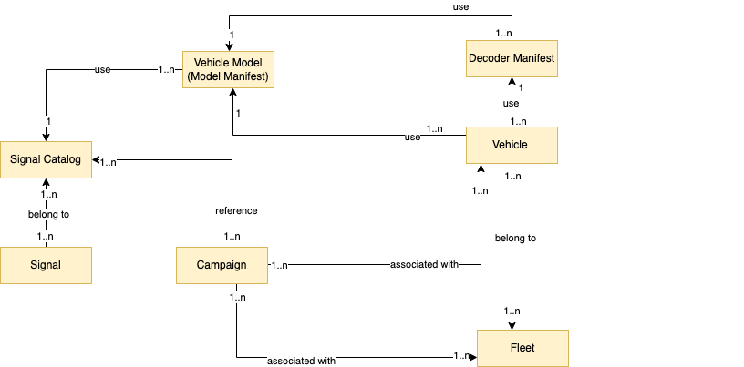

# Model AWS IoT FleetWise vehicles

AWS IoT FleetWise provides a vehicle modeling framework that you can use to build virtual
representations of your vehicles in the cloud. Signals, signal catalogs, vehicle models, and
decoder manifests are the core components that you work with to model your vehicles.

**Signal**

Signals are fundamental structures that you define to contain vehicle data and
its metadata. A signal can be an attribute, a branch, a sensor, or an actuator.
For example, you can create a sensor to receive in-vehicle temperature values,
and to store its metadata, including a sensor name, a data type, and a unit. For
more information, see [Manage AWS IoT FleetWise signal catalogs](signal-catalogs.md "signal-catalogs.md").

**Signal catalog**

A signal catalog contains a collection of signals. Signals in a signal catalog
can be used to model vehicles that use different protocols and data formats. For
example, there are two cars made by different automakers: one uses the Control
Area Network (CAN bus) protocol; the other one uses the On-board Diagnostics
(OBD) protocol. You can define a sensor in the signal catalog to receive
in-vehicle temperature values. This sensor can be used to represent the
thermocouples in both cars. For more information, see [Manage AWS IoT FleetWise signal catalogs](signal-catalogs.md "signal-catalogs.md").

**Vehicle model (model manifest)**

Vehicle models are declarative structures that you can use to standardize the
format of your vehicles and to define relationships between signals in the
vehicles. Vehicle models enforce consistent information across multiple vehicles
of the same type. You add signals to create vehicle models. For more
information, see [Manage AWS IoT FleetWise vehicle models](vehicle-models.md "vehicle-models.md").

**Decoder manifest**

Decoder manifests contain decoding information for each signal in vehicle
models. Sensors and actuators in vehicles transmit low-level messages (binary
data). With decoder manifests, AWS IoT FleetWise is able to transform binary data into
human-readable values. Every decoder manifest is associated with a vehicle
model. For more information, see [Manage AWS IoT FleetWise decoder manifests](decoder-manifests.md "decoder-manifests.md").

You can use the AWS IoT FleetWise console or API to model vehicles in the following way.

1. Create or import a signal catalog containing signals that you'll use to create a
   vehicle model. For more information, see [Create an AWS IoT FleetWise signal catalog](create-signal-catalog.md "create-signal-catalog.md") and [Import a signal catalog (AWS CLI)](import-signal.md#import-signal-catalog "import-signal.md#import-signal-catalog").

###### Note

    * If you use the AWS IoT FleetWise
     console to create the first vehicle model, you don't need to manually
     create a signal catalog. When you create your first vehicle model,
     AWS IoT FleetWise automatically creates a signal catalog for you. For more
     information, see [Create an AWS IoT FleetWise vehicle model](create-vehicle-model.md "create-vehicle-model.md").
    * AWS IoT FleetWise currently supports a signal catalog for each AWS account
     per AWS Region.

2. Use signals in the signal catalog to create a vehicle model. For more information,
   see [Create an AWS IoT FleetWise vehicle model](create-vehicle-model.md "create-vehicle-model.md").

###### Note

    * If you use the AWS IoT FleetWise
     console to create a vehicle model, you can upload .dbc files to import
     signals. .dbc is a file format that Controller Area Network (CAN bus)
     databases support. After the vehicle model is created, new signals are
     automatically added to the signal catalog. For more information, see
     [Create an AWS IoT FleetWise vehicle model](create-vehicle-model.md "create-vehicle-model.md").
    * If you use the `CreateModelManifest` API operation to
     create a vehicle model, you must use the
     `UpdateModelManifest` API operation to activate the
     vehicle model. For more information, see [Update an AWS IoT FleetWise vehicle model](update-vehicle-model-cli.md "update-vehicle-model-cli.md").
    * If you use the AWS IoT FleetWise console to create a vehicle model, AWS IoT FleetWise
     automatically activates the vehicle model for you.

3. Create a decoder manifest. The decoder manifest contains decoding information for
   every signal specified in the vehicle model that you created in the previous step.
   The decoder manifest is associated with the vehicle model that you created. For more
   information, see [Manage AWS IoT FleetWise decoder manifests](decoder-manifests.md "decoder-manifests.md").

###### Note

    * If you use the `CreateDecoderManifest` API operation to
     create a decoder manifest, you must use the
     `UpdateDecoderManifest` API operation to activate the
     decoder manifest. For more information, see [Update an AWS IoT FleetWise decoder manifest](update-decoder-manifest.md "update-decoder-manifest.md").
    * If you use the AWS IoT FleetWise console to create a decoder manifest,
     AWS IoT FleetWise automatically activates the decoder manifest for you.

CAN bus databases support the .dbc file format. You might upload .dbc files to import
signals and signal decoders. To get an example .dbc file, do the following.

###### To get a .dbc file

1. Download the [EngineSignals.zip](samples/EngineSignals.md "samples/EngineSignals.md").
2. Navigate to the directory where you downloaded the
   `EngineSignals.zip` file.
3. Unzip the file and save it locally as
   `EngineSignals.dbc`.

###### Topics

- [Manage AWS IoT FleetWise signal catalogs](signal-catalogs.md "signal-catalogs.md")
- [Manage AWS IoT FleetWise vehicle models](vehicle-models.md "vehicle-models.md")
- [Manage AWS IoT FleetWise decoder manifests](decoder-manifests.md "decoder-manifests.md")
