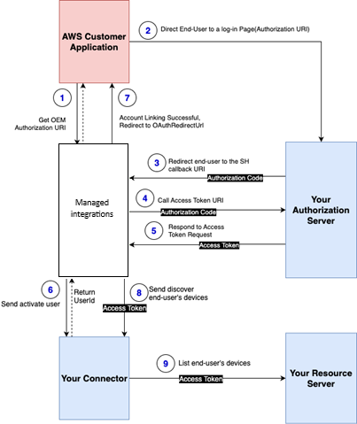

# Account linking workflow

For a customer's managed integrations for AWS IoT Device Management platform to interact with an end-user’s
devices on your third-party platform through your C2C connector, it obtains the access
token through the following workflow:

1. When a user initiates the onboarding of third-party devices through the customer
   application, managed integrations for AWS IoT Device Management returns Authorization URI as well as the
   AssociationId.
2. The application front-end stores the AssociationId and redirects the end user to the
   login page of the third-party platform.
   1. The end user signs in. The end user grants the client access to their device
      data.

3. The third-party platform creates an authorization code. The end user is redirected to
   managed integrations for AWS IoT Device Management platform callback URI including the code attached to the redirect
   request.
4. Managed integrations exchanges this code with the third-party platform token
   URI.
5. The token URI validates the authorization code and returns an OAuth2.0 access
   token and refresh token, associated with the end user.
6. Managed integrations calls the C2C connector with `AWS.ActivateUser`
   operation to complete the Account Linking flow and get UserId.
7. Managed integrations returns OAuthRedirectUrl (from the Connector Policy configuration)
   of the successful authentication page to the customer application.

###### Note

In case of failures, managed integrations for AWS IoT Device Management appends **`error`** and
**`error_description`** query parameters to the URL providing
error details to the customer application. 8. The customer application redirects the end user to the OAuthRedirectUrl. At this
point the application front-end knows AssociationId of the association from the first
step.

All subsequent requests made from managed integrations for AWS IoT Device Management through the C2C connector to
the third-party cloud platform, such as commands to discover devices and send commands, will include the OAuth2.0 access token.
The following diagram shows the relationship between key components of account
linking:

