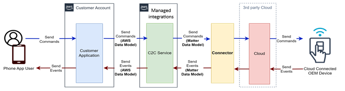

# Cloud-to-Cloud (C2C) connectors

A cloud-to-cloud connector allows you to create and facilitate bidirectional
communication between third-party devices and AWS.

###### Topics

- [What is a cloud-to-cloud (C2C) connector?](#concepts-what-is-c2c-connector "#concepts-what-is-c2c-connector")
- [What is the C2C connector
  catalog?](#concepts-connector-catalog "#concepts-connector-catalog")
- [AWS Lambda functions as C2C connectors](#lambda-connector "#lambda-connector")
- [Managed integrations connector workflow](#c2c-workflow "#c2c-workflow")
- [Guidelines for using a C2C (cloud-to-cloud) connector](#c2c-cloud-connector-disclaimer "#c2c-cloud-connector-disclaimer")
- [Build a C2C (Cloud-to-Cloud) connector](concepts-building-connector.md "concepts-building-connector.md")
- [Use a C2C (Cloud-to-Cloud) connector](use-c2c-create-cloud-connector.md "use-c2c-create-cloud-connector.md")

## What is a cloud-to-cloud (C2C) connector?

A cloud-to-cloud connector is a pre-built software package that securely links the
AWS Cloud to a third-party cloud provider's endpoint. Using the C2C connector,
solution providers can leverage managed integrations for AWS IoT Device Management to control devices that are connected to
third-party clouds.

Managed integrations includes a catalog of connectors where AWS customers can view and
select connectors they want to integrate with. For more information, see [What is the C2C connector
catalog?](#concepts-connector-catalog "#concepts-connector-catalog")

Managed integrations requires every connector be implemented as an AWS Lambda
function.

## What is the C2C connector

catalog?

The managed integrations for AWS IoT Device Management connector catalog is a collection of C2C connectors that facilitate
bidirectional communication between managed integrations for AWS IoT Device Management and a third-party cloud provider. You can view the connectors in the AWS Management Console or the AWS CLI.

###### To use the console to view the managed integrations connector catalog

1. Open the [managed integrations console](https://console.aws.amazon.com/iot/home#/managed-integrations/intro "https://console.aws.amazon.com/iot/home#/managed-integrations/intro")
2. In the left navigation pane, choose **Managed integrations**
3. In the left navigation pane of the managed integrations console, choose **Catalog**.

## AWS Lambda functions as C2C connectors

Every C2C connector Lambda function translates and transports commands and events between
managed integrations and the corresponding actions on third-party platforms. For more information about Lambda, see [What is AWS Lambda](../../../lambda/latest/dg/welcome.md "../../../lambda/latest/dg/welcome.md").

For example, suppose an end user owns a smart light-bulb manufactured by a third-party OEM.
With a C2C connector, an end user can issue a command to turn on or off this light through a managed integrations platform. This command will then be forwarded to the Lambda function
hosted in the connector,
which will translate the request into an API call against the third-party platform to turn the
device on or off.

The Lambda function is required when you call the `CreateCloudConnector` API. The
code that is deployed into the Lambda function must implement all of the interfaces and
functionality as mentioned in [Build a C2C (Cloud-to-Cloud) connector](concepts-building-connector.md "concepts-building-connector.md").

## Managed integrations connector workflow

Developers must register C2C connectors with managed integrations for AWS IoT Device Management. This registration process creates a logical connector
resource that customers can access to use the connector.

###### Note

A C2C connector is a set of metadata created within managed integrations for AWS IoT Device Management to describe
the connector.

The following diagram depicts a C2C connector's role when sending a command
from the mobile application to a cloud-connected device. The C2C connector acts as a
translation layer between managed integrations for AWS IoT Device Management and a third-party cloud platform.

## Guidelines for using a C2C (cloud-to-cloud) connector

Any C2C connector you create is your content, and any C2C connector created by
another customer that you access is third-party content. AWS does not create or
manage any C2C connectors as part of managed integrations.

You may share your C2C connectors with other managed integrations customers. If you do,
you authorize AWS as your service provider to list those C2C connectors
and related contact information on the AWS console and you understand that other AWS
customers may contact you. You are solely responsible for
granting customers access to your C2C connectors and for any terms governing another
AWS customer’s access to your C2C connectors.
