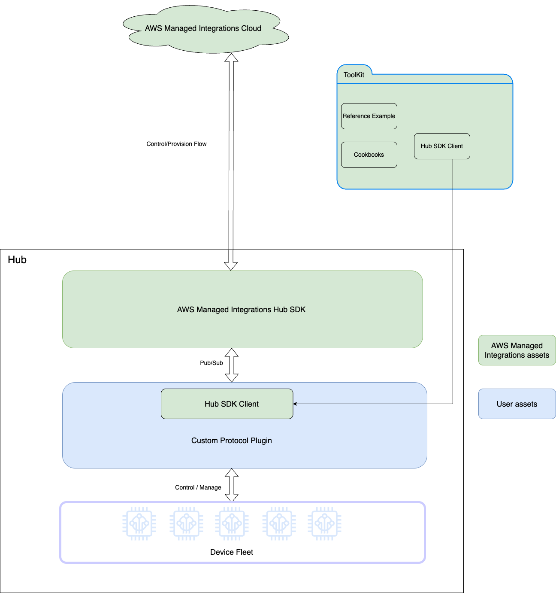

# Custom protocol plugin

You can use a custom protocol plugin to integrate your proprietary IoT protocols into the managed integrations for AWS IoT Device Management ecosystem. Through well-defined SDK interfaces,
you can onboard devices, define capabilities, and handle real-time control flows while maintaining full compatibility with managed integrations and hub SDK components.

The following lists discusses the key features of the custom protocol plugin.

**Data model customization**

Define your own AWS data model schemas and upload them to managed integrations during the provisioning flow. You can use these schemas later in your workflows.

**Flexible plugin implementation**

- Build your own plugin component using [Hub SDK client](hub-sdk-client.md "hub-sdk-client.md").
- Implement separate plugins for different functionalities, such as provisioning and control, or create a unified client for both.
- Maintain a clear boundary between managed integrations assets and your own assets such as middleware stacks, for decoupled and development-friendly code logic implementation.

**Backward compatibility**

For existing customers, smoothly onboard your new custom protocol while also keeping existing radio types working as-is.

The following diagram illustrates the custom protocol plugin architecture.

