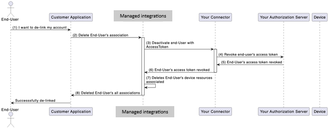

# Implement the AWS.DeactivateUser operation

## User deactivation overview

Deactivation of provided user access tokens is required when a customer deletes
their AWS customer account; or when an end user would like to unlink their account
in the system from AWS customer’s system. In either use-case managed integrations needs to
facilitate this workflow using the C2C connector.

The image below illustrates the delinking an end user account from
the system



###### User deactivation workflow

1. User initiates delinking process between AWS customer's account and the
   third-party authorization server associated with the C2C connector.
2. Customer initiates deletion of user's association through managed integrations for AWS IoT Device Management.
3. Managed integrations initiates the deactivation process via request to your connector
   using the `AWS.DeactivateUser` Operation interface.
   1. The /user's access token is included in the header of the request.

4. Your C2C connector accepts the request and invokes your authorization server to
   revoke the token and any access it provides.
   1. For example, events from an unlinked user account should no longer be sent to
      managed integrations after performing `AWS.DeactivateUser`.

5. Your authorization server revokes the access and sends a response back to your
   C2C connector.
6. Your C2C connector sends managed integrations for AWS IoT Device Management an ACK that the user's access token
   has been revoked.
7. Managed integrations deletes all resources owned by the end user which were associated
   with your resource server.
8. Managed integrations sends an ACK to the customer, stating all associations relating
   to your system are deleted.
9. The customer notifies the end user that their account has been unlinked from your
   platform.

## AWS.DeactivateUser requirements

- The C2C connector Lambda function receives a request message
  from managed integrations to handle the `AWS.DeactivateUser` operation.
- The C2C connector must revoke the provided **OAuth2.0** token and the corresponding
  refresh token of the user within your authorization server.

The following is an example `AWS.DeactivateUser`request that your connector
will receive:

```

{
     "header": {
         "auth": {
             "token": "ashriu32yr97feqy7afsaf",
             "type": "OAuth2.0"

         }
     },
     "payload":{
         "operationName": "AWS.DeactivateUser"
         "operationVersion": "1.0"
         "connectorId": "`Your-connector-Id`"
     }
 }

```
