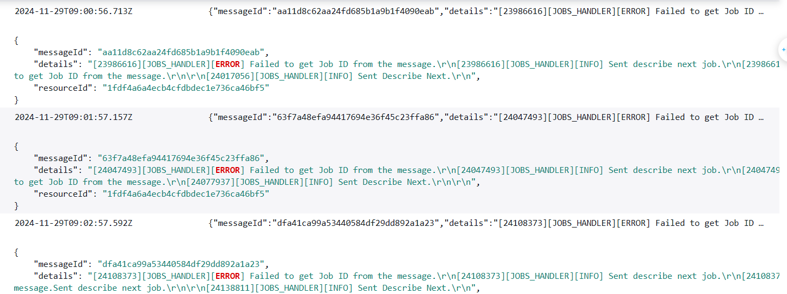

# Enable CloudWatch Logs

The Hub SDK provides comprehensive logging functionality. By default, the Hub SDK writes logs to the local file system. However, you can leverage the
cloud API to configure log streaming to CloudWatch Logs, which offers:

- **Monitor device performance**: Capture detailed runtime logs for proactive device management.
  Enable advanced log analysis and monitoring across your device fleet
- **Troubleshoot issues**: Generate granular log entries for rapid diagnostic analysis.
  Record system and application-level events for in-depth investigation.
- **Flexible and centralized logging**: Remote log management without direct device access.
  Aggregate logs from multiple devices in a single, searchable repository.

## Prerequisites

- Onboard the managed device to the cloud. See
  [Hub onboarding setup](managedintegrations-sdk-v2-cookbook-hubsetup.md "managedintegrations-sdk-v2-cookbook-hubsetup.md")
  for details.
- Verify Hub agent startup and successful initialization. See
  [Install and validate the managed integrations Hub SDK](managedintegrations-sdk-v2-cookbook-deployment.md "managedintegrations-sdk-v2-cookbook-deployment.md")
  for details.

###### Note

To create logging configurations, see [PutRuntimeLogConfiguration API](../APIReference/API_PutRuntimeLogConfiguration.md "../APIReference/API_PutRuntimeLogConfiguration.md")
for details.

###### Warning

Enabling logs counts towards the tiered quota metering.
Increasing log levels will result in higher message volume and additional costs.

## Setup Hub SDK log configurations

Configure the hub SDK log settings by calling the API to set up runtime log configuration.

###### Example sample API Request

```
aws iot-managed-integrations put-runtime-log-configuration \
    --managed-thing-id MANAGED_THING_ID \
    --runtime-log-configurations LogLevel=DEBUG,UploadLog=TRUE

```

### RuntimeLogConfigurations attributes

The following attributes are optional and can be configured in the `RuntimeLogConfigurations` API.

**LogLevel**

Sets minimum severity level for runtime traces. Values: `DEBUG, ERROR, INFO, WARN`

Default: `WARN` (released build)

**LogFlushLevel**

Determines severity level for immediate data flushing to local storage. Values: `DEBUG, ERROR, INFO, WARN`

Default: `DISABLED`

**LocalStoreLocation**

Specifies storage location for runtime traces. Default: `/var/log/awsiotmi`

- Active log: `/var/log/awsiotmi/ManagedIntegrationsDeviceSdkHub.log`
- Rotated logs: `/var/log/awsiotmi/ManagedIntegrationsDeviceSdkHub.N.log`
  (N indicates rotation order)

**LocalStoreFileRotationMaxBytes**

Triggers file rotation when current file exceeds specified size.

###### Important

For optimal efficiency, keep file size below 125 KB. Values above 125 KB will be automatically limited.

**LocalStoreFileRotationMaxFiles,**

Sets maximum number of rotation files allowed by log daemon.

**UploadLog**

Controls runtime trace transfer to cloud.
Logs are stored in `/aws/iotmanagedintegration` CloudWatch Logs group.

Default: `false`.

**UploadPeriodMinutes**

Defines frequency of runtime trace uploads. Default: `5`

**DeleteLocalStoreAfterUpload**

Controls file deletion after upload. Default: `true`

###### Note

If set to false, uploaded files are renamed to: `/var/log/awsiotmi/ManagedIntegrationsDeviceSdkHub.uploaded.{uploaded_timestamp}`

### Example log file

See example of a CloudWatch Logs file below:


