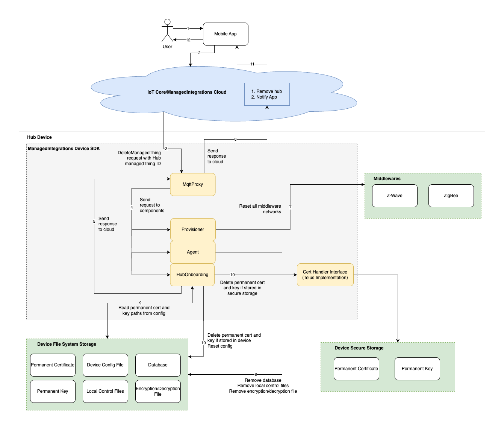

# Offboard managed integrations hub

## Overview of Hub SDK offboard process

The hub offboarding process removes a hub from AWS Cloud management system.
When the cloud sends a [DeleteManagedThing](../APIReference/API_DeleteManagedThing.md "../APIReference/API_DeleteManagedThing.md")
request, the process accomplishes two primary objectives:

**Device-side actions**:

- Reset the hub's internal state
- Delete all locally saved data
- Prepare the device for potential future re-onboarding

**Cloud-side actions**:

- Remove all cloud resources associated with the hub
- Complete disconnection from the previous account

Customers typically initiate hub offboarding when:

- Changing the hub's associated account
- Replacing an existing hub with a new device

The process ensures a clean, secure transition between hub configurations,
allowing seamless device management and account flexibility.



## Prerequisites

- You must have a hub that is onboarded. For instructions, see
  [Hub onboarding setup](managedintegrations-sdk-v2-cookbook-hubsetup.md "managedintegrations-sdk-v2-cookbook-hubsetup.md").
- In the `iotmi_config.json` file located at **/data/aws/iotmi/config/**,
  verify that `iot_provisioning_state` shows `PROVISIONED`.
- Confirm that the permanent certificates and keys referenced in the `iotmi_config.json` exist in their specified paths.
- Ensure that HubOnboarding, Agent, Provisioner, and MQTT proxy are correctly configured and running.
- Verify that the hub has no child devices. Use the [DeleteManagedThing](../APIReference/API_DeleteManagedThing.md "../APIReference/API_DeleteManagedThing.md") API to remove all child devices before proceeding.

## Hub SDK offboard process

Follow these steps to offboard the hub:

### Retrieve hub_managed_thing ID

The `iotmi_config.json` file is used to store the managed thing ID for a Managed integrations hub.
This identifier is a critical piece of information that allows the hub to communicate with the AWS IoT Managed integrations service.

The managed thing ID is stored within the **rw** (read-write) section of the JSON file,
under the `managed_thing_id` field. This is seen in the following sample configuration:

```
{
      "ro": {
          "iot_provisioning_method": "FLEET_PROVISIONING",
          "iot_claim_cert_path": "`PATH`",
          "iot_claim_pk_path": "`PATH`",
          "UPC": "`UPC`",
          "sh_endpoint_url": "`ENDPOINT_URL`",
          "SN": "`SN`",
          "fp_template_name": "`TEMPLATENAME`"
      },
      "rw": {
          "iot_provisioning_state": "PROVISIONED",
          "client_id": "`ID`",
          "managed_thing_id": "`ID`",
          "iot_permanent_cert_path": "`CERT_PATH`",
          "iot_permanent_pk_path": "`KEY`",
          "metadata": {
              "last_updated_epoch_time": 1747766125
          }
      }
}
```

### Send command to offboard hub

Use your account credentials and run the
command with the `managed_thing_id` retrieved in
the previous section:

```
aws iot-managed-integrations delete-managed-thing \
    --identifier `HUB_MANAGED_THING_ID`
```

### Verify hub was offboarded

Use your account credentials and run the
command with the `managed_thing_id` retrieved in
the previous section:

```
aws iot-managed-integrations get-managed-thing \
    --identifier `HUB_MANAGED_THING_ID`
```

### Success and failure scenarios

#### Success scenario

If the command to offboard the hub was successful, the following sample
response is expected:

```
{
      "Message" : "Managed Thing resource not found."
}
```

Additionally, the following sample `iotmi_config.json`
would be observed if the hub offboarding command was successful.
Verify that the **rw** section contains only
`iot_provisioning_state` and optionally **metadata**.
The absence of **metadata** is acceptable.
`iot_provisioning_state` must be **NOT_PROVISIONED**.

```
{
      "ro": {
          "iot_provisioning_method": "FLEET_PROVISIONING",
          "iot_claim_cert_path": "`PATH`",
          "iot_claim_pk_path": "`PATH`",
          "UPC": "1234567890101",
          "sh_endpoint_url": "`ENDPOINT_URL`",
          "SN": "1234567890101",
          "fp_template_name": "test-template"
      },
      "rw": {
          "iot_provisioning_state": "NOT_PROVISIONED",
          "metadata": {
              "last_updated_epoch_time": 1747766125
          }
      }
}
```

#### Failure scenario

If the command to offboard the hub was unsuccessful, the following sample
response is expected:

```
{
      "Arn" : "`ARN`",
      "CreatedAt" : 1.748968266655E9,
      "Id" : "`ID`",
      "ProvisioningStatus" : "DELETE_IN_PROGRESS",
      "Role" : "CONTROLLER",
      "SerialNumber" : "`SERIAL_NO`",
      "Tags" : { },
      "UniversalProductCode" : "`UPC`",
      "UpdatedAt" : 1.748968272107E9
}
```

- If **ProvisioningStatus** is `DELETE_IN_PROGRESS`,
  follow instructions in [Hub recovery](#hub-recovery "#hub-recovery").
- If **ProvisioningStatus** is not `DELETE_IN_PROGRESS`,
  the command to offboard the hub either failed in the Managed integrations cloud,
  or was not received by Managed integrations cloud. Follow instructions in
  [Hub recovery](#hub-recovery "#hub-recovery").
- If offboarding was unsuccessful, your `iotmi_config.json` file
  will look like the sample file below.

```
{
      "ro": {
          "iot_provisioning_method": "FLEET_PROVISIONING",
          "iot_claim_cert_path": "PATH",
          "iot_claim_pk_path": "PATH",
          "UPC": "123456789101",
          "sh_endpoint_url": "ENDPOINT_URL",
          "SN": "123456789101",
          "fp_template_name": "test-template"
      },
      "rw": {
          "iot_provisioning_state": "PROVISIONED",
          "client_id": "ID",
          "managed_thing_id": "ID",
          "iot_permanent_cert_path": "PATH",
          "iot_permanent_pk_path": "PATH",
          "metadata": {
              "last_updated_epoch_time": 1747766125
          }
      }
}
```

## (Optional) After offboarding Hub SDK

###### Important

The following scenarios list optional actions to take after offboarding Hub SDK failed, or if you want to re-onboard your hub
after offboarding.

**Re-onboard**

If offboarding was successful, onboard your Hub SDK following
[Step 3: Create a managed thing (fleet provisioning)](managedintegrations-sdk-v2-cookbook-hubsetup.md#managedintegrations-sdk-v2-cookbook-managedthing "managedintegrations-sdk-v2-cookbook-hubsetup.md#managedintegrations-sdk-v2-cookbook-managedthing"),
and the rest of the onboard process.

**Hub recovery**

**Device hub offboarding success and Cloud offboarding fails**

If [GetManagedThing](../APIReference/API_GetManagedThing.md "../APIReference/API_GetManagedThing.md") API call doesn't return
`Managed Thing resource not found` message, but the file `iotmi_config.json`
is offboarded. See [Success scenario](#hub-offboarding-success-scenarios "#hub-offboarding-success-scenarios") for a sample json file.

To recover from this scenario, see [Force deletion](#forced-deletion "#forced-deletion").

**Device hub offboarding fails**

This scenario is when the file `iotmi_config.json` is not offboarded correctly.
See [Failure scenario](#hub-offboarding-failure-scenarios "#hub-offboarding-failure-scenarios") for a sample json file.

To recover from this scenario, see [Force deletion](#forced-deletion "#forced-deletion").
If `iotmi_config.json` is still not offboarded, the hub has to be factory reset.

**Device hub offboarding and Cloud offboarding fails**

In this scenario, `iotmi_config.json` is still not offboarded, and hub status
is either `ACTIVATED`, or `DISCOVERED`.

To recover from this scenario, see [Force deletion](#forced-deletion "#forced-deletion"). If force deletion
fails, or `iotmi_config.json` is still not offboarded, the hub has to be factory reset.

**Hub is offline and hub status is DELETE_IN_PROGRESS**

In this scenario, the hub is offline and cloud receives an offboarding command.

To recover from this scenario, see [Force deletion](#forced-deletion "#forced-deletion").

**Force deletion**

To delete cloud resources without a successful device hub offboarding,
follow these steps. This operation may result in inconsistency between the cloud and device states,
potentially causing issues with future operations.

Call
[DeleteManagedThing](../APIReference/API_DeleteManagedThing.md "../APIReference/API_DeleteManagedThing.md") API with the hub's `managed_thing_id`
and the **force** parameter:

```
aws iot-managed-integrations delete-managed-thing \
  --identifier `HUB_MANAGED_THING_ID` \
  --force
```

Next, call the [GetManagedThing](../APIReference/API_GetManagedThing.md "../APIReference/API_GetManagedThing.md") API and verify that it returns `Managed Thing resource not found`.
This confirms that the cloud resources are deleted.

###### Note

This approach is not recommended,
as it can lead to inconsistencies between the cloud and device states.
It's generally better to ensure a successful device hub offboarding
before attempting to delete the cloud resources.
