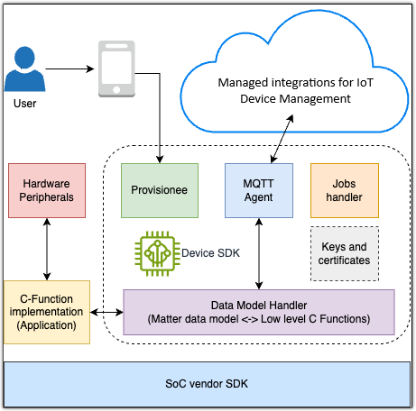

# End device SDK architecture and

components

This section describes the End device SDK architecture and how its components interact with your
low level C-Functions. The following diagram illustrates the core components and their
relationships in the SDK framework.

###### End device SDK components

The End device SDK architecture contains these components for managed integrations feature
integration:

**Provisionee**

Creates device resources in the managed integrations cloud, including device certificates and
private keys for secure MQTT communication. These credentials establish trusted
connections between your device and managed integrations.

**MQTT Agent**

Manages MQTT connections through a thread-safe C client library. This background
process handles command queues in multi-threaded environments, with configurable queue
sizes for memory-constrained devices. Messages route through managed integrations for
processing.

**Jobs handler**

Processes over-the-air (OTA) updates for device firmware, security patches, and file
delivery. This built-in service manages software updates for all registered
devices.

**Data Model Handler**

Translates operations between managed integrations and your Low Level C-Functions using AWS' implementation of the Matter Data Model. For more information, see the
[Matter
documentation](https://project-chip.github.io/connectedhomeip-doc/index.html "https://project-chip.github.io/connectedhomeip-doc/index.html") on _GitHub_.

**Keys and certificates**

Manages cryptographic operations through the PKCS #11 API, supporting both
hardware security modules and software implementations like [corePKCS11](https://github.com/FreeRTOS/corePKCS11 "https://github.com/FreeRTOS/corePKCS11"). This API handles
certificate operations for components such as the Provisionee and MQTT Agent during TLS
connections.
