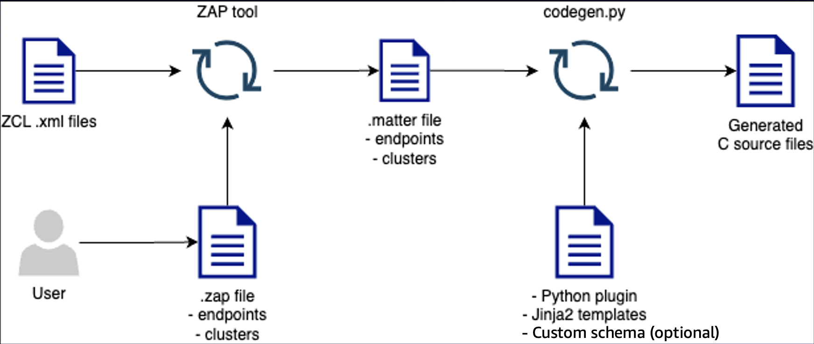

# Data model code generator

Learn how to use the code generator for the data model. The generated code can be used to
serialize and deserialize the data models that are exchanged between the cloud and the
device.

The project repository contains a code generation tool for creating C code data model
handlers. The following topics describe the code generator and the workflow.

###### Topics

- [Code generation process](#managedintegrations-sdk-codegen-intro "#managedintegrations-sdk-codegen-intro")
- [Environment setup](managedintegrations-sdk-codegen-env.md "managedintegrations-sdk-codegen-env.md")
- [Generate code for devices](managedintegrations-sdk-codegen-generate.md "managedintegrations-sdk-codegen-generate.md")

## Code generation process

The code generator creates C source files from three primary inputs: AWS' implementation of the Matter Data Model (.matter file)
from the Zigbee Cluster Library (ZCL) Advanced Platform, a Python plugin that handles
preprocessing, and Jinja2 templates that define code structure. During generation, the
Python plugin processes your .matter files by adding global type definitions, organizing data
types based on their dependencies, and formatting the information for template
rendering.

The following image describes the code generator creating the C source
files.

The End device SDK includes Python plugins and Jinja2 templates that work with [codegen.py](https://github.com/project-chip/connectedhomeip/blob/master/scripts/codegen.py "https://github.com/project-chip/connectedhomeip/blob/master/scripts/codegen.py") in the [connectedhomeip](https://github.com/project-chip/connectedhomeip/tree/master "https://github.com/project-chip/connectedhomeip/tree/master") project. This combination generates multiple C
files for each cluster based on your .matter file input.

###### The following subtopics describe these files.

- [Python plugin](#managedintegrations-sdk-codegen-plugin "#managedintegrations-sdk-codegen-plugin")
- [Jinja2 templates](#managedintegrations-sdk-codegen-jinja "#managedintegrations-sdk-codegen-jinja")
- [(Optional) Custom schema](#managedintegrations-sdk-codegen-schema "#managedintegrations-sdk-codegen-schema")

### Python plugin

The code generator, `codegen.py`, parses the .matter files,
and sends the information as Python objects to the plugin. The plugin file
`iotmi_data_model.py` preprocesses this data and renders
sources with provided templates. Preprocessing includes:

1. Adding information not available from `codegen.py`, such
   as global types
2. Performing topological sort on data types to establish correct definition
   order

###### Note

The topological sort ensures dependent types are defined after their
dependencies, regardless of their original order.

### Jinja2 templates

The End device SDK provides Jinja2 templates tailored for data model handlers and low level
C-Functions.

| Jinja2 templates                         | Template                                | Generated source                                                                                                      | Remarks |
| ---------------------------------------- | --------------------------------------- | --------------------------------------------------------------------------------------------------------------------- | ------- |
| `cluster.h.jinja`                        | `iotmi_device_<cluster>.h`              | Creates low level C function header files.                                                                            |
| `cluster.c.jinja`                        | `iotmi_device_<cluster>.c`              | Implement and register callback function pointers with the Data Model Handler.                                     |
| `cluster_type_helpers.h.jinja`           | `iotmi_device_type_helpers_<cluster>.h` | Defines function prototypes for data types.                                                                           |
| `cluster_type_helpers.c.jinja`           | `iotmi_device_type_helpers_<cluster>.c` | Generates data type function prototypes for cluster-specific enumerations, bitmaps, lists, and structures.         |
| `iot_device_dm_types.h.jinja`            | `iotmi_device_dm_types.h`               | Defines C data types for global data types.                                                                           |
| `iot_device_type_helpers_global.h.jinja` | `iotmi_device_type_helpers_global.h`    | Defines C data types for global operations.                                                                           |
| `iot_device_type_helpers_global.c.jinja` | `iotmi_device_type_helpers_global.c`    | Declares standard data types including boolean, integers, floating point, strings, bitmaps, lists, and structures. |

### (Optional) Custom schema

End device SDK combines the standardized code generation process with custom schema. This
enables extension of Matter Data Model for your devices and device software.
Custom schemas can help describe device capabilities for device-to-cloud communication.

For detailed information about managed integrations data models, including format, structure, and requirements,
see [Managed integrations data model](managedintegrations-data-model.md "managedintegrations-data-model.md").

Use `codegen.py` tool to generate C source files for custom schema, as follows:

###### Note

Each custom cluster requires the same **cluster ID** for the following three files.

- Create custom schema in `JSON` format that provides a representation of
  clusters for capability reporting to create new custom clusters in the cloud.
  A sample file is located at `codegen/custom_schemas/custom.SimpleLighting@1.0`.
- Create ZCL (Zigbee Cluster Library) definition file in `XML` format
  that contains the same information as the custom schema.
  Use the ZAP tool to generate your Matter IDL files from ZCL XML.
  A sample file is located at `codegen/zcl/custom.SimpleLighting.xml`.
- The output from ZAP tool is `Matter IDL File (.matter)`
  and it defines the Matter clusters corresponding to your custom schema.
  This is the input for `codegen.py` tool to
  generate C source files for End device SDK. A sample file is located at
  `codegen/matter_files/custom-light.matter`.

For detailed instructions on how to integrate custom managed integrations data models into your code generation workflow,
see [Generate code for devices](managedintegrations-sdk-codegen-generate.md "managedintegrations-sdk-codegen-generate.md").
