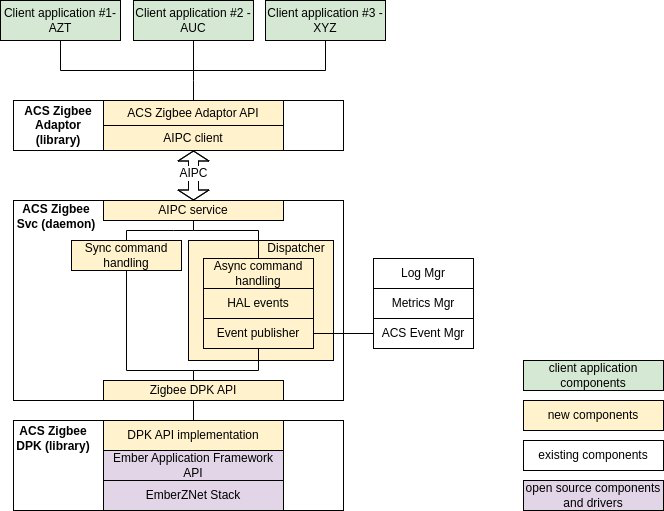
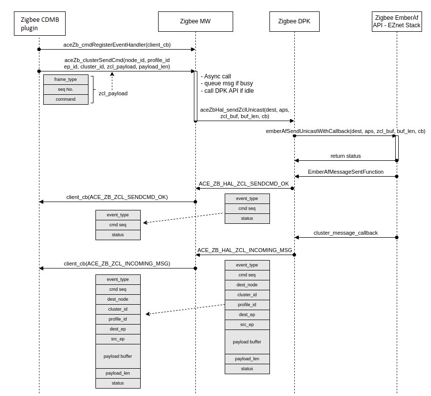
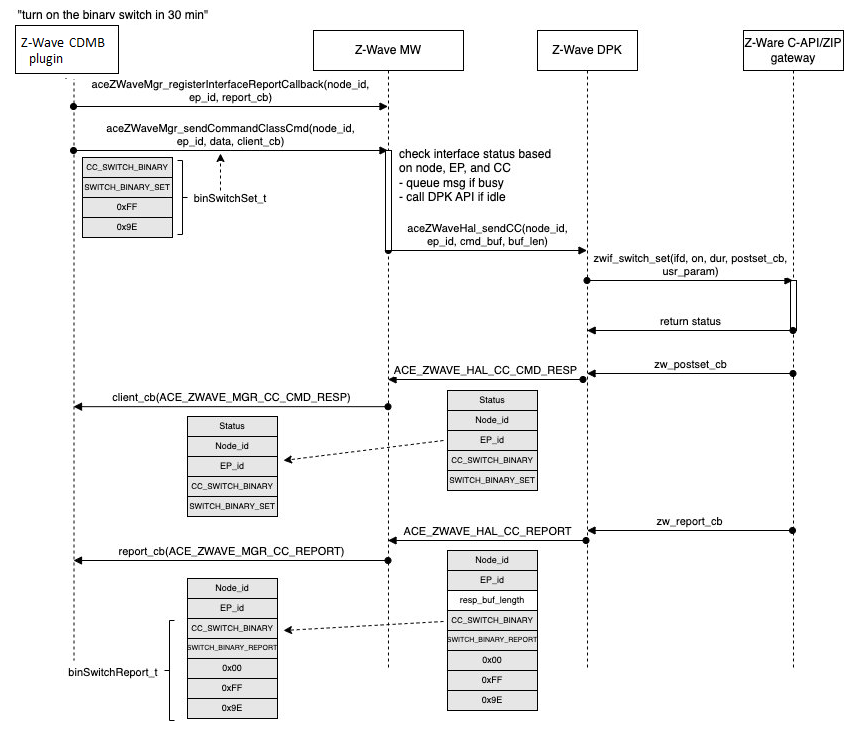

# Protocol-specific middleware

###### Important

**The documentation and code provided here describes a reference
implementation of the middleware. It is not provided to you as part of the
SDK.**

The protocol-specific middleware has a critical role of interacting with the underlying
protocol stacks. Both device onboarding and device control components of the managed integrations Hub SDK
use it to interact with the end device.

The middleware performs the following functions.

- Abstracts the APIs from the device protocol stacks from different vendors by providing a
  common set of APIs.
- Provides software execution management such as thread scheduler, event queue management,
  and data cache.

## Middleware architecture

The block diagram below represents the architecture of the Zigbee middleware. The
architecture of middlewares of other protocols like Z-Wave is also similar.

The protocol-specific middleware has three main components.

- **ACS Zigbee DPK**: The Zigbee Device Porting Kit (DPK)
  is used to provide abstraction from the underlying hardware and operating system, thereby
  enabling portability. Basically this can be considered as the hardware abstraction layer
  (HAL), which provides a common set APIs to control and communicate with the Zigbee radios
  from different vendors. The Zigbee middleware contains DPK API implementation for the
  Silicon Labs Zigbee Application framework.
- **ACS Zigbee Service**: The Zigbee service runs as a
  dedicated daemon. It includes an API handler serving the API calls from client
  applications through the IPC channels. AIPC is used as the IPC channel between Zigbee
  adaptor and Zigbee service. It provides other functionalities like handling both
  async/sync commands, handling events from the HAL, and using ACS Event Manager for event
  registering/publishing.
- **ACS Zigbee Adaptor**: The Zigbee adaptor is a library
  running within the application process (in this case, the application is the CDMB plugin).
  The Zigbee adaptor provides a set of APIs which are consumed by client applications like
  CDMB/Provisioner protocol plugins to control and communicate with the end device.

## End-to-end middleware command flow

example

Here is an example of the command flow through the Zigbee middleware.

Here is an example of the command flow through the Z-Wave middleware.

