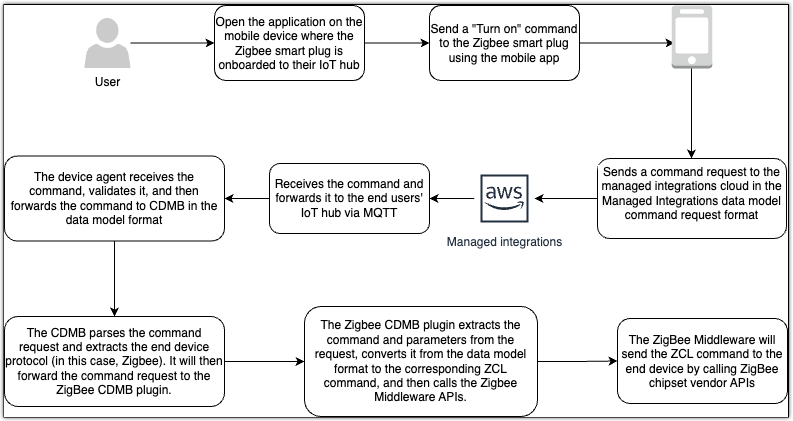

# Device control

Managed integrations handles device registration, command execution, and control. You can build
end-user experiences without knowledge of device-specific protocols using its vendor and
protocol-agnostic device management.

With device control, you can view and modify device states, such as light bulb brightness
or door position. The feature emits events for state changes, which you can use for analytics,
rules, and monitoring.

###### Key features

**Modify or read device state**

View and change device attributes based on device types. You can access:

- **Device state:** Current device attribute
  values
- **Connectivity state:** Device reachability
  status
- **Health status:** System values like battery level
  and signal strength (RSSI)

**State change notification**

Receive events when device attributes or connectivity states change, such as light
bulb brightness adjustments or door lock status changes.

**Offline mode**

Devices communicate with other devices on the same IoT hub even without internet
connectivity. Device states synchronize with the cloud when connectivity resumes.

**State synchronization**

Track state changes from multiple sources, device manufacturer apps, and manual
device adjustments.

Review the Hub SDK components and processes you need to control devices through
managed integrations. This topic describes how the Edge Agent, Common Data Model Bridge (CDMB), and
protocol-specific plugins work together to handle device commands, manage device states, and
process responses across different protocols.

## Device control flows

The following diagram demonstrates the end-to-end device control flow by describing how
an end user turns on a Zigbee smart plug.

## Hub SDK components for

device control

The Hub SDK architecture uses the following components to process and route device
control commands in your IoT implementation. Each component plays a specific role in
translating cloud commands into device actions, managing device states, and handling
responses. The following sections detail how these components work together in your
deployment:

The Hub SDK consists of the following components, and facilitates device onboarding and
control on IoT hubs.

###### Primary components:

**Edge agent**

Acts as a gateway between the IoT hub and managed integrations.

**Common data model bridge (CDMB)**

Translates between the AWS data model and local protocol data models like Z-Wave
and Zigbee. It includes a core CDMB and protocol-specific CDMB plugins.

**Provisioner**

Handles device discovery and onboarding. It includes a core provisioner and
protocol-specific provisioner plugins for protocol-specific onboarding tasks.

###### Secondary components

**Hub onboarding**

Provisions the hub with client certificates and keys for secure cloud
communication.

**MQTT proxy**

Provides MQTT connections to the managed integrations cloud.

**Logger**

Writes logs locally or to the managed integrations cloud.
