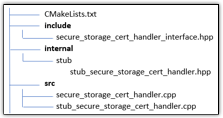

# Create a custom certificate handler for secure storage

Device certificate management is crucial when onboarding the managed integrations hub. While certificates are stored in the file system by default, you can create a custom certificate handler for enhanced security and flexible credential management.

The managed integrations End device SDK provides a certificate handler to secure storage interface that you can implement as a shared object (.so) library. Build your secure storage implementation to read and write certificates, then link the library file to the HubOnboarding process at runtime.

## API definition and

components

Review the following `secure_storage_cert_handler_interface.hpp` file to understand the API components and requirements for your implementation

###### Topics

- [API definition](#managedintegrations-sdk-v2-cookbook-certhandler-apidef "#managedintegrations-sdk-v2-cookbook-certhandler-apidef")
- [Key components](#managedintegrations-sdk-v2-cookbook-certhandler-apicomp "#managedintegrations-sdk-v2-cookbook-certhandler-apicomp")

### API definition

**Contents of
`secure_storage_cert_hander_interface.hpp`**

```
/*
    * Copyright 2024 Amazon.com, Inc. or its affiliates. All rights reserved.
    *
    * AMAZON PROPRIETARY/CONFIDENTIAL
    *
    * You may not use this file except in compliance with the terms and
    * conditions set forth in the accompanying LICENSE.txt file.
    *
    * THESE MATERIALS ARE PROVIDED ON AN "AS IS" BASIS. AMAZON SPECIFICALLY
    * DISCLAIMS, WITH RESPECT TO THESE MATERIALS, ALL WARRANTIES, EXPRESS,
    * IMPLIED, OR STATUTORY, INCLUDING THE IMPLIED WARRANTIES OF MERCHANTABILITY,
    * FITNESS FOR A PARTICULAR PURPOSE, AND NON-INFRINGEMENT.
    */
    #ifndef SECURE_STORAGE_CERT_HANDLER_INTERFACE_HPP
    #define SECURE_STORAGE_CERT_HANDLER_INTERFACE_HPP

    #include <iostream>
    #include <memory>

    namespace IoTManagedIntegrationsDevice {
    namespace CertHandler {
    /**
     * @enum CERT_TYPE_T
     * @brief enumeration defining certificate types.
     */
     typedef enum { CLAIM = 0, DHA = 1, PERMANENT = 2 } CERT_TYPE_T;
     class SecureStorageCertHandlerInterface {
      public:
       /**
        * @brief Read certificate and private key value of a particular certificate
        * type from secure storage.
        */
        virtual bool read_cert_and_private_key(const CERT_TYPE_T cert_type,
                                              std::string &cert_value,
                                              std::string &private_key_value) = 0;
        /**
          * @brief Write permanent certificate and private key value to secure storage.
          */
        virtual bool write_permanent_cert_and_private_key(
            std::string_view cert_value, std::string_view private_key_value) = 0;
        };
        std::shared_ptr<SecureStorageCertHandlerInterface> createSecureStorageCertHandler();
    } //namespace CertHandler
    } //namespace IoTManagedIntegrationsDevice

    #endif //SECURE_STORAGE_CERT_HANDLER_INTERFACE_HPP


```

### Key components

- CERT_TYPE_T - different types of certificates on the hub.
  - CLAIM - the claim cert originally on the hub, will be exchanged for a permanent
    cert.
  - DHA - unused for now.
  - PERMANENT - permanent cert to connect with managed integrations endpoint.

- read_cert_and_private_key - (FUNCTION TO BE IMPLEMENTED) Reads cert and key value in
  to the reference input. This function must be able to read both the CLAIM and PERMANENT
  cert, and is differentiated by the cert type mentioned above.
- write_permanent_cert_and_private_key - (FUNCTION TO BE IMPLEMENTED) writes permanent
  cert and key value to the desired location.

## Example build

Separate your internal implementation headers from the public interface (`secure_storage_cert_handler_interface.hpp`) to maintain a clean project structure. With this separation, you can manage public and private components while building your certificate handler.

###### Note

Declare `secure_storage_cert_handler_interface.hpp` as public.

###### Topics

- [Project structure](#managedintegrations-sdk-v2-cookbook-proj "#managedintegrations-sdk-v2-cookbook-proj")
- [Inherit the interface](#managedintegrations-sdk-v2-cookbook-interface "#managedintegrations-sdk-v2-cookbook-interface")
- [Implementation](#managedintegrations-sdk-v2-cookbook-interimpl "#managedintegrations-sdk-v2-cookbook-interimpl")
- [CMakeList.txt](#managedintegrations-sdk-v2-cookbook-cmakelist "#managedintegrations-sdk-v2-cookbook-cmakelist")

### Project structure



### Inherit the interface

Create a concrete class that inherits the interface. Hide this header file and other
files under a separate directory so that private and public headers can be differentiated
easily when building.

```
#ifndef IOTMANAGEDINTEGRATIONSDEVICE_SDK_STUB_SECURE_STORAGE_CERT_HANDLER_HPP
  #define IOTMANAGEDINTEGRATIONSDEVICE_SDK_STUB_SECURE_STORAGE_CERT_HANDLER_HPP

  #include "secure_storage_cert_handler_interface.hpp"

  namespace IoTManagedIntegrationsDevice::CertHandler {
    class StubSecureStorageCertHandler : public SecureStorageCertHandlerInterface {
      public:
        StubSecureStorageCertHandler() = default;

        bool read_cert_and_private_key(const CERT_TYPE_T cert_type,
                                      std::string &cert_value,
                                      std::string &private_key_value) override;

        bool write_permanent_cert_and_private_key(
            std::string_view cert_value, std::string_view private_key_value) override;
            /*
            * any other resource for function you might need
            */


          };
      }
    #endif //IOTMANAGEDINTEGRATIONSDEVICE_SDK_STUB_SECURE_STORAGE_CERT_HANDLER_HPP


```

### Implementation

Implement the storage class defined above,
`src/stub_secure_storage_cert_handler.cpp`.

```
/*
  * Copyright 2024 Amazon.com, Inc. or its affiliates. All rights reserved.
  *
  * AMAZON PROPRIETARY/CONFIDENTIAL
  *
  * You may not use this file except in compliance with the terms and
  * conditions set forth in the accompanying LICENSE.txt file.
  *
  * THESE MATERIALS ARE PROVIDED ON AN "AS IS" BASIS. AMAZON SPECIFICALLY
  * DISCLAIMS, WITH RESPECT TO THESE MATERIALS, ALL WARRANTIES, EXPRESS,
  * IMPLIED, OR STATUTORY, INCLUDING THE IMPLIED WARRANTIES OF MERCHANTABILITY,
  * FITNESS FOR A PARTICULAR PURPOSE, AND NON-INFRINGEMENT.
  */

  #include "stub_secure_storage_cert_handler.hpp"

  using namespace IoTManagedIntegrationsDevice::CertHandler;

  bool StubSecureStorageCertHandler::write_permanent_cert_and_private_key(
              std::string_view cert_value, std::string_view private_key_value) {
            // TODO: implement write function
            return true;
  }

  bool StubSecureStorageCertHandler::read_cert_and_private_key(const CERT_TYPE_T cert_type,
                                                          std::string &cert_value,
                                                          std::string &private_key_value) {
          std::cout<<"Using Stub Secure Storage Cert Handler, returning dummy values";
          cert_value = "StubCertVal";
          private_key_value = "StubKeyVal";
          // TODO: implement read function
          return true;
  }


```

Implement the factory function defined in the interface,
`src/secure_storage_cert_handler.cpp`.

```
#include "stub_secure_storage_cert_handler.hpp"

        std::shared_ptr<IoTManagedIntegrationsDevice::CertHandler::SecureStorageCertHandlerInterface>
        IoTManagedIntegrationsDevice::CertHandler::createSecureStorageCertHandler() {
          // TODO: replace with your implementation
        return std::make_shared<IoTManagedIntegrationsDevice::CertHandler::StubSecureStorageCertHandler>();
      }


```

### CMakeList.txt

```
#project name must stay the same
      project(SecureStorageCertHandler)

      # Public Header files. The interface definition must be in top level with exactly the same name
      #ie. Not in anotherDir/secure_storage_cert_hander_interface.hpp
      set(PUBLIC_HEADERS
                ${PROJECT_SOURCE_DIR}/include
      )

      # private implementation headers.
      set(PRIVATE_HEADERS
                ${PROJECT_SOURCE_DIR}/internal/stub
      )

      #set all sources
      set(SOURCES
                ${PROJECT_SOURCE_DIR}/src/secure_storage_cert_handler.cpp
                ${PROJECT_SOURCE_DIR}/src/stub_secure_storage_cert_handler.cpp
        )

      # Create the shared library
      add_library(${PROJECT_NAME} SHARED ${SOURCES})
      target_include_directories(
                ${PROJECT_NAME}
                PUBLIC
                    ${PUBLIC_HEADERS}
                PRIVATE
                    ${PRIVATE_HEADERS}
      )

      # Set the library output location. Location can be customized but version must stay the same
      set_target_properties(${PROJECT_NAME} PROPERTIES
                LIBRARY_OUTPUT_DIRECTORY ${CMAKE_BINARY_DIR}/../lib
                VERSION 1.0
                SOVERSION 1
      )

      # Install rules
      install(TARGETS ${PROJECT_NAME}
                LIBRARY DESTINATION lib
                ARCHIVE DESTINATION lib
      )

      install(FILES ${HEADERS}
                DESTINATION include/SecureStorageCertHandler
      )


```

## Usage

After compilation, you'll have a `libSecureStorageCertHandler.so` shared object library file and its associated symbolic links. Copy both the library file and symbolic links to the library location expected by the HubOnboarding binary.

###### Topics

- [Key
  considerations](#managedintegrations-sdk-v2-cookbook-certhandler-useconsider "#managedintegrations-sdk-v2-cookbook-certhandler-useconsider")
- [Use secure
  storage](#managedintegrations-sdk-v2-cookbook-certhandler-usagehowto "#managedintegrations-sdk-v2-cookbook-certhandler-usagehowto")

### Key

considerations

- Verify that your user account has read and write permissions for both the HubOnboarding binary and `libSecureStorageCertHandler.so` library.
- Keep `secure_storage_cert_handler_interface.hpp` as your only public header file. All other header files should remain in your private implementation.
- Verify your shared object library name. While you build `libSecureStorageCertHandler.so`, HubOnboarding might require a specific version in the filename, such as `libSecureStorageCertHandler.so.1.0`. Use the `ldd` command to check library dependencies and create symbolic links as needed.
- If your implementation of the shared library has external dependencies, store them in a directory that HubOnboarding can access, such as `/usr/lib or the iotmi_common` directory.

### Use secure

storage

Update your `iotmi_config.json` file by setting both `iot_claim_cert_path` and `iot_claim_pk_path` to `SECURE_STORAGE`.

```
{
  "ro": {
    "iot_provisioning_method": "FLEET_PROVISIONING",
    "iot_claim_cert_path": "`SECURE_STORAGE`",
    "iot_claim_pk_path": "`SECURE_STORAGE`",
    "fp_template_name": "device-integration-example",
    "iot_endpoint_url": "[`ACCOUNT-PREFIX`]-ats.iot.`AWS-REGION`.amazonaws.com",
    "SN": "1234567890",
    "UPC": "1234567890"
  },
  "rw": {
    "iot_provisioning_state": "NOT_PROVISIONED"
  }
}
```
