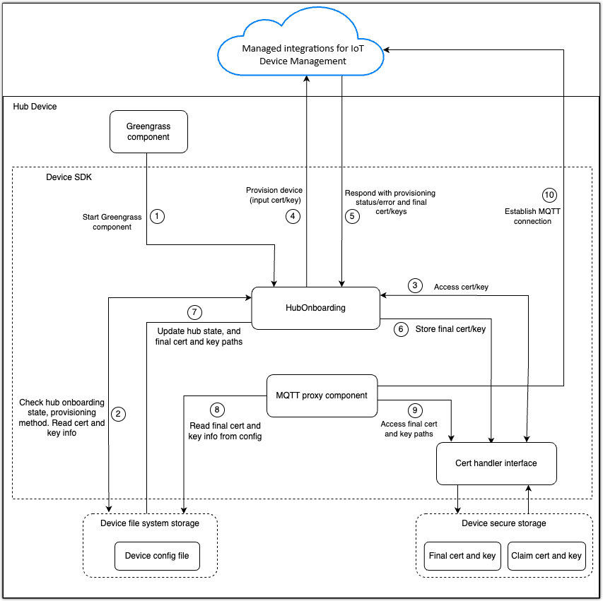

# Onboard your hubs to managed integrations

Set up your hub devices to communicate with managed integrations by configuring the required
directory structure, certificates, and device configuration files. This section describes how
the hub onboarding subsystem components work together, where to store certificates and
configuration files, how to create and modify the device configuration file, and the steps to
complete the hub provisioning process.

## Hub onboarding subsystem

The hub onboarding subsystem uses these core components to manage device provisioning and
configuration:

**Hub onboarding component**

Manages the hub onboarding process by coordinating hub state, provisioning approach,
and authentication materials.

**Device config file**

Stores essential hub configuration data on the device, including:

- Device provisioning state (provisioned or non-provisioned)
- Certificate and key locations
- Authentication information Other SDK processes, such as the MQTT proxy,
  reference this file to determine hub state and connection settings.

**Certificate handler interface**

Provides a utility interface for reading and writing device certificates and keys.
You can implement this interface to work with:

- File system storage
- Hardware security modules (HSM)
- Trusted platform modules (TPM)
- Custom secure storage solutions

**MQTT proxy component**

Manages device-to-cloud communication using:

- Provisioned client certificates and keys
- Device state information from the config file
- MQTT connections to managed integrations

The following diagram describes the hub onboarding subsystem architecture and its components. If you're not using AWS IoT Greengrass, you can disregard that component of the diagram.

