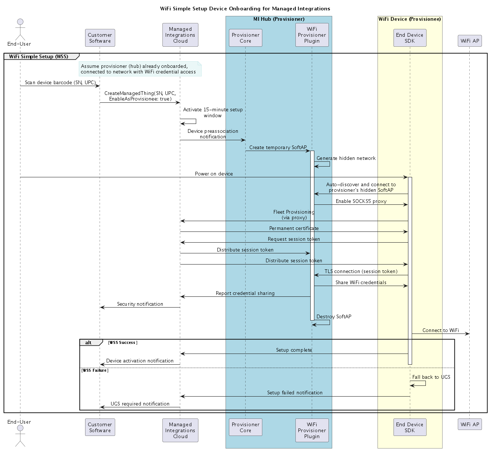

# WiFi Simple Setup to onboard and operate devices

WiFi Simple Setup (WSS) is an automated device onboarding method that simplifies WiFi credential provisioning for IoT devices managed through AWS IoT Managed Integrations.

**On this page:**

- [What is WiFi Simple Setup](#managedintegrations-sdk-v2-cookbook-wss-what-is "#managedintegrations-sdk-v2-cookbook-wss-what-is")
- [Common use cases](#managedintegrations-sdk-v2-cookbook-wss-use-cases "#managedintegrations-sdk-v2-cookbook-wss-use-cases")
- [When to use WSS](#managedintegrations-sdk-v2-cookbook-wss-when-to-use "#managedintegrations-sdk-v2-cookbook-wss-when-to-use")
- [Prerequisites](#managedintegrations-sdk-v2-cookbook-wss-prerequisites "#managedintegrations-sdk-v2-cookbook-wss-prerequisites")
- [How WSS works](#managedintegrations-sdk-v2-cookbook-wss-how-it-works "#managedintegrations-sdk-v2-cookbook-wss-how-it-works")
- [WSS workflow](#managedintegrations-sdk-v2-cookbook-wss-workflow "#managedintegrations-sdk-v2-cookbook-wss-workflow")
- [Deployment scenarios](#managedintegrations-sdk-v2-cookbook-wss-deployment-scenarios "#managedintegrations-sdk-v2-cookbook-wss-deployment-scenarios")

## What is WiFi Simple Setup

WiFi Simple Setup (WSS) enables devices to automatically receive WiFi credentials from a provisioner device (such as a hub) through a secure, automated process. After a one-time barcode scan, the entire WiFi connection process completes automatically without requiring end-users to manually enter WiFi passwords or select networks.

### Key characteristics

- One-time barcode scan to activate device
- Automatic discovery and connection
- Secure local credential exchange using TLS 1.2/1.3
- Configurable time-bounded activation window (Default 15 mins)
- Automatic fallback to User Guided Setup if needed

## Common use cases

- Smart home cameras requiring WiFi connectivity
- IoT sensors in residential environments
- WiFi-enabled appliances and devices
- Any managed integrations device requiring automated WiFi setup

### Example scenario

A customer purchases a smart home camera. After unboxing, they scan the device barcode with their mobile app, power on the camera, and within 60 seconds the camera automatically connects to their WiFi network without manual password entry. As part of the same process, the camera is also onboarded with managed integrations and can now be controlled using managed integrations APIs.

## When to use WSS

### Comparison of onboarding methods

| Onboarding method comparison | Method                        | User Action                                         | Best For                           | Automation Level |
| ---------------------------- | ----------------------------- | --------------------------------------------------- | ---------------------------------- | ---------------- |
| **WSS**                      | Scan barcode                  | WiFi devices needing automated setup                | High • automatic after scan     |
| **SS (Simple Setup)**        | Scan QR + manual pairing      | Protocol-specific devices (Zigbee, Z-Wave)          | Medium • requires pairing steps |
| **ZTS (Zero Touch)**         | None (pre-registered)         | Enterprise deployments with fulfillment integration | Highest • fully automatic       |
| **UGS (User Guided)**        | Button presses + manual steps | Fallback when automation fails                      | Low • manual intervention       |

### When to choose WSS

- Device requires WiFi connectivity
- Hub or provisioner available in household
- Streamlined setup experience desired
- Mobile app has barcode scanning capability

### When to use alternatives

- **ZTS:** Enterprise deployments with fulfillment center pre-registration
- **SS:** Protocol-specific devices (Zigbee, Z-Wave) with different pairing requirements
- **UGS:** Fallback when WSS unavailable or fails

## Prerequisites

### For provisioner devices (hubs)

- Hub SDK integration with WiFi connectivity
- Software access point (SoftAP) creation capability
- Access to local WiFi credentials via customer-provided API
- Registered as managed integrations CONTROLLER role with credential locker

### For provisionee devices

- Managed integrations End device SDK integration with WiFi capability
- Hardware security module (HSM) or Trusted Platform Module (TPM)
- Claim certificate and private key securely stored
- Unique Serial Number (SN: 12-50 characters) and UPC/EAN
- Barcode labels on device or packaging

###### Note

**EAN Support:** Provisioners currently support UPC only. EAN support is planned for future releases.

### For customer implementation

- Managed integrations account configured
- Fleet Provisioning setup (custom endpoint, provisioning profile, template)
- Mobile application with barcode scanning capability
- Customer API for WiFi credential access

## How WSS works

### Architecture overview

The following diagram shows the WSS architecture with cloud services, provisioner hub, and provisionee device components:

### Key components

**Cloud services:** Coordinate authentication, manage device lifecycle, and distribute session tokens for secure credential exchange.

**Provisioner (Hub):** WiFi-connected device that creates temporary access point and shares WiFi credentials with new devices.

**Provisionee (Device):** New WiFi device requiring network access for initial setup and operation.

**Mobile application:** Customer-provided app that initiates setup via barcode scanning.

## WSS workflow

The following diagram shows the complete WiFi Simple Setup workflow from barcode scanning through device activation:

### Workflow phases

**Phase 1: Account linking**

End-user scans device barcode (SN + UPC), activating a 15-minute setup window. Cloud notifies all eligible provisioners in the household.

###### Important

Only one provisionee can be onboarded at a time. If you scan multiple devices at a time, only the latest one will be onboarded. If you want to onboard devices that were already scanned, you need to run `UpdateManagedThing`.

**Phase 2: Device discovery**

Device powers on, calculates temporary credentials, and automatically connects to provisioner's hidden temporary network.

**Phase 3: Cloud authentication**

Device completes Fleet Provisioning via provisioner's restricted proxy, obtaining permanent certificate. Cloud validates device and provisioner relationship, then distributes session tokens.

**Phase 4: Credential exchange**

Device establishes secure TLS connection to provisioner using session token. Provisioner shares WiFi credentials. Provisioner reports credential sharing for security monitoring.

**Phase 5: Network connection**

Device connects to WiFi network and reports success to cloud. Setup complete—device is operational.

**Fallback:** If any phase fails, device automatically falls back to User Guided Setup with mobile app guidance.

## Deployment scenarios

### Scenario 1: Standard hub with WiFi access

Hub connected to WiFi with access to credentials via customer API. Hub shares credentials directly with provisionee without cloud WiFi storage.

### Scenario 2: Multiple provisioners

Multiple hubs in household provide redundancy. First provisioner to respond serves the device. Automatic load distribution improves reliability.

### Scenario 3: Automatic fallback

If provisioner unavailable or connection fails, device automatically falls back to User Guided Setup. Mobile app guides user through manual setup. Fallback is transparent to end-user.
