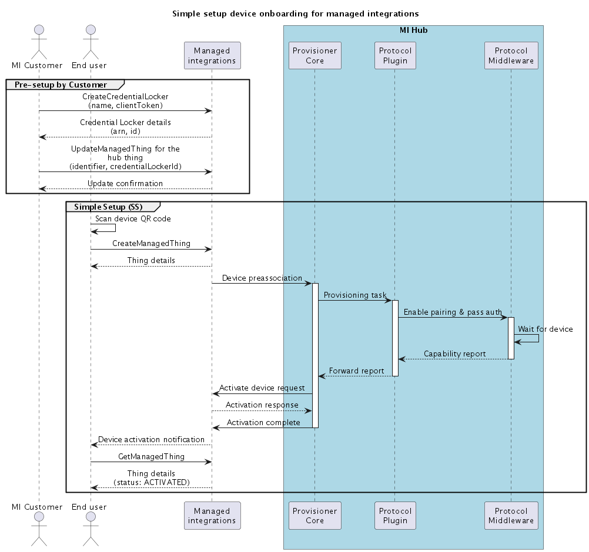
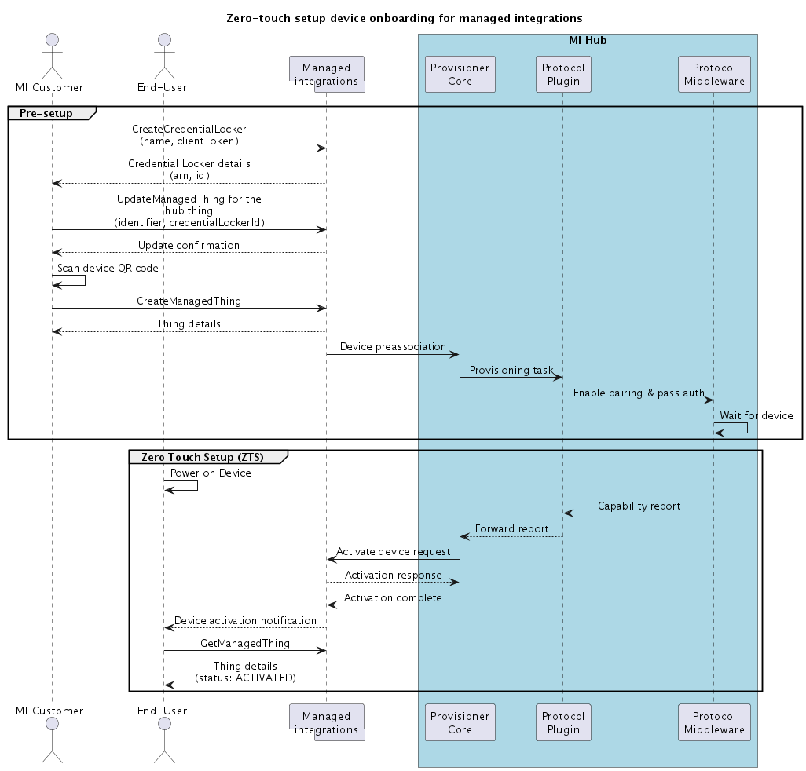
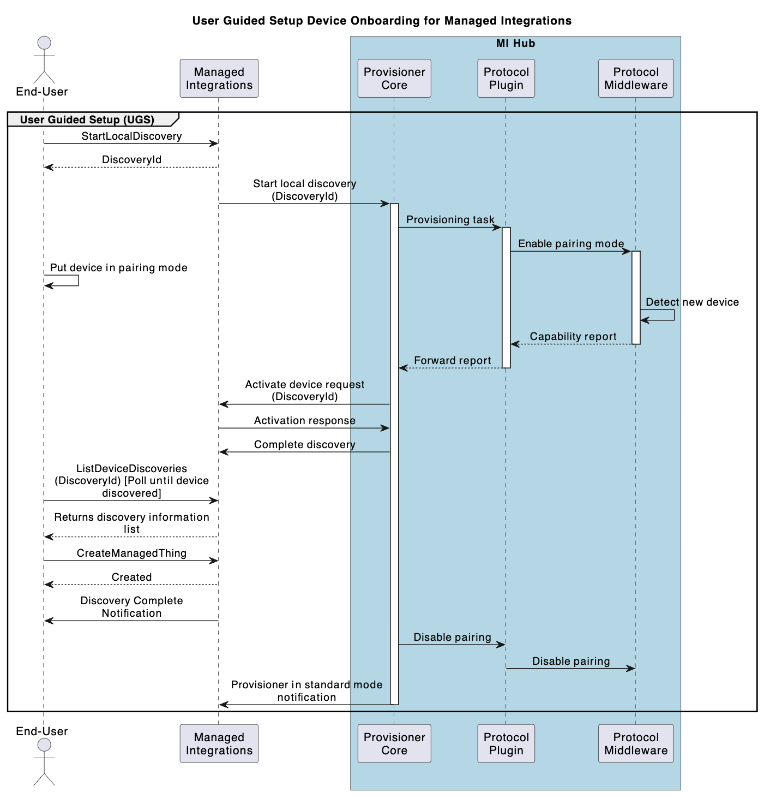

# Device onboarding

Review how the Hub SDK components support device onboarding before you begin working with
managed integrations. This section covers the essential architectural components you need for device
onboarding, including how the core provisioner and protocol-specific plugins
work together to handle device authentication, communication, and user
setup.

## Hub SDK components for

device onboarding

###### SDK components

- [Core
  provisioner](#managedintegrations-sdk-v2-onboarding-core-provisioner "#managedintegrations-sdk-v2-onboarding-core-provisioner")
- [Protocol-specific
  provisioner plugins](#managedintegrations-sdk-v2-onboarding-protocol-plugins "#managedintegrations-sdk-v2-onboarding-protocol-plugins")
- [Protocol-specific middleware](#managedintegrations-sdk-v2-onboarding-protocol-middleware "#managedintegrations-sdk-v2-onboarding-protocol-middleware")

### Core

provisioner

The core provisioner is the central component that orchestrates device onboarding in
your IoT hub deployment. It coordinates all communication between managed integrations and your
protocol-specific provisioner plugins, ensuring secure and reliable device onboarding.
When you onboard a device, the core provisioner handles the authentication flow, manages
MQTT messaging, and processes device requests through these functions:

**MQTT connection**

Creates connections with the MQTT broker for cloud
topic publishing and subscribing.

**Message queue and handler**

Processes incoming add and remove device requests in sequence.

**Protocol plugin interface**

Works with protocol-specific provisioner plugins for device onboarding by
managing authentication and radio joining modes.

**Hub SDK client APIs**

Receive and forward device capability reports from protocol-specific CDMB
plugins to managed integrations.

### Protocol-specific

provisioner plugins

Protocol-specific provisioner plugins are libraries that manage device onboarding for
different communication protocols. Each plugin translates commands from the core
provisioner into protocol-specific actions for your IoT devices. These plugins
perform:

- Protocol-specific middleware initialization
- Radio joining mode configuration based on core provisioner requests
- Device removal through middleware API calls

### Protocol-specific middleware

Protocol-specific middleware acts as a translation layer between your device protocols
and managed integrations. This component processes communication in both directions—receiving
commands from the provisioner plugins and sending them to protocol stacks, while also
collecting responses from devices and routing them back through the
system.

## Device onboarding flows

Review the sequence of operations that occur when you onboard devices using the
Hub SDK. This section displays how components interact during the onboarding process and
outlines the supported onboarding methods.

###### Onboarding flows

- [Simple setup (SS)](#managedintegrations-sdk-v2-onboarding-ssflow "#managedintegrations-sdk-v2-onboarding-ssflow")
- [Zero-touch setup (ZTS)](#managedintegrations-sdk-v2-onboarding-zerotouch-flow "#managedintegrations-sdk-v2-onboarding-zerotouch-flow")
- [User guided setup
  (UGS)](#managedintegrations-sdk-v2-onboarding-ugsflow "#managedintegrations-sdk-v2-onboarding-ugsflow")

### Simple setup (SS)

The end user powers on the IoT device and scans its QR code using the device
manufacturer application. The device is then enrolled onto
the managed integrations cloud and connects to the IoT hub.

### Zero-touch setup (ZTS)

Zero-touch setup (ZTS) streamlines device onboarding by pre-associating the device upstream in the supply chain. For example,
instead of end-users scanning the device QR code, this step is completed earlier to pre-link devices to customer accounts. For example, this step can be completed
at the fulfillment center.

When the end user receives and powers on the device, it automatically enrolls in the managed integrations cloud and connects to the IoT hub without requiring any additional setup actions.

### User guided setup

(UGS)

The end user powers on the device and follows interactive steps to onboard it to
managed integrations. This might include pressing a button on the IoT hub, using a device
manufacturer app, or pressing buttons on both the hub and device. You can use this method
if Simple setup fails.

