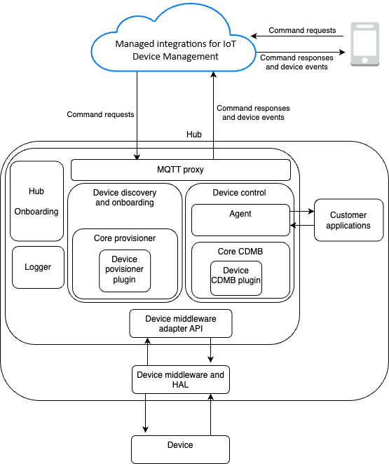

# Managed integrations Hub SDK

Use the topics in this section to learn how to onboard and control IoT hub devices using the managed integrations Hub SDK.
For more information about the managed integrations End device SDK, see the [Managed integrations End device SDK](managedintegrations-sdk-devices.md "managedintegrations-sdk-devices.md").

## Hub SDK architecture

