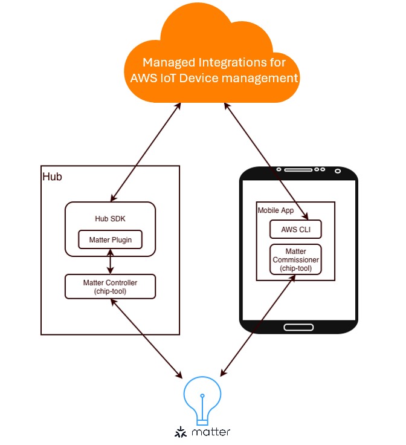

# Matter Plugin

###### Topics

- [What is Matter Plugin](#what-is-matter-plugin "#what-is-matter-plugin")
- [How to build Matter Plugin](#how-to-build-matter-plugin "#how-to-build-matter-plugin")
- [Quickstart: Set Up and Run the Matter Plugin](#quickstart-setup-run-matter-plugin "#quickstart-setup-run-matter-plugin")
- [The steps below are to be run on the Raspberry Pi i.e. the Commissioner.](#raspberry-pi-commissioner-steps "#raspberry-pi-commissioner-steps")
- [Supported Matter device types](#supported-matter-device-types "#supported-matter-device-types")
- [Adding Support for Additional Clusters](#adding-support-for-additional-clusters "#adding-support-for-additional-clusters")
- [Integrate different Matter Controller solutions](#integrate-different-matter-controller-solutions "#integrate-different-matter-controller-solutions")

## What is Matter Plugin

Matter Plugin is a reference implementation built using the [Custom protocol plugin](custom-protocol-plugin.md "custom-protocol-plugin.md") feature of the Managed integrations Hub SDK. It enables your hub to control Matter devices both locally on the same network, following the Matter specification, and remotely through Managed integrations.



The Matter Plugin is included in the Hub SDK. It communicates with Matter devices, implements Matter Controller functionalities, and exposes a remote control path via Managed integrations.

chip-tool is a command-line based reference controller from [connectedhomeip](https://github.com/project-chip/connectedhomeip "https://github.com/project-chip/connectedhomeip"). It acts as a Commissioner/Controller on a Matter fabric, allowing you to commission devices, read/write attributes, and invoke commands and is intended for development and interoperability testing. In this guide, the Matter Plugin will use chip-tool to control the Matter device and also demonstrate Matter commissioning from the Mobile App.

The scope of this distribution does not include a production mobile application, nor does it cover certification and production activities such as CSA lab test and certification. These remain part of your product development process.

## How to build Matter Plugin

The Matter Plugin has the following dependencies in addition to the Hub SDK:

- OpenSSL 3.0.x: The OpenSSL version requirement is not strict — in most cases, the system's default version works fine.
- [nng](https://github.com/nanomsg/nng "https://github.com/nanomsg/nng") v1.4.0
- [cJSON](https://github.com/DaveGamble/cJSON "https://github.com/DaveGamble/cJSON") v1.7.18
- [AWS IoT Device SDK CPP V2](https://github.com/aws/aws-iot-device-sdk-cpp-v2 "https://github.com/aws/aws-iot-device-sdk-cpp-v2") v1.33.0
- [AWS SDK CPP](https://github.com/aws/aws-sdk-cpp "https://github.com/aws/aws-sdk-cpp") 1.11.433

Configure the repo with the following command:

```
cd IotMI-DeviceSDK-MatterPlugin
mkdir build
cd build
cmake ..
```

Then build it with the following command:

```
cmake --build .
```

After building, add the library path to LD_LIBRARY_PATH:

```
export LD_LIBRARY_PATH=/path/to/libraries:$LD_LIBRARY_PATH
```

## Quickstart: Set Up and Run the Matter Plugin

Follow the steps below to set up the Matter Plugin and the corresponding Matter solution. The flow assumes two machines: a Hub (running the Hub SDK + Matter Plugin) and a Raspberry Pi that represents the "Mobile App" for commissioning and basic control.

### Node ID Management

In Matter, every node on a fabric—including devices, controllers, and commissioners—must have a unique Node ID. To avoid collisions, a consistent allocation policy is required. In this guide, Node IDs are assigned manually; in production, you should manage Node IDs properly.

For the examples in this document, the Hub's chip-tool (used by the Matter Plugin) uses default Node ID `112233`, and the chip-tool on the Mobile App Raspberry Pi uses Node ID `123456`. Newly commissioned devices are assigned non-conflicting Node IDs on the same fabric (for instance, 101 in the quickstart).

### Prerequisites

Before you begin, ensure that you have the following:

- Your Hub is already onboarded to Managed integrations and the Hub SDK is deployed (via script or systemd). If not already onboarded, follow [Hub onboarding setup](managedintegrations-sdk-v2-cookbook-hubsetup.md "managedintegrations-sdk-v2-cookbook-hubsetup.md") to onboard to Managed integrations, and [Install and validate the managed integrations Hub SDK](managedintegrations-sdk-v2-cookbook-deployment.md "managedintegrations-sdk-v2-cookbook-deployment.md") to run the hub SDK. Once onboarded, make a note of your hub's managed thing ID. This will be required later.
- You have a Raspberry Pi (or any machine) that can run both chip-tool and AWS CLI.
- You have a Matter device for testing. It can be a real matter device or a virtual Matter device (e.g., [lighting-app](https://github.com/project-chip/connectedhomeip/tree/master/examples/lighting-app/linux "https://github.com/project-chip/connectedhomeip/tree/master/examples/lighting-app/linux"))

### Step 1. Prepare the Raspberry Pi (representing the Mobile App)

- Install AWS CLI and build and install chip-tool
- Build chip-tool following the [official chip-tool build guide](https://github.com/project-chip/connectedhomeip/blob/master/docs/development_controllers/chip-tool/chip_tool_guide.md#building-from-source "https://github.com/project-chip/connectedhomeip/blob/master/docs/development_controllers/chip-tool/chip_tool_guide.md#building-from-source"). The version we've verified is v1.4.2.0.
- Install AWS CLI following the [official instructions](../../../cli/latest/userguide/getting-started-install.md "../../../cli/latest/userguide/getting-started-install.md").
- Prepare persistent storage for chip-tool

```
mkdir -p $HOME/iotmi/matter/
```

- Generate the commissioner certificate chain (assign node ID `123456` to this chip-tool)

```
cd connectedhomeip/
cd out/chip-tool/
./chip-tool pairing get-commissioner-root-certificate \
    --commissioner-nodeid 123456 \
    --storage-directory $HOME/iotmi/matter/
```

The generated chain is stored at: `$HOME/iotmi/matter/chip_tool_config.alpha.ini`

You'll copy this file to the Hub later.

### Step 2. Prepare the Hub (which runs the Matter Plugin)

- Build or Install chip-tool on the Hub (the Matter Plugin uses it to perform Matter operations). You can refer to the [chip-tool build guide](https://github.com/project-chip/connectedhomeip/blob/master/docs/development_controllers/chip-tool/chip_tool_guide.md#building-from-source "https://github.com/project-chip/connectedhomeip/blob/master/docs/development_controllers/chip-tool/chip_tool_guide.md#building-from-source"). The version we've verified is v1.4.2.0.

We'll also need the the sha256sum of the chip-tool for later use. You can use the following command to get the sha256sum:

```
sha256sum /path/to/chip-tool
```

- Prepare storage and copy the commissioner file from the Raspberry Pi

```
mkdir -p $HOME/iotmi/matter/
# From Raspberry Pi to Hub (example):
# scp $HOME/iotmi/matter/chip_tool_config.alpha.ini user@HUB_HOST:$HOME/iotmi/matter/
```

- Run the Matter Plugin (provide chip-tool path, its SHA256, and the storage folder)

```
./iotmi_matter_plugin \
    --chip-tool-path /path/to/chip-tool \
    --sha256sum SHA256SUM_OF_THE_CHIP_TOOL \
    --storage-folder $HOME/iotmi/matter/ \
    --node-id 112233
```

## The steps below are to be run on the Raspberry Pi i.e. the Commissioner.

### Step 3. Commission a Matter device (on the Raspberry Pi)

Use chip-tool to commission the device using its decoded QR code and provision Wi-Fi credentials. In this example, the device will use node ID 101 and the commissioner node ID is `123456`.

```
./chip-tool pairing code-wifi 101 \
    YOUR_WIFI_SSID YOUR_WIFI_PW  \
    MT:MFAA0W8C00UFQV2VL00 \
    --bypass-attestation-verifier 1 \
    --commissioner-nodeid 123456 \
    --storage-directory $HOME/iotmi/matter/
```

**Notes:**

- `101` is the device's Matter node ID (you may choose a different value).
- `MT:MFAA0W8C00UFQV2VL00` is the decoded QR content for the device. To get the decoded context from a QR code, you need to choose a QR code app or library to decode it. You can also use a web service that supports decoding QR code decoding.
- `-bypass-attestation-verifier 1` is for test use only. For production, update the PAA store and perform attestation checks.

chip-tool supports different pairing methods, including QR code or PIN code pairing with Thread or WiFi devices. For more information about the [chip-tool pairing command](https://github.com/project-chip/connectedhomeip/blob/master/docs/development_controllers/chip-tool/chip_tool_guide.md#pairing "https://github.com/project-chip/connectedhomeip/blob/master/docs/development_controllers/chip-tool/chip_tool_guide.md#pairing"), see the official documentation.

### Step 4. Grant Hub access on the device (update ACL)

After commissioning, allow the Hub's chip-tool to control the device. In this example, node ID `123456` (Raspberry Pi) has Admin permission (5) and node ID `112233` (Hub) has Manage permission (4).

```
chip-tool accesscontrol write acl \
    '[{"fabricIndex":1,"privilege":5,"authMode":2,"subjects":[123456], "targets": null},{"fabricIndex":1,"privilege":4,"authMode":2,"subjects":[112233], "targets": null}]' \
    101 0 \
    --commissioner-nodeid 123456
    --storage-directory $HOME/iotmi/matter/
```

### Step 5. Create a managed thing for the device (User-Guided Setup)

- Start discovery (replace with your Hub's managed thing ID):

```
aws iot-managed-integrations start-device-discovery \
    --discovery-type CUSTOM \
    --custom-protocol-detail '{"Name": "Matter", "NodeId":"101", "FabricId":"1"}' \
    --controller-identifier <HUB_MANAGED_THING_ID>
```

Sample response includes a user-guided setup job ID:

```
{
    "Id": "USER_GUIDED_SETUP_JOB_ID",
    "StartedAt": 1753683326.056
}
```

- Query discovered devices using the job ID:

```
aws iot-managed-integrations \
    list-discovered-devices --identifier <USER_GUIDED_SETUP_JOB_ID>
```

Sample response:

```
{
    "Items": [
        {
            "DeviceTypes": [],
            "DiscoveredAt": "2025-08-05T06:46:35.407000+08:00",
            "AuthenticationMaterial": "<AUTH_MATERIAL>"
        }
    ]
}
```

- Create a managed thing for the device using the AuthenticationMaterial:

```
aws iot-managed-integrations create-managed-thing \
    --role DEVICE \
    --authentication-material-type DISCOVERED_DEVICE \
    --authentication-material "<AUTH_MATERIAL>"
```

Sample response (with device's managed thing ID):

```
{
    "Id": "DEVICE_MANAGED_THING_ID",
    "Arn": "arn:aws:iotmanagedintegrations:eu-west-1:228183742813:managed-thing/515cf5a707ec41aaabb9914a1dd2889f",
    "CreatedAt": "2025-08-06T15:00:08.718000+08:00"
}
```

### Step 6. Control the device via Managed integrations

Use the `send-managed-thing-command` command to send a command to your managed thing.

```
json=$(jq -cr '.|@json' <<EOF
[
  {
    "endpointId": "1",
    "capabilities": [
      {
        "id": "matter.OnOff@1.4",
        "name": "On/Off",
        "version": "1",
        "actions": [
          {
            "name": "Toggle",
            "parameters": {}
          }
        ]
      }
    ]
  }
]
EOF
)
aws iot-managed-integrations send-managed-thing-command \
    --managed-thing-id "DEVICE_MANAGED_THING_ID" \
    --endpoints "$json"
```

### Step 7. Read device state

Send the following command to get the device state.

```
aws iot-managed-integrations get-managed-thing-state \
    --managed-thing-id "DEVICE_MANAGED_THING_ID"
```

Sample result:

```
{
    "Endpoints": [
        {
            "endpointId": "1",
            "capabilities": [
                {
                    "id": "matter.OnOff@1.4",
                    "name": "On/Off",
                    "version": "1.4",
                    "properties": [
                        {
                            "value": {
                                "lastChangedAt": "2025-08-14T13:16:02.132Z",
                                "propertyValue": false
                            },
                            "name": "OnOff"
                        }
                    ]
                }
            ]
        }
    ]
}
```

### Step 8. Remove the managed thing from your hub

- Remove the managed thing from your hub with the following command

```
aws iot-managed-integrations delete-managed-thing \
    --identifier "DEVICE_MANAGED_THING_ID"
```

- Unpair the device from the Raspberry Pi's fabric (if desired):

```
./chip-tool pairing unpair 101 \
    --commissioner-nodeid 123456 \
    --storage-directory $HOME/iotmi/matter/
```

## Supported Matter device types

| Matter device type                                                                                                                                                                                                                                             | Supported Capabilities                                                                                                                                                                                                                                                                                                                                                                                                                                                                                                                                                                                                                                                                                                                                                                                                                                                                                                   |
| -------------------------------------------------------------------------------------------------------------------------------------------------------------------------------------------------------------------------------------------------------------- | ------------------------------------------------------------------------------------------------------------------------------------------------------------------------------------------------------------------------------------------------------------------------------------------------------------------------------------------------------------------------------------------------------------------------------------------------------------------------------------------------------------------------------------------------------------------------------------------------------------------------------------------------------------------------------------------------------------------------------------------------------------------------------------------------------------------------------------------------------------------------------------------------------------------------ |
| [OnOffLight](https://github.com/project-chip/connectedhomeip/blob/master/data_model/1.4/device_types/OnOffPlug-inUnit.xml "https://github.com/project-chip/connectedhomeip/blob/master/data_model/1.4/device_types/OnOffPlug-inUnit.xml")                      | [Identify (0x0003)](https://github.com/project-chip/connectedhomeip/blob/master/data_model/1.4/clusters/Identify.xml "https://github.com/project-chip/connectedhomeip/blob/master/data_model/1.4/clusters/Identify.xml"), [On/Off (0x0006)](https://github.com/project-chip/connectedhomeip/blob/master/data_model/1.4/clusters/OnOff.xml "https://github.com/project-chip/connectedhomeip/blob/master/data_model/1.4/clusters/OnOff.xml"), [Level Control (0x0008)](https://github.com/project-chip/connectedhomeip/blob/master/data_model/1.4/clusters/LevelControl.xml "https://github.com/project-chip/connectedhomeip/blob/master/data_model/1.4/clusters/LevelControl.xml")                                                                                                                                                                                                                                        |
| [DimmableLight](https://github.com/project-chip/connectedhomeip/blob/master/data_model/1.4/device_types/DimmableLight.xml "https://github.com/project-chip/connectedhomeip/blob/master/data_model/1.4/device_types/DimmableLight.xml")                         | [Identify (0x0003)](https://github.com/project-chip/connectedhomeip/blob/master/data_model/1.4/clusters/Identify.xml "https://github.com/project-chip/connectedhomeip/blob/master/data_model/1.4/clusters/Identify.xml"), [On/Off (0x0006)](https://github.com/project-chip/connectedhomeip/blob/master/data_model/1.4/clusters/OnOff.xml "https://github.com/project-chip/connectedhomeip/blob/master/data_model/1.4/clusters/OnOff.xml"), [Level Control (0x0008)](https://github.com/project-chip/connectedhomeip/blob/master/data_model/1.4/clusters/LevelControl.xml "https://github.com/project-chip/connectedhomeip/blob/master/data_model/1.4/clusters/LevelControl.xml")                                                                                                                                                                                                                                        |
| [ColorTemperatureLight](https://github.com/project-chip/connectedhomeip/blob/master/data_model/1.4/device_types/ColorTemperatureLight.xml "https://github.com/project-chip/connectedhomeip/blob/master/data_model/1.4/device_types/ColorTemperatureLight.xml") | [Identify (0x0003)](https://github.com/project-chip/connectedhomeip/blob/master/data_model/1.4/clusters/Identify.xml "https://github.com/project-chip/connectedhomeip/blob/master/data_model/1.4/clusters/Identify.xml"), [On/Off (0x0006)](https://github.com/project-chip/connectedhomeip/blob/master/data_model/1.4/clusters/OnOff.xml "https://github.com/project-chip/connectedhomeip/blob/master/data_model/1.4/clusters/OnOff.xml"), [Level Control (0x0008)](https://github.com/project-chip/connectedhomeip/blob/master/data_model/1.4/clusters/LevelControl.xml "https://github.com/project-chip/connectedhomeip/blob/master/data_model/1.4/clusters/LevelControl.xml"), [Color Control (0x0300)](https://github.com/project-chip/connectedhomeip/blob/master/data_model/1.4/clusters/ColorControl.xml "https://github.com/project-chip/connectedhomeip/blob/master/data_model/1.4/clusters/ColorControl.xml") |
| [OnOffPlug-InUint](https://github.com/project-chip/connectedhomeip/blob/master/data_model/1.4/device_types/OnOffPlug-inUnit.xml "https://github.com/project-chip/connectedhomeip/blob/master/data_model/1.4/device_types/OnOffPlug-inUnit.xml")                | [Identify (0x0003)](https://github.com/project-chip/connectedhomeip/blob/master/data_model/1.4/clusters/Identify.xml "https://github.com/project-chip/connectedhomeip/blob/master/data_model/1.4/clusters/Identify.xml"), [On/Off (0x0006)](https://github.com/project-chip/connectedhomeip/blob/master/data_model/1.4/clusters/OnOff.xml "https://github.com/project-chip/connectedhomeip/blob/master/data_model/1.4/clusters/OnOff.xml"), [Level Control (0x0008)](https://github.com/project-chip/connectedhomeip/blob/master/data_model/1.4/clusters/LevelControl.xml "https://github.com/project-chip/connectedhomeip/blob/master/data_model/1.4/clusters/LevelControl.xml")                                                                                                                                                                                                                                        |
| [DimmablePlug-InUnit](https://github.com/project-chip/connectedhomeip/blob/master/data_model/1.4/device_types/DimmablePlug-InUnit.xml "https://github.com/project-chip/connectedhomeip/blob/master/data_model/1.4/device_types/DimmablePlug-InUnit.xml")       | [Identify (0x0003)](https://github.com/project-chip/connectedhomeip/blob/master/data_model/1.4/clusters/Identify.xml "https://github.com/project-chip/connectedhomeip/blob/master/data_model/1.4/clusters/Identify.xml"), [On/Off (0x0006)](https://github.com/project-chip/connectedhomeip/blob/master/data_model/1.4/clusters/OnOff.xml "https://github.com/project-chip/connectedhomeip/blob/master/data_model/1.4/clusters/OnOff.xml"), [Level Control (0x0008)](https://github.com/project-chip/connectedhomeip/blob/master/data_model/1.4/clusters/LevelControl.xml "https://github.com/project-chip/connectedhomeip/blob/master/data_model/1.4/clusters/LevelControl.xml")                                                                                                                                                                                                                                        |
| [OnOffLightSwitch](https://github.com/project-chip/connectedhomeip/blob/master/data_model/1.4/device_types/OnOffLightSwitch.xml "https://github.com/project-chip/connectedhomeip/blob/master/data_model/1.4/device_types/OnOffLightSwitch.xml")                | [Identify (0x0003)](https://github.com/project-chip/connectedhomeip/blob/master/data_model/1.4/clusters/Identify.xml "https://github.com/project-chip/connectedhomeip/blob/master/data_model/1.4/clusters/Identify.xml"), [On/Off (0x0006)](https://github.com/project-chip/connectedhomeip/blob/master/data_model/1.4/clusters/OnOff.xml "https://github.com/project-chip/connectedhomeip/blob/master/data_model/1.4/clusters/OnOff.xml")                                                                                                                                                                                                                                                                                                                                                                                                                                                                               |
| [DimmerSwitch](https://github.com/project-chip/connectedhomeip/blob/master/data_model/1.4/device_types/DimmerSwitch.xml "https://github.com/project-chip/connectedhomeip/blob/master/data_model/1.4/device_types/DimmerSwitch.xml")                            | [Identify (0x0003)](https://github.com/project-chip/connectedhomeip/blob/master/data_model/1.4/clusters/Identify.xml "https://github.com/project-chip/connectedhomeip/blob/master/data_model/1.4/clusters/Identify.xml"), [On/Off (0x0006)](https://github.com/project-chip/connectedhomeip/blob/master/data_model/1.4/clusters/OnOff.xml "https://github.com/project-chip/connectedhomeip/blob/master/data_model/1.4/clusters/OnOff.xml"), [Level Control (0x0008)](https://github.com/project-chip/connectedhomeip/blob/master/data_model/1.4/clusters/LevelControl.xml "https://github.com/project-chip/connectedhomeip/blob/master/data_model/1.4/clusters/LevelControl.xml")                                                                                                                                                                                                                                        |
| [ColorDimmerSwitch](https://github.com/project-chip/connectedhomeip/blob/master/data_model/1.4/device_types/ColorDimmerSwitch.xml "https://github.com/project-chip/connectedhomeip/blob/master/data_model/1.4/device_types/ColorDimmerSwitch.xml")             | [Identify (0x0003)](https://github.com/project-chip/connectedhomeip/blob/master/data_model/1.4/clusters/Identify.xml "https://github.com/project-chip/connectedhomeip/blob/master/data_model/1.4/clusters/Identify.xml"), [On/Off (0x0006)](https://github.com/project-chip/connectedhomeip/blob/master/data_model/1.4/clusters/OnOff.xml "https://github.com/project-chip/connectedhomeip/blob/master/data_model/1.4/clusters/OnOff.xml"), [Level Control (0x0008)](https://github.com/project-chip/connectedhomeip/blob/master/data_model/1.4/clusters/LevelControl.xml "https://github.com/project-chip/connectedhomeip/blob/master/data_model/1.4/clusters/LevelControl.xml"), [Color Control (0x0300)](https://github.com/project-chip/connectedhomeip/blob/master/data_model/1.4/clusters/ColorControl.xml "https://github.com/project-chip/connectedhomeip/blob/master/data_model/1.4/clusters/ColorControl.xml") |
| [DoorLock](https://github.com/project-chip/connectedhomeip/blob/master/data_model/1.4/device_types/DoorLock.xml "https://github.com/project-chip/connectedhomeip/blob/master/data_model/1.4/device_types/DoorLock.xml")                                        | [Identify (0x0003)](https://github.com/project-chip/connectedhomeip/blob/master/data_model/1.4/clusters/Identify.xml "https://github.com/project-chip/connectedhomeip/blob/master/data_model/1.4/clusters/Identify.xml"), [Door Lock (0x0101)](https://github.com/project-chip/connectedhomeip/blob/master/data_model/1.4/clusters/DoorLock.xml "https://github.com/project-chip/connectedhomeip/blob/master/data_model/1.4/clusters/DoorLock.xml")                                                                                                                                                                                                                                                                                                                                                                                                                                                                      |
| [Thermostat](https://github.com/project-chip/connectedhomeip/blob/master/data_model/1.4/device_types/Thermostat.xml "https://github.com/project-chip/connectedhomeip/blob/master/data_model/1.4/device_types/Thermostat.xml")                                  | [Identify (0x0003)](https://github.com/project-chip/connectedhomeip/blob/master/data_model/1.4/clusters/Identify.xml "https://github.com/project-chip/connectedhomeip/blob/master/data_model/1.4/clusters/Identify.xml"), [Thermostat (0x0201)](https://github.com/project-chip/connectedhomeip/blob/master/data_model/1.4/clusters/Thermostat.xml "https://github.com/project-chip/connectedhomeip/blob/master/data_model/1.4/clusters/Thermostat.xml")                                                                                                                                                                                                                                                                                                                                                                                                                                                                 |
| [WaterLeakDetector](https://github.com/project-chip/connectedhomeip/blob/master/data_model/1.4/device_types/WaterLeakDetector.xml "https://github.com/project-chip/connectedhomeip/blob/master/data_model/1.4/device_types/WaterLeakDetector.xml")             | [Identify (0x0003)](https://github.com/project-chip/connectedhomeip/blob/master/data_model/1.4/clusters/Identify.xml "https://github.com/project-chip/connectedhomeip/blob/master/data_model/1.4/clusters/Identify.xml"), [Boolean State (0x0045)](https://github.com/project-chip/connectedhomeip/blob/master/data_model/1.4/clusters/BooleanState.xml "https://github.com/project-chip/connectedhomeip/blob/master/data_model/1.4/clusters/BooleanState.xml")                                                                                                                                                                                                                                                                                                                                                                                                                                                          |

## Adding Support for Additional Clusters

To extend the Matter Plugin to support additional device types and capabilities, modify **matter_action_converter.cpp** following this pattern:

**Implementation pattern:**

1. Define mappings for enums and bitmaps
2. Add UpdateState logic for writable attributes
3. Add command processing for cluster actions
4. Add attribute parsing for state reporting

**Use existing clusters as templates:**

1. **OnOff cluster** - Simplest reference showing all four components with basic enums, writable attributes, commands, and attribute reporting
2. **DoorLock cluster** - Complex example demonstrating multiple enum types, bitmap fields, struct parameters, optional command parameters, and extensive attribute coverage

All supported clusters (Identify, OnOff, LevelControl, DoorLock, Thermostat, ColorControl, BooleanState) follow this structure. Review the existing implementations in matter_action_converter.cpp to understand the complete pattern.

## Integrate different Matter Controller solutions

This section provides guidance on how to integrate different Matter Controller solutions with the Matter Plugin. It outlines the possible approaches and important considerations but does not provide detailed implementation code.

There are two main ways to integrate Matter Controller solutions. The first one is using the Matter Plugin with a customized chip-tool. The second one is to use a Matter Controller of your choice and integration with Managed integrations through Custom Protocol library.

### Using the Matter Plugin with a Customized Chip-Tool

In this approach, the Matter Plugin is extended to work with a customized version of the Chip-Tool. To achieve this, you may need to modify the Matter Plugin source code and introduce additional logic:

- Adjust STDIO parsing logic: If your customized chip-tool generates logs with a different pattern, update the parsing logic accordingly.
- Implement secure storage: The Matter Plugin provides a file-based storage mechanism for device information. For production use, replace this with a more secure storage implementation or apply encryption to the data. And it also needs a proper cleanup procedures when the Matter Plugin is uninstalled.
- Implement binary signing and integrity protection: In production deployments, you should enforce integrity protection for both the customized chip-tool and the extended Matter Plugin. This includes signing the binaries as part of your software release process, verifying signatures during startup, and integrating platform security features such as secure boot or OS-level integrity tools.
- Introduce task/event rate limiting: To prevent overload, ensure the Matter Plugin includes proper task and event rate limiting. In production deployments, you should also add basic metrics and monitoring to detect abnormal update patterns and temporarily throttle or suspend the affected device or subscription. This circuit-breaker–like behavior is not provided by the reference implementation and must be implemented by the customer.
- Integrate chip-tool main function logic directly: If you prefer not to rely on STDIO, you can integrate the chip-tool's main function into the Matter Plugin. Standard input/output logic can then be connected to the read/write functions of the ChptoolProc class.
- Support code generation: Implement a mechanism to handle Matter specification version updates through code generation.
- Implement Matter Administration features, including:
  - Assigning Node IDs to the Commissioner, Controller, and Matter devices.
  - Managing multiple Fabrics.

On the chip-tool side, the following enhancements are also recommended:

- Use secure storage: chip-tool stores Matter certificates, private keys, and statistics in local directories. Replace this with a secure implementation.
- Enable parallel processing: By default, Chip-Tool executes one command at a time. Adding parallel execution support may improve efficiency in certain scenarios.

### Using an Existing Matter Controller with Managed integrations

If your Matter Controller is not based on chip-tool (for example, a Python-based implementation or function-call–based solution), the STDIO approach may not be suitable. In such cases, you can integrate directly with Managed integrations using a [Custom protocol plugin](custom-protocol-plugin.md "custom-protocol-plugin.md"), while using the Matter Plugin as a reference. The following considerations apply:

- Maintain Fabric and Node IDs: Ensure that device metadata, such as adding/removing devices and caching attributes, is consistently maintained.
- Manage subscriptions: Each device should maintain up to one active subscription, so that its state can be updated continuously.
- Propagate state changes: When a device updates its state, verify changes and propagate events to Managed integrations.
- Implement a Matter data model translator: Although Managed integrations uses the Matter data model, its representation is in JSON format. A translator is required to map between your Matter data model format and the JSON representation.
