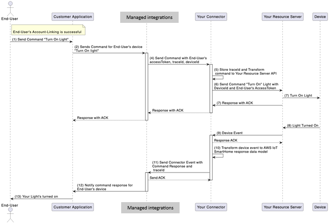

# Implement the AWS.SendCommand operation

The `AWS.SendCommand` operation allows Managed integrations for AWS IoT Device Management to send commands
initiated by the end user via the AWS customer to your resource server. Your resource
server may support multiple types of devices, where each type has its own response model.

Command execution is an asynchronous process where Managed integrations for AWS IoT Device Management sends a request for command
execution with a `traceId`, which your connector will include in a command response sent
back to Managed integrations for AWS IoT Device Management via the `SendConnectorEvent` API. Managed integrations for AWS IoT Device Management expects the resource server to
return a response acknowledging that command was received, but not necessarily indicating
that command was executed.

###### Device Command Execution Workflow

The following diagram illustrates the command execution flow with an example where the
end user tries to turn on the lights of their house:



###### Workflow Steps

1. **End user sends command** - An end user sends a command to turn on a light using the AWS customer's
   application.
2. **Customer relays command** - The customer relays the command information to Managed integrations for AWS IoT Device Management with the end user's
   device information.
3. **Managed integrations generates traceId** - Managed integrations for AWS IoT Device Management generates "traceId" that your connector will use while sending
   command responses back to service.
4. **Command request sent to connector** - Managed integrations for AWS IoT Device Management sends the command request to your connector, using the
   `AWS.SendCommand` operation interface.
   - The payload defined by this interface consists of the device identifier,
     device commands formulated as Matter endpoints/clusters/commands, the end user's
     access token, and other required parameters.

5. **Connector stores traceId** - Your connector stores the `traceId` to be included in the command
   response.
   - Your connector translates Managed integrations for AWS IoT Device Management command request into your resource
     server's appropriate format.

6. **Connector gets UserId** - Your connector gets `UserId` from the provided end user's access token and associates it
   with the command.
   - The `UserId` may be either retrieved from your resource server using a separate
     call or extracted from the access token in case of JWT and similar tokens.
   - Implementation depends on your resource server and access token
     details.

7. **Connector calls resource server** - Your connector calls the resource server to "Turn On" end user's light.
8. **Resource server interacts with device** - The resource server interacts with the device.
   - The connector relays to Managed integrations for AWS IoT Device Management that the resource server has
     delivered the command, responding with an ACK as the
     initial, synchronous command response.
   - Managed integrations for AWS IoT Device Management then relays it back to customer application.

9. **Device executes command** - After the device turns on the light, that device event is captured by your
   resource server.
10. **Resource server sends device event** - Your resource server sends the device event to connector.
11. **Connector transforms event** - Your connector transforms the device event generated by resource server into
    Managed integrations for AWS IoT Device Management DEVICE_COMMAND_RESPONSE event operation type.
12. **Connector calls SendConnectorEvent** - Your connector calls the `SendConnectorEvent` API with operation as
    "DEVICE_COMMAND_RESPONSE".
    - It attaches the `traceId` provided by Managed integrations for AWS IoT Device Management in the
      initial request.

13. **Managed integrations notifies customer** - Managed integrations for AWS IoT Device Management notifies the customer about end user's device state
    change.
14. **Customer notifies end user** - Customer notifies the end user that the device's light has turned on.

###### Note

Your resource server configuration determines the logic for handling failed device command request and response messages. This includes message retry attempts using the same referenceId for the command.

###### C2C connector Requirements for Device Command Execution

The following list outlines the requirements for your C2C connector to facilitate a
successful device command execution.

- The C2C connector Lambda can process `AWS.SendCommand` operation
  request messages from managed integrations for AWS IoT Device Management.
- Your C2C connector must keep track of commands sent to your resource server and
  map it with appropriate `traceId`.
- You can call managed integrations for AWS IoT Device Management service API's via SigV4 using AWS credentials of
  AWS account used for registering the C2C connector.

###### Command Execution Process

**Step 1: Managed Integrations Sends Command to Connector**

Send a POST request with one of the following payloads, depending on the authorization type:

**OAuth 2.0 Request:**

```
/Send-Command
{
     "header": {
          "auth": {
              "token": "ashriu32yr97feqy7afsaf",
              "type": "OAuth2.0"
          }
     },
     "payload": {
          "operationName": "AWS.SendCommand",
          "operationVersion": "1.0",
          "connectorId": "`Your-Connector-Id`",
          "connectorDeviceId": "`Your_Device_Id`",
          "traceId": "traceId-3241u78123419",
          "endpoints": [{
              "id": "1",
              "clusters": [{
                  "id": "0x0202",
                  "commands": [{
                      "0xff01":
                          {
                              "0x0000": "3”
                  		}
                  }]
              }]
          }]
     }
  }

```

**General Authorization request:**

```
/Send-Command
{
     "header": {
          "auth": {
              "secretsManager": {
                  "arn": "string",
                  "versionId": "string"
              },
              "type": "GeneralAuthorization"
          }
     },
     "payload": {
          "operationName": "AWS.SendCommand",
          "operationVersion": "1.0",
          "connectorId": "`Your-Connector-Id`",
          "connectorDeviceId": "`Your_Device_Id`",
          "traceId": "traceId-3241u78123419",
          "endpoints": [{
              "id": "1",
              "clusters": [{
                  "id": "0x0202",
                  "commands": [{
                      "0xff01":
                          {
                              "0x0000": "3"
                  		}
                  }]
              }]
          }]
     }
}

```

**Step 2: C2C Connector ACK Command**

```
{
     "header":{
          "responseCode":200
     },
     "payload":{
          "responseMessage": "Successfully received send-command request for connector '`Your-Connector-Id`' and connector-device-id '`Your_Device_Id`'"
     }
  }

```

**Step 3: Connector Sends Device Command Response Event**

```
AWS-API: /SendConnectorEvent
URI: POST /connector-event/{`Your-Connector-Id`}

{
   "UserId": "End-User-Id",
   "Operation": "DEVICE_COMMAND_RESPONSE",
   "OperationVersion": "1.0",
   "StatusCode": 200,
   "Message": “Example message”,
   "ConnectorDeviceId": "`Your_Device_Id`",
   "TraceId": "traceId-3241u78123419",
   "MatterEndpoint": {
        "id": "1",
        "clusters": [{
            "id": "0x0202",
            "attributes": [
                {
                    "0x0000": “3”
                }
            ],
            "commands": [
                "0xff01":
                {
                    "0x0000": "3”
                }
 		]
        }]
    }
}

```

###### Note

Device state changes as a result of a command execution will not be reflected in
Managed integrations for AWS IoT Device Management until the corresponding DEVICE_COMMAND_RESPONSE event has been received
through the SendConnectorEvent API. This means that until Managed integrations for AWS IoT Device Management receives the
event from prior step 3, regardless of whether or not your connector invocation
response denotes success, the device state will not be updated.

## Interpreting matter 'endpoints' included in

AWS.SendCommand request

Managed integrations will use the device capabilities reported during device discovery to
determine what commands a device can accept. Every device capability is modeled through
AWS implementations of the
Matter Data Model; thus, all incoming commands will be derived from the `commands` field
within a given cluster. It is your connector’s responsibility to parse the `endpoints`
field, determining the corresponding Matter command, and translating it such that correct
command reaches the device. Typically, this means translating the Matter data model into
the related API requests.

After the command has been executed, your connector then determines which `attributes`
defined by the AWS implementations of the
Matter Data Model have changed as a result. These changes are then reported to
managed integrations for AWS IoT Device Management via API DEVICE_COMMAND_RESPONSE events sent with the
`SendConnectorEvent` API.

Consider the `endpoints` field included in the following example
`AWS.SendCommand` payload:

```
          "endpoints": [{
              "id": "1",
              "clusters": [{
                  "id": "0x0202",
                  "commands": [{
                      "0xff01":
                          {
                              "0x0000": "3”
                  		}
                  }]
              }]
          }]

```

###### From this object, the connector can determine the following:

1. Set the endpoint and cluster information:
   1. Set the endpoint `id` to "1".

   ###### Note

   If a device defines multiple endpoints such that a single cluster (such as
   On/Off) can control multiple capabilities (i.e. turn a light on/off as well as
   turning a strobe on/off), this id is used to route the command to the correct
   capability. 2. Set the cluster `id` to "0x0202" (Fan Control cluster).

2. Set the command information:
   1. Set the command identifier to "0xff01" (Update State command defined by
      AWS).
   2. Update the included attribute identifiers with the values provided in the
      request.

3. Update the attribute:
   1. Set the attribute identifier to "0x0000" (FanMode attribute of the Fan Control
      Cluster).
   2. Set the attribute value to "3" (High fan speed).

Managed integrations has defined two “custom” command types that are not strictly defined by
AWS implementations of the
Matter Data Model: The ReadState and UpdateState commands. To get and set Matter defined
cluster attributes, managed integrations will send your connector an `AWS.SendCommand`
request with command IDs pertaining to UpdateState (id: 0xff01) or ReadState (id: 0xff02),
with corresponding parameters of attributes that must be either updated or read. These
commands can be invoked for ANY device type for attributes that are set as mutable
(updatable) or retrievable (readable) from the corresponding AWS implementation of the
Matter Data Model.
