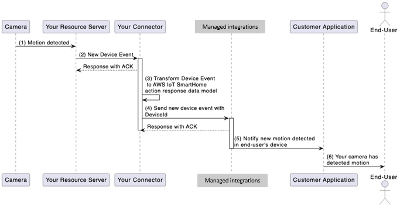

# Send device events with the SendConnectorEvent

API

## Device initiated events

overview

While the `SendConnectorEvent` API is used to asynchronously respond to
`AWS.SendCommand` and `AWS.DiscoverDevices` operations, it is also
used to notify managed integrations of any device-initiated events. Device initiated events can be
defined as any event generated by a device without a user initiated command. These device
events may include, but are not limited to, device state changes, motion detection,
battery levels, and more. You can send these events back to managed integrations using the
`SendConnectorEvent` API with operation **DEVICE_EVENT**.

The following section uses a smart camera installed at a home as an example to further
explain the working flow of these events:



###### Device event workflow

1. Your camera detects motion for which it generates an event that is sent to your
   resource server.
2. Your resource server processes the event and sends it to your
   C2C connector.
3. Your connector translates this event to the managed integrations for AWS IoT Device Management
   `DEVICE_EVENT` interface.
4. Your C2C connector sends this device event to managed integrations using the
   `SendConnectorEvent` API with Operation set to "DEVICE_EVENT".
5. Managed integrations identifies the relevant customer, and relays this event back to
   the customer.
6. The customer receives this event and displays it to user via user
   identifier.

For more information on the `SendConnectorEvent` API operation, see
`SendConnectorEvent` in the managed integrations for AWS IoT Device Management API Reference Guide.

## Device initiated events requirements

The following are some requirements for device-initiated events.

- Your C2C connector resource should be able to receive asynchronous device events
  from your resource server
- Your C2C connector resource should be able to call managed integrations for AWS IoT Device Management service
  API's via SigV4 using AWS credentials of the AWS account used for registering the
  C2C connector.

The following example demonstrates a connector sending a device-originated event via
the SendConnectorEvent API:

```
AWS-API: /SendConnectorEvent
URI: POST /connector-event/{`Your-Connector-Id`}

{
   "UserId": "Your-End-User-ID",
   "Operation": "DEVICE_EVENT",
   "OperationVersion": "1.0",
   "StatusCode": 200,
   "Message": None,
   "ConnectorDeviceId": "`Your_Device_Id`",
   "MatterEndpoint": {
        "id": "1",
        "clusters": [{
            "id": "0x0202",
            "attributes": [
                {
                    "0x0000": "3"
                }
            ]
        }]
    }]
}

```

From the following example, we see the following:

- This is coming from the device endpoint with ID equal to 1.
- The device capability this event relates to has a cluster ID of
  **0x0202**,
  pertaining to the Fan Control matter cluster.
- The attribute that has changed has the ID of **0x000**, pertaining to the Fan Mode
  Enum within the cluster. It has updated to value **3**, pertaining to the value of
  **High**.
- Since `connectorId` is a parameter returned by the cloud service on creation,
  Connectors must query using GetCloudConnector and filter by `lambdaARN`.
  The lambda's own `ARN` is queried using `Lambda.get_function_url_config` API.
  This allows the `CloudConnectorId` to be dynamically
  accessed in the lambda, and not statically configured as earlier.
