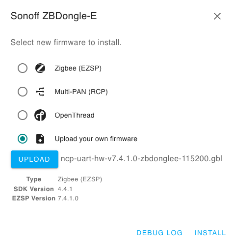
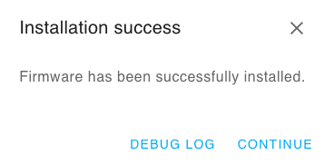
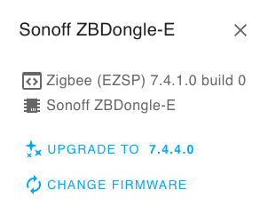

# Run managed integrations on Raspberry Pi

###### Note

This implementation of AWS IoT Hub SDK on Raspberry Pi is a demonstration project
intended for learning and testing purposes only and is not intended to be used in production environments.
For the purposes of this demo, set the following configurations for development ease:

**AWS credentials storage**: For demo purposes only, credentials and certificates are
stored in an accessible location for easier testing and development.
Production environments must use secure storage solutions like AWS Secrets Manager, or
Systems Manager Parameter Store. They must implement encryption at rest, and follow AWS IoT security guidelines.

**Container privileges**: The demo runs with elevated privileges to allow unrestricted access to host resources
and simplify development workflows. In production, containers should operate with minimal required privileges.

**Network bridge configuration**: The demo uses a network bridge configuration that exposes internal network traffic
for easier debugging and monitoring. In production environments, implement proper network isolation and segmentation to
prevent unauthorized access to internal network traffic.

**USB device permissions**: Unrestricted USB device access is enabled to facilitate easy
connection of development peripherals and testing devices. For production, implement strict USB device controls and validation to prevent device spoofing attacks.

These configurations enable straightforward testing and must notcbe used in production environments. When deploying to production,
please follow security best practices to prevent host system compromise and unauthorized access to credentials.

As a prerequisite, you must set up the Sonoff Zigbee USB dongle before setting up the Raspberry Pi.

## Flash firmware to Sonoff Zigbee USB dongle

### Prerequisites

- [Sonoff Zigbee USB Dongle](https://www.amazon.com/Plus-ZBDongle-Interface-Pre-Installed-Coordinated-Zigbee2MQTT/dp/B0B6P22YJC/ "https://www.amazon.com/Plus-ZBDongle-Interface-Pre-Installed-Coordinated-Zigbee2MQTT/dp/B0B6P22YJC/")
- Windows: Install [CP210x Universal Windows Driver](https://www.silabs.com/documents/public/software/CP210x_Universal_Windows_Driver.zip "https://www.silabs.com/documents/public/software/CP210x_Universal_Windows_Driver.zip")

### Flash the firmware

1. Download [Zigbee Dongle Firmware Build 7.4.1.0](https://github.com/darkxst/silabs-firmware-builder/blob/main/firmware_builds/zbdonglee/ncp-uart-hw-v7.4.1.0-zbdonglee-115200.gbl "https://github.com/darkxst/silabs-firmware-builder/blob/main/firmware_builds/zbdonglee/ncp-uart-hw-v7.4.1.0-zbdonglee-115200.gbl").
2. Open [Silabs Firmware Flasher](https://darkxst.github.io/silabs-firmware-builder/ "https://darkxst.github.io/silabs-firmware-builder/").
3. Connect the Sonoff Zigbee USB Dongle to your computer.
4. Scroll and find **ZBDongle-E**.
5. Choose **Connect**.
6. Wait for the device to connect.
7. Choose **Change firmware**.
8. Select **Upload your own firmware**.
9. Find the location of
   [Zigbee Dongle Firmware Build 7.4.1.0](https://github.com/darkxst/silabs-firmware-builder/blob/main/firmware_builds/zbdonglee/ncp-uart-hw-v7.4.1.0-zbdonglee-115200.gbl "https://github.com/darkxst/silabs-firmware-builder/blob/main/firmware_builds/zbdonglee/ncp-uart-hw-v7.4.1.0-zbdonglee-115200.gbl")
   download and select it.

 10. Click **Install**. 11. Wait for firmware to install.

 12. Choose **Continue** when installation is complete.

The dongle is now ready for use.

Choose between the below listed options to run the managed integrations Hub SDK on your Raspberry Pi.
The setup and validation steps for both approaches are listed below.

###### Topics

- [Managed integrations Hub SDK image on Raspberry Pi](raspberrypi-device-hub-sdk.md "raspberrypi-device-hub-sdk.md")
- [Managed integrations Hub SDK Docker container on Raspberry Pi](raspberrypi-container-docker-sdk.md "raspberrypi-container-docker-sdk.md")
- [Managed integrations demo application](supported-raspberry-demo-app.md "supported-raspberry-demo-app.md")
