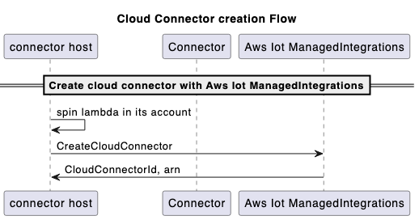
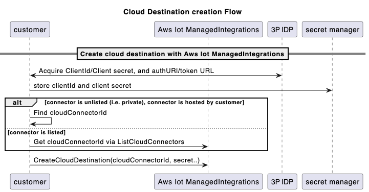
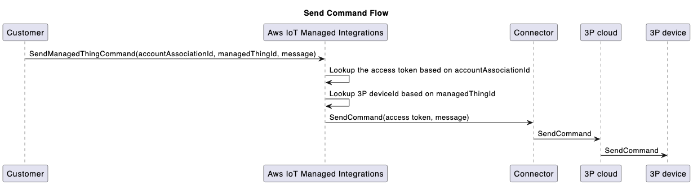
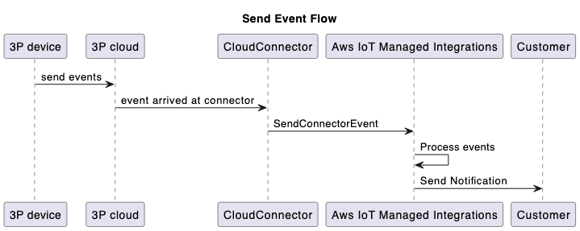

# Use a C2C (Cloud-to-Cloud) connector

A C2C connector manages the translation of
request and response messages, and enables communication between managed integrations and a third-party vendor cloud.
It facilitates unified control across different device types,
platforms and protocols enabling third-party devices to be onboarded and managed.

The following procedure lists the steps to use the C2C connector.

###### Steps to use the C2C connector:

1. **CreateCloudConnector**

Configure a connector to enable bidirectional communication between your managed integrations and third-party vendor clouds.

When setting up the connector, provide the following details:

    * **Name**: Choose a descriptive name for the connector.
    * **Description**: Provide a brief summary of the connector's purpose and capabilities.
    * **AWS Lambda ARN**: Specify the Amazon Resource Name (ARN) of the AWS Lambda function that will power the connector.

Build and deploy an AWS Lambda function that communicates with third-party vendor APIs to create a connector.
Next, call the [CreateCloudConnector](../APIReference/API_CreateCloudConnector.md "../APIReference/API_CreateCloudConnector.md") API within
managed integrations, and provide the AWS Lambda function ARN for registration. Ensure that the AWS Lambda function is deployed in the same
AWS account where you crete the connector in managed integrations.
You will be assigned a unique **Connector ID** to identify the integration.

**Sample CreateCloudConnector API Request and Response:**

```
Request:

{
    "Name": "CreateCloudConnector",
    "Description": "Testing for C2C",
    "EndpointType": "LAMBDA",
    "EndpointConfig": {
        "lambda": {
            "arn": "arn:aws:lambda:us-east-1:xxxxxx:function:TestingConnector"
        }
    },
    "ClientToken": "`abc`"
}

Response:

{
    "Id": "string"
}
```

**Creation flow:**



###### Note

Use the
[GetCloudConnector](../APIReference/API_GetCloudConnector.md "../APIReference/API_GetCloudConnector.md"),
[UpdateCloudConnector](../APIReference/API_UpdateCloudConnector.md "../APIReference/API_UpdateCloudConnector.md"),
[DeleteCloudConnector](../APIReference/API_DeleteCloudConnector.md "../APIReference/API_DeleteCloudConnector.md"),
and [ListCloudConnectors](../APIReference/API_ListCloudConnectors.md "../APIReference/API_ListCloudConnectors.md") APIs
as needed for this procedure. 2. **CreateConnectorDestination**

Configure Destinations to provide the settings and authentication credentials
that connectors need to establish secure connections with third-party vendor clouds.
Use Destinations to register your third-party authentication credentials with managed integrations,
such as OAuth 2.0 authorization details including the authorization URL,
authentication scheme, and the location of credentials within AWS Secrets Manager.

**Prerequisites**

Before creating a **ConnectorDestination**, you must:

    * Call the
     [CreateCloudConnector](../APIReference/API_CreateCloudConnector.md "../APIReference/API_CreateCloudConnector.md") API
     to create a connector.
     The ID that the function returns is used in the
     [CreateConnectorDestination](../APIReference/API_CreateConnectorDestination.md "../APIReference/API_CreateConnectorDestination.md") API
     API call.
    * Retrieve the `tokenUrl` for the 3P platform of the connector. (You can exchange an
     **authCode** for an **accessToken**).
    * Retrieve the **authUrl** for the 3P platform of the connector. (End-users can authenticate
     using their username and password).
    * Use the `clientId` and `clientSecret` (from the 3P platform)
     in your account’s secret manager.

**Sample CreateConnectorDestination API Request and Response:**

```
Request:

{
    "Name": "CreateConnectorDestination",
    "Description": "CreateConnectorDestination",
    "AuthType": "OAUTH",
    "AuthConfig": {
        "oAuth": {
            "authUrl": "https://xxxx.com/oauth2/authorize",
            "tokenUrl": "https://xxxx/oauth2/token",
            "scope": "testScope",
            "tokenEndpointAuthenticationScheme": "HTTP_BASIC",
            "oAuthCompleteRedirectUrl": "about:blank",
            "proactiveRefreshTokenRenewal": {
                "enabled": false,
                "DaysBeforeRenewal": 30
            }
        }
    },
    "CloudConnectorId": "<connectorId>", // The connectorID instance from response of Step 1.
    "SecretsManager": {
        "arn": "arn:aws:secretsmanager:*****:secret:*******",
        "versionId": "********"
    },
    "ClientToken": "***"
}

Response:

{
    "Id":"string"
}
```

**Cloud destination creation flow:**



###### Note

Use the
[GetCloudConnector](../APIReference/API_GetCloudConnector.md "../APIReference/API_GetCloudConnector.md"),
[UpdateCloudConnector](../APIReference/API_UpdateCloudConnector.md "../APIReference/API_UpdateCloudConnector.md"),
[DeleteCloudConnector](../APIReference/API_DeleteCloudConnector.md "../APIReference/API_DeleteCloudConnector.md"),
and [ListCloudConnectors](../APIReference/API_ListCloudConnectors.md "../APIReference/API_ListCloudConnectors.md") APIs
as needed for this procedure. 3. **CreateAccountAssociation**

Associations represent the relationships between end users' third-party cloud accounts
and a connector destination.
After creating an Association and linking end users to managed integrations, their devices are
accessible through an unique **Association ID**.
This integration enables three key functions: discovering devices, sending commands, and receiving events.

**Prerequisites**

Before creating an **AccountAssociation** you must complete the following:

    * Call the
     [CreateConnectorDestination](../APIReference/API_CreateConnectorDestination.md "../APIReference/API_CreateConnectorDestination.md") API
     to create a destination.
     The ID that the function returns is used in the
     [CreateAccountAssociation](../APIReference/API_CreateAccountAssociation.md "../APIReference/API_CreateAccountAssociation.md") API
     call.
    * Invoke the [CreateAccountAssociation](../APIReference/API_CreateAccountAssociation.md "../APIReference/API_CreateAccountAssociation.md") API.

**Sample CreateAccountAssociation API Request and Response:**

```
Request:

{
    "Name": "CreateAccountAssociation",
    "Description": "CreateAccountAssociation",
    "ConnectorDestinationId": "<`destinationId`>", //The destinationID from destination creation.
    "ClientToken": "***"
}

Response:

{
    "Id":"string"
}
```

###### Note

Use the
[GetCloudConnector](../APIReference/API_GetCloudConnector.md "../APIReference/API_GetCloudConnector.md"),
[UpdateCloudConnector](../APIReference/API_UpdateCloudConnector.md "../APIReference/API_UpdateCloudConnector.md"),
[DeleteCloudConnector](../APIReference/API_DeleteCloudConnector.md "../APIReference/API_DeleteCloudConnector.md"),
and [ListCloudConnectors](../APIReference/API_ListCloudConnectors.md "../APIReference/API_ListCloudConnectors.md") APIs
as needed for this procedure.

An **AccountAssociation** has a state that is queried from
[GetAccountAssociation](../APIReference/API_GetAccountAssociation.md "../APIReference/API_GetAccountAssociation.md")
and [ListAccountAssociations](../APIReference/API_ListAccountAssociations.md "../APIReference/API_ListAccountAssociations.md")
APIs. These APIs shows the state of the
**Association**.
The [StartAccountAssociationRefresh](../APIReference/API_StartAccountAssociationRefresh.md "../APIReference/API_StartAccountAssociationRefresh.md") API
allows the refresh of an **AccountAssociation** state when its refresh token expires. 4. **Device discovery**

Each managed thing is linked to device-specific details, such as its serial number and a data model.
The data model describes the device's functionality, indicating whether it's a lightbulb,
switch, thermostat, or another type of device.
To discover a 3P device and create a managedThing for the 3P device, you must follow the below steps in sequence.

    1. Call [StartDeviceDiscovery](../APIReference/API_StartDeviceDiscovery.md "../APIReference/API_StartDeviceDiscovery.md") API to
     start the device discovery process.


    **Sample StartDeviceDiscovery API Request and Response:**


    ```
    Request:

    {
        "DiscoveryType": "CLOUD",
        "AccountAssociationId": "*****",
        "ClientToken": "abc"
    }

    Response:

    {
        "Id": "string",
        "StartedAt": number
    }
    ```
    2. Invoke [GetDeviceDiscovery](../APIReference/API_GetDeviceDiscovery.md "../APIReference/API_GetDeviceDiscovery.md") API to check the status
     of the discovery process.
    3. Invoke [ListDiscoveredDevices](../APIReference/API_ListDiscoveredDevices.md "../APIReference/API_ListDiscoveredDevices.md") API to list the devices
     discovered.


    **Sample ListDiscoveredDevices API Request and Response:**


    ```
    Request:

    //Empty body

    Response:

    {
        "Items": [
        {
          "Brand": "string",
          "ConnectorDeviceId": "string",
          "ConnectorDeviceName": "string",
          "DeviceTypes": [ "string" ],
          "DiscoveredAt": number,
          "ManagedThingId": "string",
          "Model": "string",
          "Modification": "string"
        }
    ],
        "NextToken": "string"
    }
    ```
    4. Invoke [CreateManagedThing](../APIReference/API_CreateManagedThing.md "../APIReference/API_CreateManagedThing.md") API
     to select the devices from the discovery list to be imported into managed integrations.


    **Sample CreateManagedThing API Request and Response:**


    ```
    Request:

    {
        "Role": "DEVICE",
        "AuthenticationMaterial": "CLOUD:XXXX:<connectorDeviceId1>",
        "AuthenticationMaterialType": "DISCOVERED_DEVICE",
        "Name": "sample-device-name"
        "ClientToken": "xxx"
    }

    Response:

    {
       "Arn": "string", // This is the ARN of the managedThing
       "CreatedAt": number,
       "Id": "string"
    }
    ```
    5. Invoke
     [GetManagedThing](../APIReference/API_GetManagedThing.md "../APIReference/API_GetManagedThing.md") API
     to view this newly created `managedThing`. The status will be `UNASSOCIATED`.
    6. Invoke [RegisterAccountAssociation](../APIReference/API_RegisterAccountAssociation.md "../APIReference/API_RegisterAccountAssociation.md") API
     to associate this `managedThing` to a specific `accountAssociation`. At the end of a
     successful [RegisterAccountAssociation](../APIReference/API_RegisterAccountAssociation.md "../APIReference/API_RegisterAccountAssociation.md") API,
     the `managedThing` changes to `ASSOCIATED` state.


    **Sample RegisterAccountAssociation API Request and Response:**


    ```
    Request:

    {
        "AccountAssociationId": "string",
        "DeviceDiscoveryId": "string",
        "ManagedThingId": "string"
    }

    Response:

    {
        "AccountAssociationId": "string",
        "DeviceDiscoveryId": "string",
        "ManagedThingId": "string"
    }
    ```

5. **Send a command to the 3P device**

To control a newly onboarded device, use the
[SendManagedThingCommand](../APIReference/API_SendManagedThingCommand.md "../APIReference/API_SendManagedThingCommand.md")
API, with the previously created **Association ID**
and a control action based on the capability supported by the device.
The connector uses stored credentials from the account linking process,
to authenticate with the third-party cloud and invoke the relevant API call for the operation.

**Sample SendManagedThingCommand API Request and Response:**

```
Request:

{
    "AccountAssociationId": "string",
    "ConnectorAssociationId": "string",
    "Endpoints": [
       {
          "capabilities": [
             {
                "actions": [
                   {
                      "actionTraceId": "string",
                      "name": "string",
                      "parameters": JSON value,
                      "ref": "string"
                   }
                ],
                "id": "string",
                "name": "string",
                "version": "string"
             }
          ],
          "endpointId": "string"
       }
    ]
}

Response:

{
   "TraceId": "string"
}
```

**Send command to the 3P device flow:**

 6. **Connector sends events to managed integrations**

The [SendConnectorEvent](../APIReference/API_SendConnectorEvent.md "../APIReference/API_SendConnectorEvent.md") API
captures four types of events from the connector to managed integrations, represented by the following enum values
for the **Operation Type** parameter:

    * **DEVICE\_COMMAND\_RESPONSE**: The asynchronous response that the connector sends in response to a command.
    * **DEVICE\_DISCOVERY**:
     In response to a device discovery process, connector sends the list of discovered devices to managed integrations,
     it uses the [SendConnectorEvent](../APIReference/API_SendConnectorEvent.md "../APIReference/API_SendConnectorEvent.md")
     API.
    * **DEVICE\_EVENT**: Sends the received device events.
    * **DEVICE\_COMMAND\_REQUEST**: Command requests initiated from the device. For example, WebRTC workflows.

The connector can also forward device events using the
[SendConnectorEvent](../APIReference/API_SendConnectorEvent.md "../APIReference/API_SendConnectorEvent.md") API,
with an optional `userId` parameter.

    * For device events with a `userId`:


    **Sample SendConnectorEvent API Request and Response:**


    ```
    Request:

    {
        "UserId": "*****",
        "Operation": "DEVICE_EVENT",
        "OperationVersion": "1.0",
        "StatusCode": 200,
        "ConnectorId": "****",
        "ConnectorDeviceId": "***",
        "TraceId": "***",
        "MatterEndpoint": {
            "id": "**",
            "clusters": [{
                .....
                }
            }]
        }
    }

    Response:

    {
        "ConnectorId": "string"
    }
    ```
    * For device events without a `userId`:


    **Sample SendConnectorEvent API Request and Response:**


    ```
    Request:

    {
        "Operation": "DEVICE_EVENT",
        "OperationVersion": "1.0",
        "StatusCode": 200,
        "ConnectorId": "*****",
        "ConnectorDeviceId": "****",
        "TraceId": "****",
        "MatterEndpoint": {
            "id": "**",
            "clusters": [{
                ....
            }]
        }
    }

    Response:

    {
        "ConnectorId": "string"
    }
    ```

To remove the link between a particular `managedThing` and an account association, use the deregister mechanism:

**Sample DeregisterAccountAssociation API Request and Response:**

```
Request:

{
    "AccountAssociationId": "****",
    "ManagedThingId": "****"
}

Response:

HTTP/1.1 200 // Empty body


```

**Send event flow:**

 7. **Update connector status to "Listed" to make it visible to other managed integrations customers**

By default, connectors are private and only visible to the AWS account that created them.
You can choose to make a connector visible to other managed integrations customers.

To share your connector with other users, use the **Make visible** option in the
AWS Management Console on the connector details page to submit your connector ID to AWS for review. Once approved,
the connector is available to all managed integrations users in the same AWS Region.
Additionally, you can restrict access to specific AWS account IDs by
modifying the access policy on the connector's associated AWS Lambda function.
To ensure your connector is usable by other customers, manage the IAM access permissions on your
Lambda function from other AWS accounts to your visible connector.

Review the AWS service terms and your organization's policies that
govern connector sharing and access permissions before making connectors
visible to other managed integrations customers.
