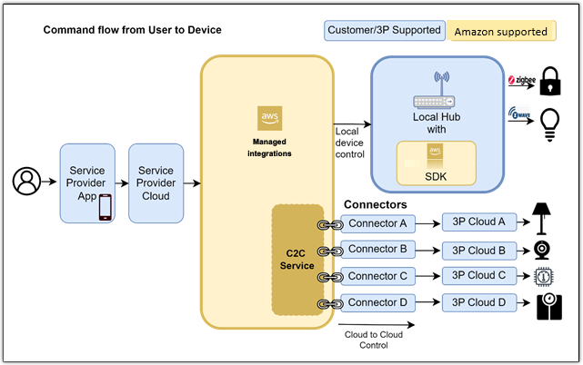

# What is managed integrations for AWS IoT Device Management?

Managed integrations for AWS IoT Device Management helps IoT solution providers unify the control and management of IoT devices from hundreds of manufacturers. You can use managed integrations to automate device setup workflows and support interoperability across many devices, regardless of device vendor or connectivity protocol. With managed integrations, you can use a single user interface and set of APIs to control, manage, and operate a range of devices.

###### Topics

- [Supported Regions](#supported-Regions "#supported-Regions")
- [Are you a first-time managed integrations user?](#first-time-user "#first-time-user")
- [Managed integrations overview](#what-is-managedintegrations "#what-is-managedintegrations")
- [Managed integrations terminology](#managedintegrations-terminology "#managedintegrations-terminology")

## Supported Regions

Managed integrations for AWS IoT Device Management is supported in the following Regions:

- Canada (Central)
- Europe (Ireland)

## Are you a first-time managed integrations user?

If you are a first-time user of managed integrations, we recommend that you begin by reading the
following sections:

- [Set up managed integrations](setting-up.md "setting-up.md")
- [Get started with managed integrations for AWS IoT Device Management](getting-started.md "getting-started.md")

## Managed integrations overview

The following image provides a high-level overview of managed integrations

## Managed integrations terminology

Within managed integrations, there are many concepts and terms critical to understand for managing your
own device implementations. The following sections outline those key concepts and terms to
provide a better understanding of managed integrations.

### General managed integrations terminology

An important concept to understand for managed integrations is a _Managed Thing_ compared to
an AWS IoT Core thing.

- _AWS IoT Core thing_: An AWS IoT Core Thing is an AWS IoT Core construct that
  provides the digital representation. Developers are expected to manage policies, data storage,
  rules, actions, MQTT topics, and delivery of device state to the data storage. For more
  information on what an AWS IoT Core thing is, see [Managing devices with
  AWS IoT](../../../iot/latest/developerguide/iot-thing-management.md "../../../iot/latest/developerguide/iot-thing-management.md").
- _Managed integrations Managed Thing_: With a
  Managed Thing, we provide an abstraction to simplify device interactions and do
  not require the developer to create items such as rules, actions, MQTT Topics, and
  policies.

### Cloud-to-cloud terminology

Physical devices that integrate with managed integrations may originate from a third-party cloud
provider. To onboard those devices to managed integrations and communicate with the third-party cloud
provider, the following terminology covers some of the key concepts supporting those
workflows:

- _Cloud-to-cloud (C2C) connector_: A C2C connector establishes a
  connection between managed integrations and the third-party cloud provider.
- _Third-party cloud provider_: For devices that are manufactured and
  managed outside of managed integrations, a third-party cloud provider enables control of these devices
  for the end user and managed integrations communicates with the third-party cloud provider for various
  workflows such as device commands.

### Data model terminology

Managed integrations uses data models for organizing data and end-to-end communication between
your devices. The following terminology covers some of the key concepts for understanding those
two data models:

- **Device:** An entity representing a physical device (such as a video
  doorbell) which has multiple nodes working together to provide a complete feature set.
- **Endpoint:** An endpoint encapsulates a standalone feature
  (ringer, motion detection, lighting in a video doorbell).
- **Capability:** An entity representing components which are
  needed to make a feature available in an endpoint (button or a light and chime in the bell
  feature of video doorbell).
- **Action:** An entity representing an interaction with a
  capability of a device (ring the bell or view who’s at the door).
- **Event:** An entity representing an event from a capability
  of a device. A device can send an event to report an incident/alarm, an activity from a sensor
  etc. (e.g. there is knock/ring on the door).
- **Property:** An entity representing a particular attribute
  in device state (bell is ringing, porch light is on, camera is recording).
- **Data Model:** The data layer corresponds to the data and
  verb elements that help support the functionality of the application. The Application operates
  on these data structures when there is an intent to interact with the device. For more
  information, see [connectedhomeip](https://github.com/project-chip/connectedhomeip/tree/v1.4-branch/src/app/zap-templates/zcl/data-model/chip "https://github.com/project-chip/connectedhomeip/tree/v1.4-branch/src/app/zap-templates/zcl/data-model/chip") on the _GitHub_ website.
- **Schema:** A schema is a representation of the data model in JSON format.
