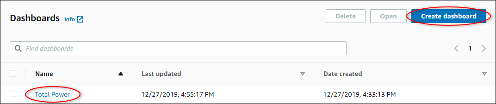

The SiteWise Monitor feature is not available to new customers. Existing customers can continue to
use the service as normal. For more information, see [SiteWise Monitor availability
change](iotsitewise-monitor-availability-change.md "iotsitewise-monitor-availability-change.md")

# Add properties and alarms to dashboards

As the project owner, you define dashboards to give your viewers a standard way to look at
asset properties and alarms. By providing a consistent view, you ensure that everyone sees the
data that you want them to see, in the same manner. You group asset properties and alarms on
to dashboards in a way that makes sense for your business and viewers.

###### Note

Project viewers can't modify a dashboard.

You can add asset properties to a new dashboard or an existing dashboard.

###### To add asset properties

1. In the navigation bar, choose the **Projects** icon.

 2. Choose one of the following options:

    * To add asset properties and alarms to an existing dashboard, choose the dashboard
     to update, and then choose **Edit**.
    * To add asset properties and alarms to a new dashboard, choose **Create
     dashboard**.

 3. Choose the asset whose properties or alarms that you want to add to the
dashboard. 4. Choose **Properties** to view the asset's properties or
**Alarms** to view the asset's alarms. If an alarm monitors a property,
you automatically add that alarm to the dashboard when you add its property. 5. Drag a property or alarm from the asset hierarchy to the dashboard. You can add
multiple properties and alarms to one visualization.

The asset property appears on the dashboard with a default visualization type:

    * The default visualization type for non-string properties is the [line chart](choose-visualization-types.md#line-charts "choose-visualization-types.md#line-charts").
    * The default visualization type for string properties is the [KPI widget](choose-visualization-types.md#kpi-charts "choose-visualization-types.md#kpi-charts").
    * The default visualization type for alarms is the [status grid widget](choose-visualization-types.md#status-grid-chart "choose-visualization-types.md#status-grid-chart").

You can change the visualization type and customize the visualization settings. For
more information, see [Customize visualizations](customize-visualizations.md "customize-visualizations.md").
