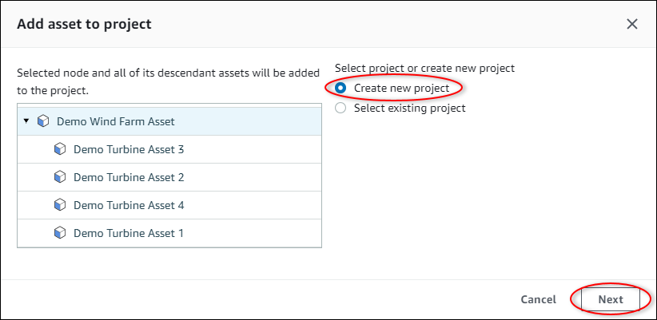
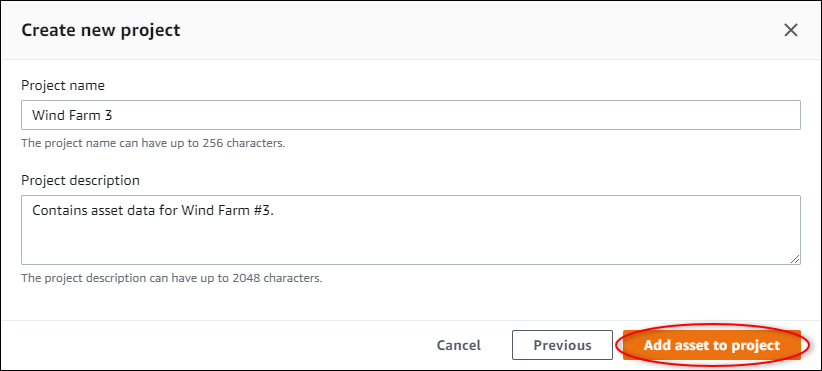
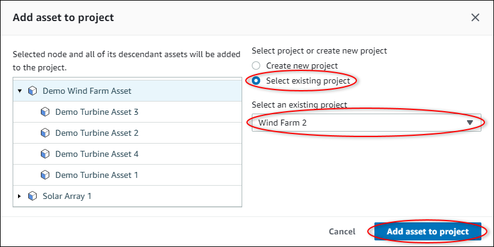
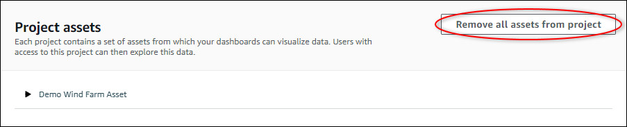

The SiteWise Monitor feature will no longer be open to new customers starting November 7, 2025 . If you would like to use SiteWise Monitor,
sign up prior to that date. Existing customers can continue to use the service as normal. For more information, see
[SiteWise Monitor availability change](iotsitewise-monitor-availability-change.md "iotsitewise-monitor-availability-change.md")

# Add assets to projects

As a portal administrator, you decide how to assign your AWS IoT SiteWise assets to projects. You
give access to users at the project level, so you should group related assets into projects
that will have a common set of viewers.

###### Note

You can only add assets to a project if you're a portal administrator. Project owners
and viewers can explore the assets in the projects to which they have access, but can't add
assets to the project.

You can add assets to an existing project or you can create a project for the chosen
assets.

## Add assets to a new project

1. In the navigation bar, choose the **Assets** icon.

 2. (Optional) Choose a project in the projects drop-down list to show only assets from a
specific project.

 3. Choose an asset in the **Assets** hierarchy, and then choose
**Add asset to project**.

###### Note

You can add only a single node hierarchy (an asset and all assets that are subordinate
to that asset) to a project. To create a dashboard to compare two assets that are children
of a common parent asset, add that common parent to the project. 4. In the **Add assets to project** dialog box, choose **Create
new project**, then choose **Next**.

 5. In **Project name**, enter a name for your project. If you plan to
create multiple projects, each with a distinct set of assets, choose a descriptive
name.

 6. In **Project description**, enter a description of the project and its
contents.

You can add project owners after you create the project. 7. Choose **Add asset to project**.

The **Create new project** dialog box closes, and the new project's
page opens.

## Add assets to an existing project

1. In the navigation bar, choose the **Assets** icon.

 2. (Optional) Choose a project in the projects drop-down list to show only assets from a
specific project.

 3. Choose an asset in the **Assets** hierarchy, and then choose
**Add asset to project**.

###### Note

You can add only a single node hierarchy (an asset and all assets that are subordinate
to that asset) to a project. To create a dashboard to compare two assets that are children
of a common parent asset, add that common parent to the project. 4. In the **Add assets to project** dialog box, choose **Select
existing project**, and then choose the project to add the assets.

 5. Choose **Add asset to project**.

The **Create new project** dialog box closes, and the new project's
page opens.

## Remove assets from a project

As a portal administrator, you can remove assets from
projects if you no longer need them.

###### To remove assets from a project

1. In the navigation bar, choose the **Projects** icon.

 2. On the **Projects** page, choose the project to remove assets
from.

 3. Choose **Remove all assets from project**.

 4. In the dialog box, confirm that you want to remove the assets.
