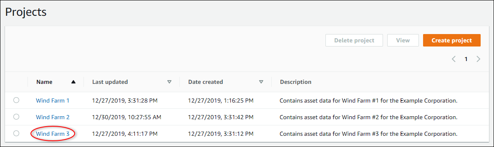
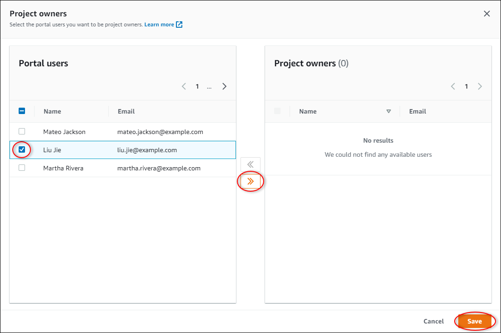
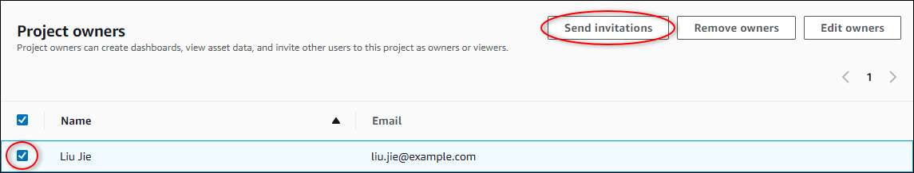

The SiteWise Monitor feature is not available to new customers. Existing customers can continue to
use the service as normal. For more information, see [SiteWise Monitor availability
change](iotsitewise-monitor-availability-change.md "iotsitewise-monitor-availability-change.md")

# Assign project owners

As a portal administrator, after you create a project, you can
assign project owners. Project owners create dashboards to provide a consistent way to view your
asset data. You can send an invitation email to assigned project owners when you are ready for
them to work with the project.

###### To assign owners to a project

1. In the navigation bar, choose the **Projects** icon.

 2. On the **Projects** page, choose the project to which to assign project
owners.

 3. In the **Project owners** section of the project details page, choose
**Add owners** if the project has no owners, or **Edit
owners**.

 4. In the **Project owners** dialog box, select the check boxes for the
users to be owners for this project.

###### Note

You can only add project owners if they're portal users. If you don't see a user
listed, contact your AWS administrator to add them to the list of portal users. 5. Choose the **>>** icon to add those users as project
owners. 6. Choose **Save** to save your changes.
Next, you can send emails to your project owners so they
can sign in and start managing the project.

###### To send email invitations to project owners

1. In the navigation bar, choose the **Projects** icon.

 2. On the **Projects** page, choose the project for which to invite
project owners.

 3. In the **Project owners** section of the project details page, select
the check boxes for the project owners to receive an email, and then choose **Send
invitations**.

 4. Your preferred email client opens, prepopulated with the recipients and the email body
with details from your project. You can customize the email before you send it to the
project owners.
