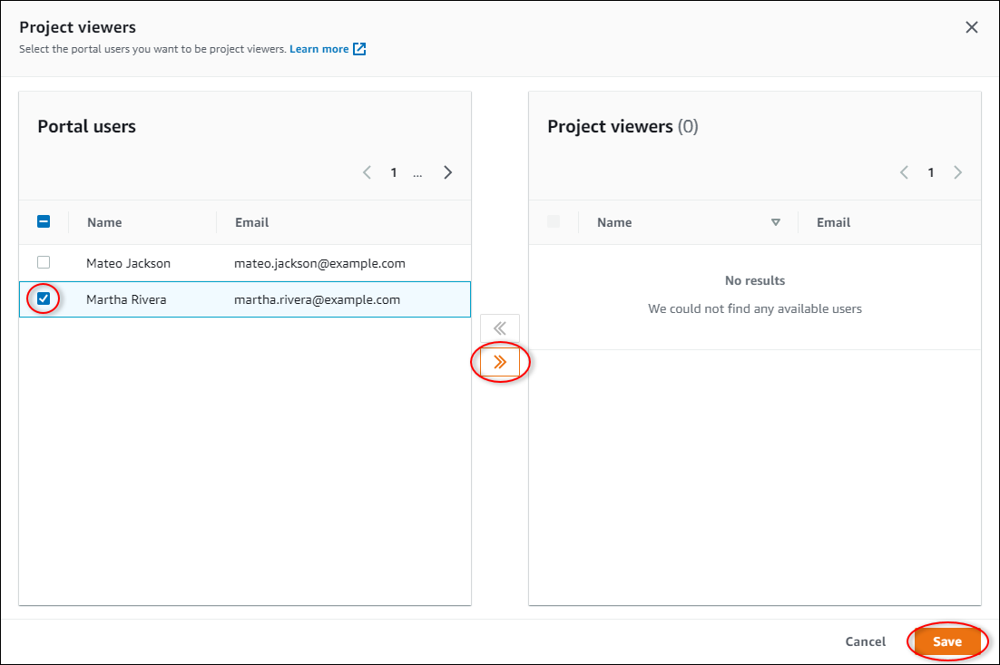

The SiteWise Monitor feature will no longer be open to new customers starting November 7, 2025 . If you would like to use SiteWise Monitor,
sign up prior to that date. Existing customers can continue to use the service as normal. For more information, see
[SiteWise Monitor availability change](iotsitewise-monitor-availability-change.md "iotsitewise-monitor-availability-change.md")

# Assign project viewers

As a project owner or portal administrator, you typically assign viewers to your project
after you define a set of dashboards to provide a common view of asset properties and alarms
to those viewers.

###### Note

You must be a project owner or portal administrator to assign viewers to a
project.

###### To assign viewers to a project

1. In the navigation bar, choose the **Projects** icon.

 2. On the **Projects** page, choose the project to which to assign
viewers.

 3. In the **Project viewers** section of the project details page, choose
**Add viewers** if the project has no viewers, or **Edit
viewers**.

 4. In the **Project viewers** dialog box, select the check boxes for the
users to be viewers for this project.

###### Note

You can only add viewers if they're portal users. If you don't see a user listed,
contact your AWS administrator to add them to the list of portal users. 5. Choose the **>>** icon to add those users as project
viewers. 6. Choose **Save** to save your changes.
Next, you can send emails to your project viewers so they
can sign in and start exploring the dashboards in the project.

###### To send email invitations to project viewers

1. In the navigation bar, choose the **Projects** icon.

 2. On the **Projects** page, choose the project to which to invite project
viewers.

 3. In the **Project viewers** section of the project details page, select
the check boxes for the project viewers to receive an email, and then choose **Send
invitations**.

 4. Your preferred email client opens, prepopulated with the recipients and the email body
with details from your project. You can customize the email before you send it to the
project viewers.
