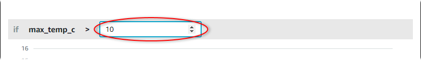

The SiteWise Monitor feature is not available to new customers. Existing customers can continue to
use the service as normal. For more information, see [SiteWise Monitor availability
change](iotsitewise-monitor-availability-change.md "iotsitewise-monitor-availability-change.md")

# Configure alarms for AWS IoT SiteWise

On the **Assets** page, project owners can configure each alarm to set it
up for their equipment and processes. You can update the alarm's threshold value and
notification settings.

###### Notes

- You can only configure alarms that your team sets up to detect in the AWS Cloud. You
  can't configure external alarms.
- You can only configure alarm properties that your team sets up for you to customize.
  For example, your AWS administrator might define a threshold or notification recipient
  as a static value that you can't change.

###### To configure an alarm

1. In the navigation bar, choose the **Assets** icon.

 2. (Optional) Choose a project in the projects drop-down list to show only assets from a
specific project.

 3. Choose an asset in the **Assets** hierarchy.

###### Tip

Choose the arrow next to an asset to view all children of that asset. 4. Choose the **Alarms** tab for the asset. 5. Select the alarm to configure. 6. Choose **Configure**. 7. On the **Configure alarm** page, do any of the following:

    1. Edit the threshold value for the alarm. You can preview the threshold on the
     recent data for the property that the alarm monitors.

    
    2. Choose a new **Notification recipient** for the alarm
     notification. You can choose an AWS IAM Identity Center (IAM Identity Center) user in your organization.
    3. Change the message **Protocol** for the alarm
     notification.
    4. Change the **Custom message** to include in the notification. The
     notification message includes this message and information about the alarm state
     change.

8. Choose **Save**.
